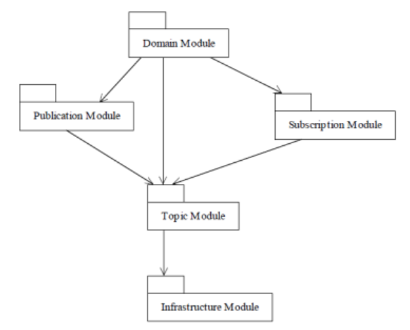

# DDS 基本概念

可以理解为发布者是一个报社，订阅者是读者，话题是邮局。

这种中间件就是建立了发布者和订阅者的模型；会使得发送者和接收者之间的关系非常的松散，即发送者不需要管接收者在哪儿，接收者也不需要管理发送者在哪儿

发送者和接收者只需要知道各自的 Topic 即可，然后通过 Topic 进行通信，就行了

Topic 的存在，就是为了适应发布订阅的模式

 

## Domain

域代表的是一个通信平面，由一个 uid 作为唯一的标识

只有在同一个域内的实体才可以进行通信；不同域之间的实体是不可以进行通信的

 

## Domain Participant

域参与者，表示域中通信者的成员

 

## Topic

对数据的一个抽象的概念，由一个 name（string）进行标识

如果将车内所有的 Topic 聚集在一起，就形成了一个虚拟的全局数据空间

 

## Publisher

发布者，用于发布 Topic 数据，将数据发送至 Topic 中

至少与一个 DataWriter 进行关联，通过调用 DataWriter 的某些函数，将数据发送出去

 

## DataWriter

真正去实现发布动作的端点，会将数据从应用层，写入到网络上

 

## Subscriber

订阅者，可以理解为是数据的接收者，会与底层的 DataReader 进行关联

 

## DataReader

真正去实现读取数据的端点，会将数据从传输层传给应用层

 

 

 

# DCPS 模型

DCPS（数据中心发布订阅）模型将 DDS 分为五大模块：

The Infrastructure（基础设施）Module

The Domain（域） Module

The Topic-Definition （话题） Module

The Publication （发布） Module

The Subscription （订阅） Module

 

 

 

# RTPS 基本概念

**R**eal-**T**ime **P**ublish **S**ubscribe，实时发布订阅协议

RTPS 主要分为四个模块：

- structure module（结构模块）

- message module（消息模块）

- behavior module（行为模块）

- discovery module（发现模块）

 

 

 

# DDS 的用途

在 dds 中传输的数据一般有以下几种类型：

周期性数据（periodic）：可能是持续不断发生的传感器数据，数据定期更新，可能有多个 sub 端接收同一个 topic 的数据，可能要求出现故障也可以及时的恢复数据（比如 camera）

状态和位置数据（state and states）：偶尔会发生变化的连续数据，新加入网络的数据需要获取最后发布的数据以明确当前的状态和位置信息（比如 GPS）

时间和命令（events and commands）信令，需要高可靠性

应用程序将数据对象（Data object）传递给DCPS层

DCPS层通过历史缓存将数据传递给RTPS层

RTPS层以RTPS消息的形式将序列化后的数据传输给UDP/IP协议栈传输

 

- historycache是DCPS层与RTPS层之间交互接口的一部分
- 在写入者端，它包括数据对象变更的部分历史记录
- 在读取端，它包括可存储的部分数据对象变更
- historycache的内容取决于DDS QOS策略以及读取者的通信状态