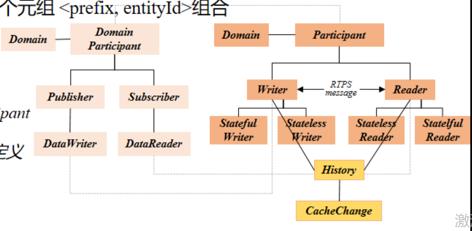
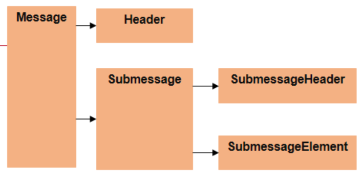
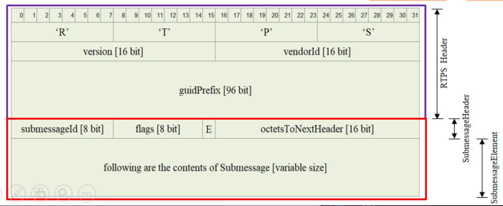
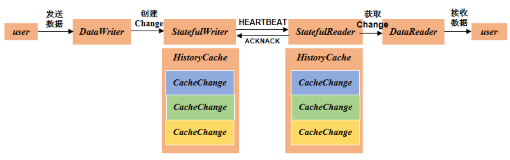

# RTPS 的背景及介绍
为什么要引入一个新的协议：因为 DDS 标准只是说明了应用的接口和架构层面的规范（以及 QoS 是如何使用）

而 DDS 如何接发数据、数据的报文格式如何，这都是没有涉及到的

因此引入 RTPS 协议对底层的收发数据进行管理

**R**eal-**T**ime **P**ublish **S**ubscribe，实时发布订阅协议

RTPS 定义了 DDS 基于有线传输的通信行为、报文格式等；定义了一套独立于传输方式的模型

（不管底层使用的是 Tcp 还是 Udp，上层都是用同一套模型对数据进行收发）

 

RTPS 主要分为四个模块：

- structure module（结构模块）

- message module（消息模块）

- behavior module（行为模块）

- discovery module（发现模块）

 

 

 

# RTPS 报文
RTPS消息由固定长度的报文头（**header**）和可变数量的子消息（**submessage**）组成

其中每个 RTPS 消息都包括若干个子信息

消息的总长度由下层的传输协议确定（UDP、TCP、IP）

 

 

## 消息报头

消息报头必须存在于每个消息的开头，用以识别 RTPS 消息、协议版本和中间件所属供应商

主要包括**协议**、**协议版本**、**全局唯一标识符前缀**三个字段

- 协议字段用于标识消息属于RTPS消息

- 全局唯一标识符前缀被消息中所有子消息共用，表示所属的**参与者**

 

 

## 子消息

主要包括两部分：**子消息报头**（submessage header），**一组子消息元素**（submessage element）

子消息报头包括**子消息标识符**、**子消息标志**、**子消息长度**三部分

- 子消息标识符是 RTPS 中规定的用于标识特定子消息类型的值
  
- 子消息标志用于标识子消息的字节序及与具体子消息类型相关的标志位信息
  
- 子消息长度不包括子消息报头的长度

 

 

 

# RTPS module

## Structure module
主要是用来定义 RTPS 的通信端点，并与 DDS 实体对象相互映射

在模型中有个 historycache 和 cachechange 的概念

每次对数据的修改都会添加一条 cachachange

而 historycache 是用来存放 cachechange 的容器

每个 cachechange 都有一个序列号，用来标识自己是第几条

那么，数据的发送就变为了 DataWriter 将数据从当前的 historycache 中，发送到 DataReader 中的 historycache 中

 

## Message module
结构：固定大小的 Header，数量可变的 Submessage

其中的 submessage，是由 submessageHeader 和 submessageElement 组成

 

header 部分是定长的，20个字节，其中：

- 4个字节用于描述字符串 “RTPS”

- 2个字节用于描述当前版本

- 2个字节用于描述供应商 id

- 12个字节的 GUID 前缀（可以唯一的确定一个参与者）

 

 

 

## Behavior module
为了满足互操作性，规定最基本的实现要求

背景：RTPS协议可能由不同的厂家都对其进行了实现，而不同厂家的因为如果需要实现通信，那么最少需要实现那些基本需求

 

定义了两个参考实现：
- stateful（在QoS策略的可靠性中，就需要设置为reliable），维护远程实体的全部状态，保证严格可靠的通信（比如说writer会维护reader的状态信息，这样reader需要什么，writer就会写什么）

- stateless（在QoS策略的可靠性中，就需要设置为best effort），几乎不保留远程实体的状态，适用于组播的情况

 

- 以stateful为例，stateful writer需要**定期**发送heart beat（心跳包），来与stateful reader建立联系
- writer会问stateful reader说，我这边有信息发生了更改，你这边是否需要最新的消息
- 而stateful reader则会给出一个ACKNACK，对writer进行回应
- stateful writer定期发送心跳包信息，必须对否认的确定做出回应；stateful reader响应心跳包信息，必须对缺失做出回应

 

 

 

## discovery module

RTPS 的服务发现协议：

- SPDP 协议（**Participant**发现协议），主要是通信端点的匹配过程（内置端点的通信匹配）
- SEDP 协议（**Endpoint**发现协议），主要是每个通信端点分为 DataWriter 和 DataReader 两类

 

服务发现协议，是集成在 RTPS 中

会发送报文 DATA(p)（组播报文），一旦发现新的 entity，就会向组播地址发送报文信息，以此实现服务的发现

接收者本地也会存储这个新的 entity 对象的信息

 

RTPS 和 DCPS 一样，也是由多个 Participant 组成，每个 Participant 拥有多个 Endpoint，Endpoint 又分为 Reader 和 Writer

RTPS 由 Entity、Participant、Endpoint、Writer、Reader、HistoryCache 以及 CacheChange 组成

Endpoint 是 RTPS 最基本的通信单元

 

HistoryCache 是 RTPS 实体之间交流的桥梁

其中有多个 CacheChange，当用户要发送某个数据时，就把某个 CacheChange 告诉实体Writer

Writer 把这个 CacheChange 放入 HistoryCache 里

然后将 CacheChange 分发给需要接受数据的 Reader

（Reader 端也是同理）

 

 

 

### SPDP

简单参与者发现协议，通过组播，利用内置节点，发现 domain 中的参与者

在 SPDP 协议中，每个  Participant  都会内置一个 DataWriter（SPDP builtin ParticipantWriter）和 DataReader（SPDP builtin ParticipantReader）

（上述两个端点，会在 Participant 创建的时候，一起创建出来）

这两节点是用于收发需要发现节点时所需的数据

（它们都是无状态的；因为参与者发现协议是要让所有的其他参与者发现自己，所以使用的是组播发送）

 

这里的 Writer 会周期性地向预先配置好的一系列 locators（目标地址；一般是组播地址）发送数据

Writer 会不断发布自己已经发现了的 Participant ，然后将自己发送的信息和其他人交换，这样每个 Participant 就能够互相了解知道了

所以说，SPDP 主要是负责利用内置的 builtin Endpoint ，实现 Participant 之间的相互发现

发送的消息是 pdata（guid）和 user_qos（com 组件的服务信息）

pdata 中还有 builtin end set（一系列的 flag；RTPS 规定的 flags）

 

而对于 com 来说，借助 SPDP 中报文的 user_data

可以 com 的服务信息及其他信息存入，并发送给另一端，进行上层的匹配（即服务的匹配）

 

### SEDP

简单端点发现协议

参与者中，其他的内置 Writer 和 Reader 进行匹配（Qos 策略和 Topic 的匹配）

内置的 Endpoint 主要有四个：（而这内置的四个端点，也会在 Participant 创建时，构建出来）

- SEDP builtin Publications Writer
- SEDP builtin Publications Reader
- SEDP builtin Subscriptions Writer
- SEDP builtin Subscriptions Reader
- SEDP builtin Topics Writer（可选）
- SEDP builtin Topics Reader（可选）

发送的 edp 报文（包含当前 endpoint 的 Qos 策略）

如果实体中的某个节点（例如 Writer 节点）下线，那么就需要再用 SEDP 更新节点的状态