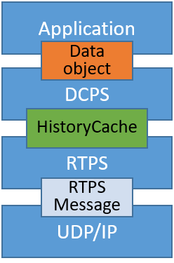

# DCPS

DCPS（Data-Centric Publish-Subscribe）

DCPS的模型主要分为五大模块：
  - infrastructure module（基础设施模块）

  - domain module（域模块）
  
  - topic-definition module（话题模块）
  
  - publication module（发布模块）
  
  - subscription module（订阅模块）

 

- 每对当前的实例对象进行一次修改，就会对应的产生一条**CacheChange**类型的change；而DATA子消息是通过这种类型的change转换而来的

- 也就是说，每创建一条change，就会对应发送一条DATA子消息

- History类是用来存储CacheChange的容器

 

## 发布模块（publication module）
### publisher类
- publisher类作为datawriter的工厂类和容器类，会给下层的datawriter提供添加、删除、查找等操作

- 使用`std::map<std::string, std::vector<std::weak_ptr<DataWriter>>>`，按照topic的姓名来存储每个topic的发布者datawriter

- 应用程序将数据对象（Data object）传递给DCPS层
- DCPS层通过历史缓存将数据传递给RTPS层
- RTPS层以RTPS消息的形式将序列化后的数据传输给UDP/IP协议栈传输

 

- 感觉，RTPS就是将下层的UDP/IP封装（Real Time Publish Subscribe）
- 然后DDS就是DCPS，底层再使用RTPS进行数据的传输

 

- historycache是DCPS层与RTPS层之间交互接口的一部分
- 在写入者端，它包括数据对象变更的部分历史记录
- 在读取端，它包括可存储的部分数据对象变更
- historycache的内容取决于DDS QOS策略以及读取者的通信状态

 

如何理解DCPS架构
- 分为两部分：Domain和Entity
- Domain是之前说过的域的概念，而Entity则是实体，上述所有的实例对象都会继承这个Entity
- Entity是一个抽象实体，会让所有的派生类都继承它，并支持以下三个特性
  - QoS策略
  - Listener，监听器，异步的；可以通知数据是否到达；还可以加一个stateconditions，当到某个条件的时候，就要执行某个时间，这里是同步的

 

- 基础设施模块：QosPolicy，Entity，StatusCondition，WaitSet以及Listenser
  - 定义抽象类和其他模块细化的接口
- 域模块：DomainEntity，DomainParticipant
  - 充当DDS服务的入口/也是DDS服务的其他实体的容器
- 订阅模块：Subscriber，DataReader及相关Listener类
  - 实现订阅端所需的接口
- 发布模块：Publisher，DataWriter及相关Listener类
  - 实现发不断所需的接口
- 订阅模块：Topic，Data
  - 与应用程序定义的Data关联（比如说控制一些QoS的策略）