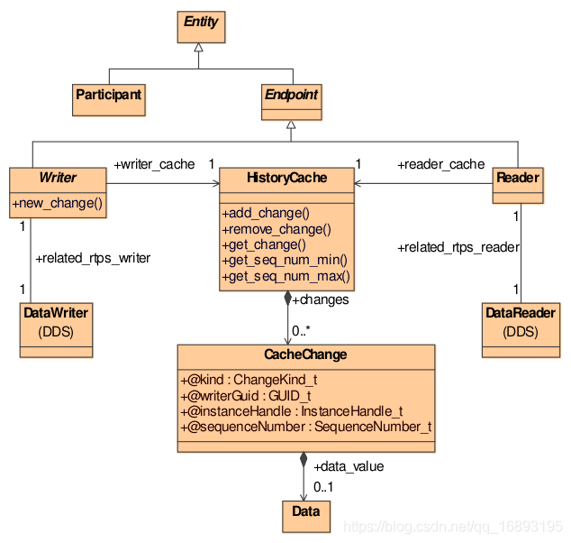
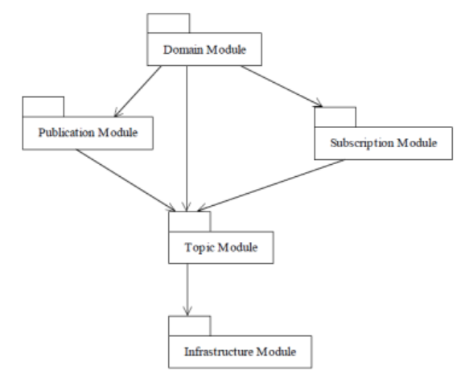

# DDS基本概念
Domain：代表的是一个通信平面，由一个uid作为唯一的标识，只有在同一个域内的实体才可以进行通信；不同域之间的实体是不可以进行通信的

Domain Participant：域参与者，表示域中通信者的成员

Topic：对数据的一个抽象的概念，由一个name（string）进行标识；如果将车内所有的topic聚集在一起，就形成了一个虚拟的全局数据空间

Publisher：发布者，用于发布Topic数据，将数据发送至topic中；至少与一个datawriter进行关联，通过调用datawriter的某些函数，将数据发送出去

DataWriter：真正去实现发布动作的端点，会将数据从应用层，写入到CAN总线上

Subscriber：订阅者，可以理解为是数据的接收者，会与底层的DataReader进行关联

DataReader：真正去实现读取数据的端点，会将数据从传输层传给应用层

 

可以理解为发布者是一个报社，订阅者是读者；DDS中间件是邮局，这种中间件就是建立了发布者和订阅者的模型；会使得发送者和接收者之间的关系非常的松散，即发送者不需要管接收者在哪儿，接收者也不需要管理发送者在哪儿

发送者和接收者只需要知道各自的topic即可，然后通过topic进行通信，就行了

topic的存在，就是为了适应发布订阅的模式（可以关联名称）

笔记
- info_dst：acknack,heartbeat
- rtps的服务发现协议：spdp，edp协议
  - spdp主要是通信端点的匹配过程（内置端点的通信匹配）
  - sedp协议，主要是每个通信端点有多个datawriter和datareader
- SPDP协议：**Participant**发现协议
- SEDP协议：**Endpoint**发现协议

 

- 发现协议，是集成在RTPS中
- 会发送报文DATA(p)（组播报文），一有新的entity，就会向组播地址发送报文信息，以此实现服务的发现
- 接收者本地也会存储这个新的entity对象的信息

 

- RTPS传输由多个participant组成，每个participant拥有多个endpoint（端点），endpoint又分为reader和writer
- endpoint（端点）是RTPS最基本的通信单元
- RTPS与DDS实体通过HistoryCache进行沟通
  - 里面有多个CacheChange，当用户要发送某个数据时，就把某个CacheChange告诉RTPS中的实体Writer，Writer把这个CacheChange塞进HistoryCache里，然后将CacheChange分发给需要接受数据的reader（Reader也是一样）
- 

 

- RTPS传输协议由Entity、Participant、Endpoint、Writer、Reader、HistoryCache以及CacheChange组成
- 应用通过DDS层实体来访问对应的RTPS实体，HistoryCache是他们之间的桥梁

 

## SPDP
- 在RTPS协议的SPDP协议中，每个participant都会内置一个DataWriter（SPDP builtin ParticipantWriter）和DataReader(SPDP builtin ParticipantReader)，这里的writer会周期性地向预先配置好的一系列locators（目标地址；一般是组播地址）发送数据；这里的writer会不断发布自己发现了的participant，然后将自己发送的信息和其他人交换，这样每个participant就能够互相了解知道了
- 所以说，这里的SPDP主要是负责利用内置的builtin endpoing，实现participant之间的相互发现
- 发送的消息是pdata（guid）和user_qos（com组件的服务信息）
  - pdata中还有builtin end set（一系列的falg；rtps规定的flags）
- 加入一个组播
- 参与者发现协议（builtin的发现；节点一上来就需要用这个协议进行匹配）
- 

 

## SEDP
- 内置的writer和reader进行匹配（qos策略，topic的匹配）
- ？这里说SEDP也有内置的endpoint
- 内置的endpoint主要有四个：
  - SEDP builtin Publications Writer
  - SEDP builtin Publications Reader
  - SEDP builtin Subscriptions Writer
  - SEDP builtin Subscriptions Reader
  - SEDP builtin Topics Writer（可选）
  - SEDP builtin Topics Reader（可选）
- https://blog.csdn.net/qq_16893195/article/details/113937167
- 发送的edp报文（档期那的datawriter的qos策略是啥）
- 如果实体中的某个节点 writer节点下线，那么就需要再用SEDP更新节点的状态

 

- SPDP 简单参与者发现协议，SEDP 简单端点发现协议

 

- autosar adaptive -> ara::com -> dds
- autosar adaptive和autosar classic的区别，是什么原因导致了adaptive的诞生，二者的应用分别在哪些方面，至少需要了解二者的架构上的组成
- ara，了解ara的**主要**组件有啥，这些组件的作用是什么，然后需要着重了解ara::com的架构，务必要理解proxy/skeleton模式（这模式不懂，后续很难深入下去理解com如何进行网络绑定）
- 因为后续需要做的是网络绑定，因此对于网络绑定的几种方法（IPC，SOME/IP，DDS）都要有一定程度的了解，并且深入理解DDS
- 对于DDS，我认为需要划分为两个部分，一个是上层的DDS架构，即DCPS；另一个是下层的传输协议RTPS，并且涉及服务发现的部分
  - 比如说DCPS，这里要明白DCPS划分的五个部分、理解QoS的不同策略
  - 再者就是RTPS，要了解报文的组成，服务发现的协议以及在RTPS层中角色与DCPS中对象的映射

 

- 其实，can总线的广播机制，本质上也是一种发布订阅模型，只不过它做的比较简陋，信息的每次发布都是通过广播的机制传达到所有的总线上

- 借助sdpd中报文的user_data，将com的服务信息及其他信息存入，然后再利用spdp将数据发送给另一端
- 也就是说com是利用spdp的报文中的user_data，进行上层的匹配

 

- domain -> createpaticipant -> entity -> topic/publisher/subscriber
- publisher = participant.createpublisher();
- topic = participant.createtopic();
- 上述是发布者的创建过程

 

- 有一点，对于com的架构不太了解，到底什么是proxy/skeleton模式、导致后续dds和com模块进行映射的时候，一直搞不明白
- 我认为，RTPS之所以有history，以及等cache，一个很大的原因便是，当QoS的策略需要保证信息的可靠传输的时候，信息丢包需要重新发送时，就会用到cache中的数据
- 然后一条数据

 

- 每发送一条data的消息，都会添加一条change（也就是cachechange）
- 而history则是存放cachechange的容器
- 类图关系中，History是基类（它包含所有的Cachechange）
- 然后在RTPS层中的ReaderHistory,WriterHistory，就要继承History
- 最后，在DDS层的SubscriberHistory，PublisherHistory则分别继承ReaderHistory,WriterHistory

 
cachechange
- buffer_里面存放具体的数据，writer_guid存放writer的id

 

history
- 用vector+shared_ptr来存放cachechange，同时还有排序函数

- rtps将writer和reader都分为了stateless和stateful两种
- cachechange和history（将每次数据的发送和接收都抽象为一条条cachechange，然后将cachechange存储在history）

 

- RTPS层的behavior module为什么会有stateful 和 stateless，主要就是因为qos策略中可能会设置可靠与不可靠通信

- 如果使用stateful（reliability）的，就需要定时发送心跳信息

 

- 当创建了一个RTPS的参与者participant时，会自动的创建几个内置节点
  - SPDPbuiltinParticipantWriter
  - SPDPbuiltinParticipantReader
  - 这两节点是用于收发需要发现节点时所需的数据（它们都是无状态的；因为参与者发现协议是要让所有的其他参与者发现自己，所以使用的是组播发送）

- SEDP则会有四个端点，SEDPbuiltinPublicationsWriter

# DCPS模型

DCPS（数据中心发布订阅）模型将DDS分为五大模块：

- The Infrastructure（基础设施）Module
- The Domain（域） Module
- The Topic-Definition （话题） Module
- The Publication （发布） Module
- The Subscription （订阅） Module

 

# QoS策略

user data: 将应用程序的信息附加到创建的entity上面- 后面的SPDP中就会将user data附加上去

durability: 将样本发送给订阅端之后是否保留样本

- 我理解为这个和后面的可靠性是挂钩的，因为如果需要可靠性的话，那么发送数据后就应该在本地保存数据
- 需要topic，datareader和datawriter在这个策略上都一致，才能够相互兼容，从而收发数据
- 比如说riter和reader设置的是保留发送的数据，而topic设置的是不保留，那么此时二者就不能对topic的数据进行读写
- 更新:这里的数据保留和history其实是不同的，比如说数据发送给了reader1，那么我是否还要保留呢? 后续可能还有reader2reader3，他们要不要读取这个数据? 那么就是这个策略决定的

presentation: 控制如何将datawriter的修改呈现给datareader比如说是有序还是乱序的 (具体看上层业务是如何规定的)目前来说是规定它必然是有序的

ownership: 控制多个data writer是否能够写同一个数据对象实例- 所有权是独占的(只能有一个线程对数据进行读写)或共享(可以有多个线程同时写数据)

liveliness: 控制服务何时以及如何确定参与者是否还活着