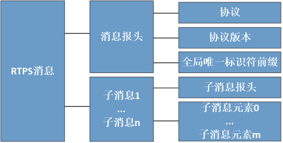
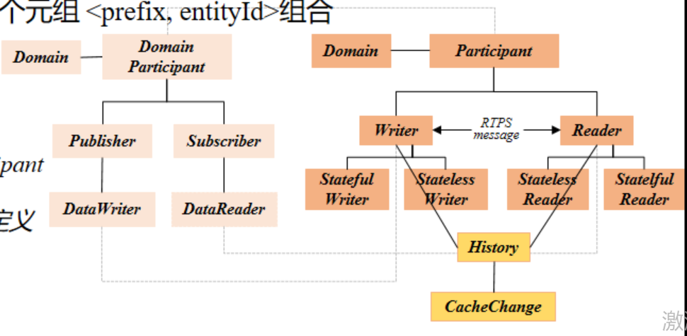
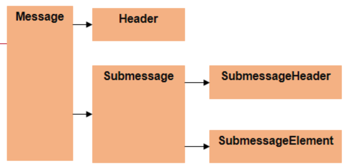
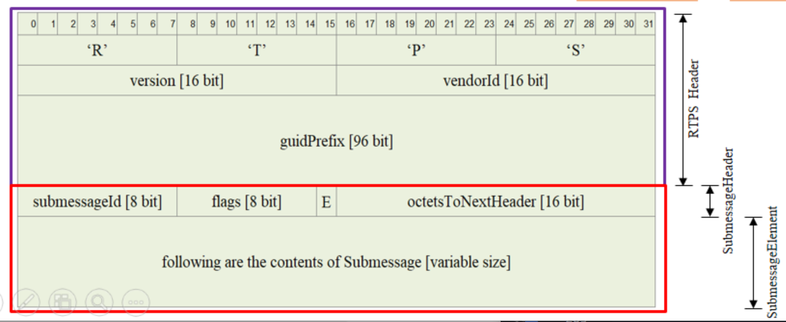
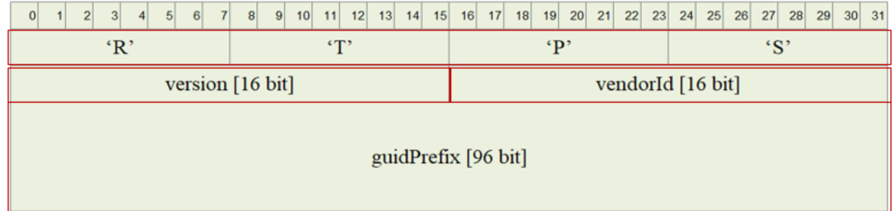
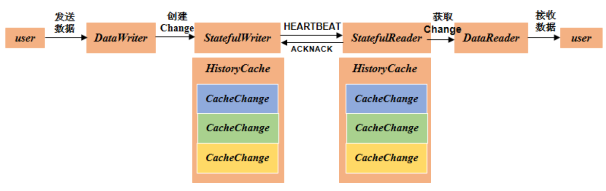

# RTPS的背景及介绍
为什么要引入一个新的协议，一个关键点就是，DDS标准知识只说明了应用的接口和架构层面的规范（以及QoS是如何使用）

而DDS如何接发数据、数据的报文格式如何，这都是没有涉及到的

因此引入RTPS协议对底层的收发数据进行管理（Real-Time Publish Subscribe，实时发布订阅协议）

RTPS,是定义DDS基于有线传输的通信行为、报文格式等；定义了一套独立于传输方式的模型

（不管底层使用的是tcp还是udp，这里都是用同一套模型对数据进行收发）

RTPS主要分为四个模块：
- structure module（结构模块）

- message module（消息模块）

- behavior module（行为模块）

- discovery module（发现模块）

 

# RTPS报文
RTPS消息由固定长度的报文头（**header**）和可变数量的子消息（**submessage**）组成

其中每个RTPS消息都包括若干个子信息

消息的总长度由下层的传输协议确定（UDP/IP）

 

## 消息报头

消息报头必须存在于每个消息的开头，用以识别RTPS消息、协议版本和中间件所属供应商

主要包括**协议**、**协议版本**、**全局唯一标识符前缀**三个字段

- 协议字段用于标识消息属于RTPS消息

- 全局唯一标识符前缀被消息中所有子消息共用，表示所属的参与者

## 子消息

主要包括两部分：**子消息报头**（submessage header），**一组子消息元素**（submessage element）

子消息报头包括子消息标识符、子消息标志、子消息长度三部分

- 子消息标识符是RTPS中规定的用于标识特定子消息类型的值
  
- 子消息标志用于标识子消息的字节序及与具体子消息类型相关的标志位信息
  
- 子消息长度不包括子消息报头的长度

 

# RTPS module

## Structure module
主要是用来定义RTPS的通信端点，并与DDS实体对象相互映射

在模型中有个historycache和cachechange的概念

每次对数据的修改都会添加一条cachachange，则historycache是一个容器，是用来存放cachechange的容器

每个cachechange都有一个序列号，用来标识自己是第几条

那么，数据的发送就变为了writer将数据从cachechange的一条发送到reader中的cachechange中

 

## Message module
结构：固定大小的Header，数量可变的Submessage

其中的submessage，是由submessageHeader和submessageElement组成

RTPS的报文格式：

- header部分是定长的，20个字节

- 其中，4个字节用于描述字符串“RTPS”，2个字节用于描述当前版本，2个字节用于描述供应商id，12个字节的GUID前缀（可以唯一的确定一个参与者）

 

## Behavior module
为了满足互操作性，规定最基本的实现要求

背景：RTPS协议可能由不同的厂家都对其进行了实现，而不同厂家的因为如果需要实现通信，那么最少需要实现那些基本需求

 

定义了两个参考实现：
- stateful（在QoS策略的可靠性中，就需要设置为reliable），维护远程实体的全部状态，保证严格可靠的通信（比如说writer会维护reader的状态信息，这样reader需要什么，writer就会写什么）

- stateless（在QoS策略的可靠性中，就需要设置为best effort），几乎不保留远程实体的状态，适用于组播的情况

 

- 以stateful为例，stateful writer需要**定期**发送heart beat（心跳包），来与stateful reader建立联系
- writer会问stateful reader说，我这边有信息发生了更改，你这边是否需要最新的消息
- 而stateful reader则会给出一个ACKNACK，对writer进行回应
- stateful writer定期发送心跳包信息，必须对否认的确定做出回应；stateful reader响应心跳包信息，必须对缺失做出回应

- ara::com -> dds
- ara::com是以服务为中心进行通信的组件，而通信方面，即网络绑定，存在数种可选的方案，比如说dds、some/ip、ipc；其中dds便是其中一种通信方法
- dds -> rtps
- dds是一个以数据为中心的分布式通信架构标准，自带服务发现等功能，但是却没有规定底层的数据是如何进行传输的，也没有规定服务是如何相互发现的，因此需要引入rtps进行管理
- 所以回到实际应用上，映射关系就是service(ara::com层) -> publisher/subscriber（dds层） -> datawriter/datareader（rtps层）
- 有个问题：为什么要使用dds？直接使用数据进行收发，本地存储每个服务的id，即可，为啥需要这样抽象？？？