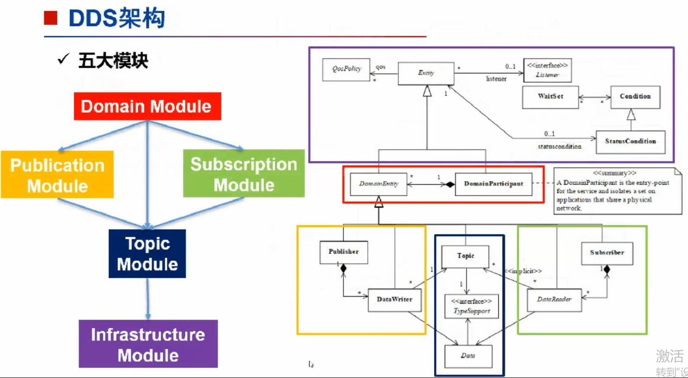

# DCPS（Data-Centric Publish-Subscribe）

DCPS的模型主要分为五大模块：

domain module（域模块）

- 域模块：DomainEntity，DomainParticipant，充当DDS服务的入口/也是DDS服务的其他实体的容器

infrastructure module（基础设施模块）
- 基础设施模块：QosPolicy，Entity，StatusCondition，WaitSet以及Listenser，定义抽象类和其他模块细化的接口

publication module（发布模块）
- 发布模块：Publisher，DataWriter及相关Listener类，实现发布端所需的接口

subscription module（订阅模块）
- 订阅模块：Subscriber，DataReader及相关Listener类，实现订阅端所需的接口

topic-definition module（话题模块）
- 话题模块：Topic，Data，与应用程序定义的Data关联（比如说控制一些QoS的策略）

 

 

 

# 对 DCPS 的理解

分为两部分：Domain 和 Entity

Domain是之前说过的域的概念，而Entity则是实体，上述所有的实例对象都会继承这个Entity

Entity是一个抽象实体，会让所有的派生类都继承它，并支持以下特性：
- QoS策略
- Listener，监听器，异步的；可以通知数据是否到达
  - 还可以加一个stateconditions，当到某个条件的时候，就要执行某个时间，这里是同步的

