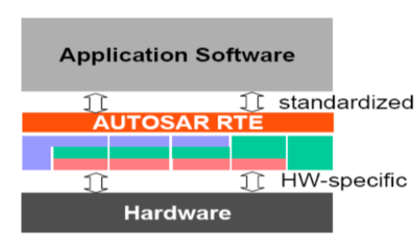

# AUTomotive Open System ARchitecture

 

## Classic AUTOSAR方法论
- 指导汽车领域ECU软件开发的流程

- 通过虚拟功能总线（VFB）提供SWC之间通信的抽象描述
- 提供标准的数据交换格式：ARXML

 

- SWC：功能性软件组件，一般包含某些特定的实时运行的调节算法和可运行实体
- 一个上层的应用，可以拆分为不同的SWC

 

- ECU：电子控制单元，汽车专用微机控制器，也叫汽车专用单片机
  - 由微处理器（CPU）、存储器（ROM、、RAM）、输入/输出接口（I/O）、模数转换器（A/D）以及整形、驱动等大规模集成电路组成
- 为了实现ECU软件的可移植和可重用，严格区分了应用程序与基础软件；同时也提供了标准化的接口（RTE）

<!--  -->

 

- CP的软件架构有以下特点：
  - 高实时性（相比linux的抢占式系统，具有一定的实时性）

  - 基于信号通信（CAN总线；不过随着some/ip的引入，也具备了面向服务的通信的能力）
  - 任务共享地址空间（我理解就是代码都跑在一个同一个OS里面，所有大家都共用一个地址空间）
  - 静态配置&部署（生成的都是.c和.h文件）

 

## Adaptive AUTOSAR方法论
- 尽量做到兼容AP和CP
- 基于面向服务架构（SOA）
- 更详细的manifest定义（这就是ARXML）

 

面向服务的架构（SOA）
- 组织和利用分布式功能的软件架构的**设计方法**
- 将原本的应用程序拆分为了多个不同的功能组件（服务和服务之间会通过中立的接口进行通信；服务之间可以使用some/ip、dds、或者自己组装的tcpudp，进行通信，这里只要两个通信的服务使用的是相同的通信协议即可）
- 接口与协议和语言无关（参考微服务架构的rpc通信）
- 服务之间是松耦合的（需要被发现以后才能够使用）

 

Adaptive运行时环境（ARA）
- 基于SOA的设计方法开发的软件架构
- 使用cpp11/14作为开发语言（可能21以后就会全面使用14进行开发）
- 是基于posix标准的os接口进行开发（比如linux、qnx都是可行的）
- 为应用程序提供一组标准的API
- 相比CP，AP的实现是多个进程（守护进程）和共享库，然后由守护进程对信息进行转发
- ara中多个进程是通过IPC进行通信

 

- QNX是遵循POSIX规范的**类UNIX实时**操作系统，主要面向嵌入式系统，可能是最成功的微内核操作系统之一
- 在汽车领域，qnx是目前最大的操作系统供应商
- 是分布式、嵌入式、可规模拓展的硬实时操作系统
- 仅提供四种服务：进程调度、进程间通信、底层网络通信和中断处理
- 所有程序都使用同一个地址空间，不加保护；应用程序可以自由访问所有空间，效率极高
- 大内核空间结构：kernel等核心模块的地址空间与应用程序隔离

 

开放架构：
- 没有ARXML描述，应用基本上是软件实现（也有部分硬件）

 

开放抽象平台：
- 定义抽象软件组件（将上层的软件抽象为不同的组件部分）
- 还需要定义不同组件的抽象接口是什么

 

开发软件架构：
- 区分非autosar组件（这里是允许存在非autosar组件的部分，不过需要将其标识出来）

 

开发车辆硬件架构：
- 定义ECU硬件拓扑，不同的ECU之间是如何进行通信的