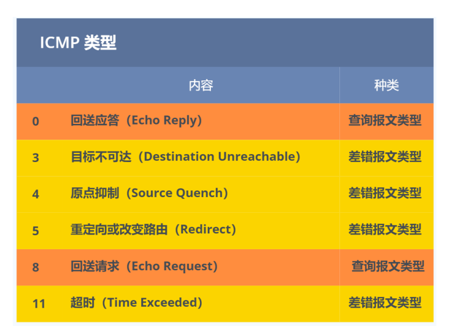

# NAT

作用：同个公司、家庭、教室内的主机对外部通信时，把私有 IP 地址转换成公有 IP 地址

# ICMP

作用：

- 全名是互联网控制报文协议
- 主要功能包括
  - 确认 IP 包是否成功送达⽬标地址
  - 报告发送过程中 IP 包被废弃的原因和改善⽹络设置等

两大类

- ⼀类是⽤于诊断的查询消息，也就是「查询报⽂类型」 
- 另⼀类是通知出错原因的错误消息，也就是「差错报⽂类型」 

报文类型

- 

### NAPI机制

- 随着网络带宽的发展，网速越来越快，之前的中断收包模式已经无法适应目前千兆，万兆的带宽了。如果每个数据包大小等于MTU大小1460字节。当驱动以千兆网速收包时，CPU将每秒被中断91829次。在以MTU收包的情况下都会出现每秒被中断10万次的情况。过多的中断会引起一个问题，CPU一直陷入硬中断而没有时间来处理别的事情了。为了解决这个问题，内核在2.6中引入了NAPI机制。

  NAPI就是混合中断和轮询的方式来收包，当有中断来了，驱动关闭中断，通知内核收包，内核软中断轮询当前网卡，在规定时间尽可能多的收包。时间用尽或者没有数据可收，内核再次开启中断，准备下一次收包

- ⽐如，当有⽹络包到达时，⽹卡发起硬件中断，于是会执⾏⽹卡硬件中断处理函数，中断处理函数处理完需要「暂 时屏蔽中断」，然后唤醒「软中断」来轮询处理数据，直到没有新数据时才恢复中断，这样⼀次中断处理多个⽹络 包，于是就可以降低⽹卡中断带来的性能开销

- 那软中断是怎么处理⽹络包的呢？它会从 Ring Buffer 中拷⻉数据到内核 struct sk_buff 缓冲区中，从⽽可以作为⼀ 个⽹络包交给⽹络协议栈进⾏逐层处理

、

# 女巫攻击

传统互联网领域

- 模拟出多种身份进行攻击，生活中常见的就是多个ip地址刷流量，刷赞
- 再比如说：电商平台操纵多个消耗刷单，抢购软件冒充多人实施抢购
- 解决办法：采用可靠的第三方进行验证（实名认证）

区块链领域

- 投票时生成多个地址刷票，诸如矿工挖矿的记账权、token空投、DAO决策等等
- 原因：区块链以钱包地址定义为一个用户
- 解决办法：工作量证明、资产证明、行为证明等等
