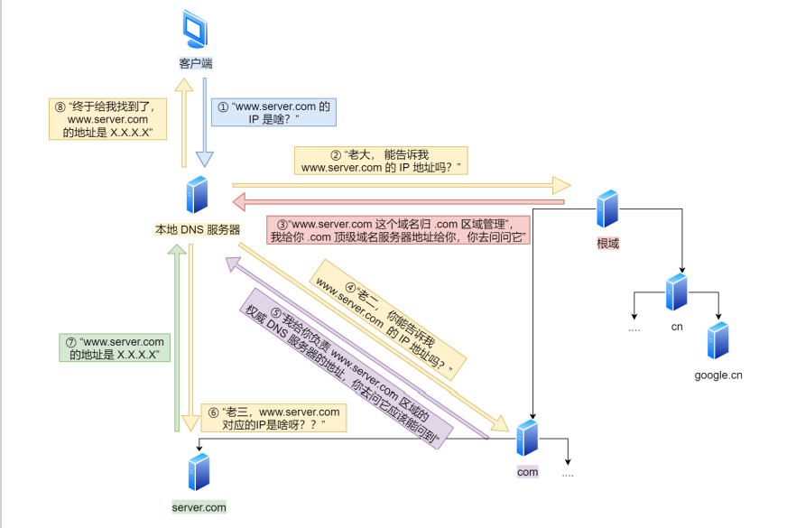

# DNS

作用：将域名⽹址⾃动转换为具体的 IP 地址

域名解析的工作流程

- 1、浏览器⾸先看⼀下⾃⼰的缓存⾥有没有，如果没有就向操作系统的缓存要，还没有就检查本机域名解析⽂件 hosts ，如果还是没有，就会 DNS 服务器进⾏查询
- 2、客户端⾸先会发出⼀个 DNS 请求，问 www.server.com 的 IP 是啥，并发给本地 DNS 服务器（也就是客户端 的 TCP/IP 设置中填写的 DNS 服务器地址）
- 3、本地域名服务器收到客户端的请求后:
  - 如果缓存⾥的表格能找到 www.server.com，则它直接返回 IP 地址
  - 如果没有，本地 DNS 会去问它的根域名服务器：“⽼⼤， 能告诉我 www.server.com 的 IP 地址吗？” （根域名服务器是最⾼层次的，它不直接⽤于域名解析，但能指明⼀条道路）
- 4、根 DNS 收到来⾃本地 DNS 的请求后，发现后置是 .com，说：“www.server.com 这个域名归 .com 区域管理”，我给你 .com 顶级域名服务器地址给你，你去问问它吧。”
- 5、本地 DNS 收到顶级域名服务器的地址后，发起请求问“⽼⼆， 你能告诉我 www.server.com 的 IP 地址吗？”
- 6、顶级域名服务器说：“我给你负责 www.server.com 区域的权威 DNS 服务器的地址，你去问它应该能问到”。
- 7、本地 DNS 于是转向问权威 DNS 服务器：“⽼三，www.server.com对应的IP是啥呀？” server.com 的权威 DNS 服务器，它是域名解析结果的原出处。为啥叫权威呢？就是我的域名我做主
- 8、权威 DNS 服务器查询后将对应的 IP 地址 X.X.X.X 告诉本地 DNS
- 9、本地 DNS 再将 IP 地址返回客户端，客户端和⽬标建⽴连接

- 

