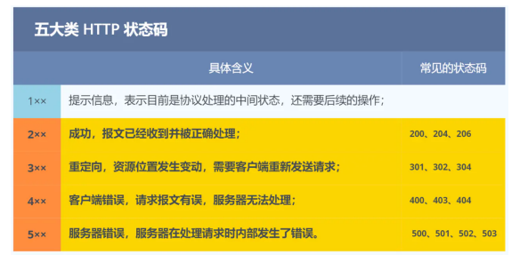

### HTTP常见状态码

- 
- 1xx （1xx 类状态码属于提示信息，是协议处理中的⼀种中间状态，实际⽤到的⽐较少）
- 2xx （2xx 类状态码表示服务器成功处理了客户端的请求，也是我们最愿意看到的状态）
  - 「200 OK」是最常⻅的成功状态码，表示⼀切正常。如果是⾮ HEAD 请求，服务器返回的响应头都会有 body 数据
  - 「204 No Content」也是常⻅的成功状态码，与 200 OK 基本相同，但响应头没有 body 数据
  - 「206 Partial Content」是应⽤于 HTTP 分块下载或断点续传，表示响应返回的 body 数据并不是资源的全部，而是其中的⼀部分，也是服务器处理成功的状态
- 3xx（3xx 类状态码表示客户端请求的资源发送了变动，需要客户端⽤新的 URL 重新发送请求获取资源，也就是重定向） 
  - 「301 Moved Permanently」表示永久重定向，说明请求的资源已经不存在了，需改⽤新的 URL 再次访问
  - 「302 Found」表示临时重定向，说明请求的资源还在，但暂时需要⽤另⼀个 URL 来访问。 301 和 302 都会在响应头⾥使⽤字段 Location ，指明后续要跳转的 URL，浏览器会⾃动重定向新的 URL
  - 「304 Not Modified」不具有跳转的含义，表示资源未修改，重定向已存在的缓冲⽂件，也称缓存重定向，用于缓存控制
- 4xx（4xx 类状态码表示客户端发送的报⽂有误，服务器⽆法处理，也就是错误码的含义） 
  - 「400 Bad Request」表示客户端请求的报⽂有错误，但只是个笼统的错误
  - 「403 Forbidden」表示服务器禁⽌访问资源，并不是客户端的请求出错
  - 「404 Not Found」表示请求的资源在服务器上不存在或未找到，所以⽆法提供给客户端
- 5xx（5xx 类状态码表示客户端请求报⽂正确，但是服务器处理时内部发⽣了错误，属于服务器端的错误码） 
  - 「500 Internal Server Error」与 400 类型，是个笼统通⽤的错误码，服务器发⽣了什么错误，我们并不知道
  - 「501 Not Implemented」表示客户端请求的功能还不⽀持，类似“即将开业，敬请期待”的意思
  - 「502 Bad Gateway」通常是服务器作为⽹关或代理时返回的错误码，表示服务器⾃身⼯作正常，访问后端服务器发⽣了错误
  - 「503 Service Unavailable」表示服务器当前很忙，暂时⽆法响应服务器，类似“⽹络服务正忙，请稍后重试”的意思

### HTTP常见字段

Host字段

- 客户端发送请求时，⽤来指定服务器的域名

Content-Length字段

- 服务器在返回数据时，会有 Content-Length 字段，表明本次回应的数据⻓度

Connection字段

- 常⽤于客户端要求服务器使⽤ TCP 持久连接，以便其他请求复⽤

Content-Type字段

- ⽤于服务器回应时，告诉客户端，本次数据是什么格式

Content-Encoding 字段

- Content-Encoding 字段说明数据的压缩⽅法，表示服务器返回的数据使⽤了什么压缩格式

### GET与POST

- Get ⽅法的含义是请求从服务器获取资源，这个资源可以是静态的⽂本、⻚⾯、图⽚视频等（安全且幂等）
- POST ⽅法则是它向 URI 指定的资源提交数据，数据就放在报⽂的 body 里（不安全不幂等）
- 科普概念
  - 安全：是指请求⽅法不会「破坏」服务器上的资源
  - 幂等：意思是多次执⾏相同的操作，结果都是「相同」的

### HTTP的优缺点

优点

- 简单
  - HTTP 基本的报⽂格式就是 header + body ，头部信息也是 key-value 简单⽂本的形式，易于理解，降低了学习 和使⽤的⻔槛
- 灵活和易于扩展
  - HTTP协议⾥的各类请求⽅法、URI/URL、状态码、头字段等每个组成要求都没有被固定死，都允许开发⼈员⾃定义和扩充
-  应⽤⼴泛和跨平台

缺点

- 无状态
  - 好处：因为服务器不会去记忆 HTTP 的状态，所以不需要额外的资源来记录状态信息，这能减轻服务器的负担，能够把更多的 CPU 和内存⽤来对外提供服务
  - 坏处：需要反复的验证信息（由此延申出cookie和session，其中Cookie 通过在请求和响应报⽂中写⼊ Cookie 信息来控制客户端的状态）
- 不安全
  - 明文传输，信息泄漏
  - 不验证通信⽅的身份，因此有可能遭遇伪装
  - ⽆法证明报⽂的完整性，所以有可能已遭篡改

### HTTP1.1性能

长连接

- 在HTTP1.0时，每发起一个请求都要三次握手
- HTTP1.1就用长连接的通信方式，也叫做持久连接
- 长连接的特点：只要任意一端没有明确提出断开连接，则保持TCP连接状态

管道网络传输

- 可在同⼀个 TCP 连接里面，客户端可以发起多个请求，只要第⼀个请求发出去了，不必等其回来，就可以发第二个请求出去，可以减少整体的响应时间

队头阻塞

- 如果前面的请求被阻塞了的话，那么后面的请求也一同被阻塞了

### HTTP与HTTPS的区别

-  HTTP 是超⽂本传输协议，信息是明⽂传输，存在安全⻛险的问题。HTTPS 则解决 HTTP 不安全的缺陷，在 TCP 和 HTTP ⽹络层之间加⼊了 SSL/TLS 安全协议，使得报⽂能够加密传输
- HTTP 连接建⽴相对简单， TCP 三次握⼿之后便可进⾏ HTTP 的报⽂传输。⽽ HTTPS 在 TCP 三次握⼿之后，还需进⾏ SSL/TLS 的握⼿过程，才可进⼊加密报⽂传输 
- HTTP 的端⼝号是 80，HTTPS 的端⼝号是 443
- HTTPS 协议需要向 CA（证书权威机构）申请数字证书，来保证服务器的身份是可信的

### HTTP1.1的优化

#### 避免发送HTTP请求

- 背景：对于⼀些具有重复性的 HTTP 请求，⽐如每次请求得到的数据都⼀样的，我们可以把这对「请求-响应」的 数据都缓存在本地，那么下次就直接读取本地的数据，不必在通过⽹络获取服务器的响应了，这样的话 HTTP/1.1 的性能肯定⾁眼可⻅的提升
- 说人话：将内容缓存至本地（同时设置过期时间），请求的时候就先看本地是否有数据
- .png)
- 过期时间：服务器在发送 HTTP 响应时，会估算⼀个过期的时间，并把这个信息放到响应头部中，这样客户端在查看响 应头部的信息时，⼀旦发现缓存的响应是过期的，则就会重新发送⽹络请求
- 如果缓存过期了，客户端重新发送后发现服务端的数据没有变更，那该怎么做呢？
  - 只需要客户端在重新发送请求时，在请求的 Etag 头部带上第⼀次请求的响应头部中的摘要，这个摘要是唯⼀标 识响应的资源，当服务器收到请求后，会将本地资源的摘要与请求中的摘要做个⽐较。 
  - 如果不同，那么说明客户端的缓存已经没有价值，服务器在响应中带上最新的资源
  - 如果相同，说明客户端的缓存还是可以继续使⽤的，那么服务器仅返回不含有包体的 304 Not Modified 响应， 告诉客户端仍然有效，这样就可以减少响应资源在⽹络中传输的延时
- .png)

#### 减少HTTP请求次数

##### 减少重定向请求次数

- 解决办法：使用代理服务器帮我们实现重定向
- .png)
- .png)

##### 合并请求

- 背景：
  - 另外由于 HTTP/1.1 是请求响应模型，如果第⼀个发送的请求，未收到对应的响应，那么后续的请求就不会发送， 于是为了防⽌单个请求的阻塞，所以⼀般浏览器会同时发起 5-6 个请求，每⼀个请求都是不同的 TCP 连接，那么 如果合并了请求，也就会减少 TCP 连接的数量，因⽽省去了 TCP 握⼿和慢启动过程耗费的时间
  - 如果把多个访问⼩⽂件的请求合并成⼀个⼤的请求，虽然传输的总资源还是⼀样，但是减少请求，也就意味着减少 了重复发送的 HTTP 头部
- 解决办法：合并请求的⽅式就是合并资源，以⼀个⼤资源的请求替换多个⼩资源的请求
- 缺点：当⼤资源中的某⼀个⼩资源发⽣变化后，客户端必须重新下载整个完整的⼤ 资源⽂件，这显然带来了额外的⽹络消耗

##### 延迟发送请求

- 遇到不需要的资源，可以按需获取

#### 减少响应的数据大小

- 无损压缩
- 有损压缩