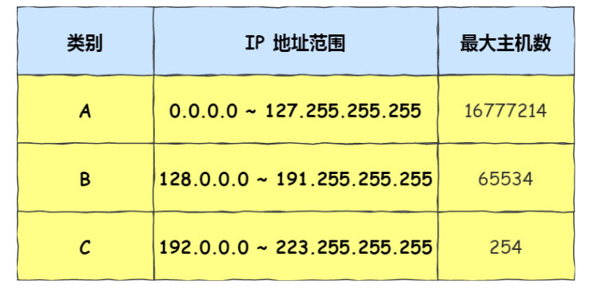

### 网络层的作用

实现主机与主机之间的通信，也叫点对点（end to end）通信

ps：数据链路层是实现两个设备之间的通信，ip层是实现两个网络之间的通信

- 在⽹络中数据包传输中，源IP地址和⽬标IP地址在传输过程中是不会变化的，只有源 MAC 地址和⽬标 MAC ⼀直在变化

### ip地址

由 32 位正整数来表示，IP 地址在计算机是以⼆进制的⽅式处理的

- 32位ip地址，分为四组，再将每组转为十进制

### ip地址分类

- a类地址：前8位是网络号（第一位为0），后24位是主机号
- b类地址：前16位是网络号（第一位为1，第二位为0），后16位是主机号
- c类地址：前24位是网络号（第一位为1，第二位为1，第三位为0），后8位是主机号
- d类地址：前三位为1，后28位为组播地址
- e类地址：前四位为1，后28位留用
- 
- 
- 牢记两个特殊的ip
  - 主机号全为 1 指定某个⽹络下的所有主机，⽤于⼴播
  - 主机号全为 0 指定某个⽹络
- 判断是第几类地址的方法：依次判断第1234位是否为1

### 广播地址

- 意义：同⼀个链路中相互连接的主机之间发送数据包
- 分类：在本地网络内广播的叫做本地广播，在不同网络之间的广播叫做直接广播

### 多播地址

- 意义：将包发送给特定组内的所有主机

### 分类网络号和主机号的两种方法

- 子网掩码
- CIDR
  - ⽐如 10.100.122.2/24，这种地址表示形式就是 CIDR，/24 表示前 24 位是⽹络号，剩余的 8 位是主机号

### 子网掩码

- 将子网掩码和ip地址进行和运算，可以划分子网网络地址和子网主机地址
- 利用前四位可以分析出网络号和主机号，再用子网掩码划分出子网网络地址和子网主机地址

### 为什么要分离网络号和主机号

- 因为两台计算机要通讯，⾸先要判断是否处于同⼀个⼴播域内，即⽹络地址是否相同。如果⽹络地址相同，表明接 受⽅在本⽹络上，那么可以把数据包直接发送到⽬标主机
- 路由器寻址⼯作中，也就是通过这样的⽅式来找到对应的⽹络号的，进⽽把数据包转发给对应的⽹络内

### 子网划分

- 利用子网掩码分离网络号和主机号，再将主机号分为子网网络地址和子网主机地址（方便路由器跳转发送）
- 
- 

### 公有ip和私有ip

- 

### 路由控制

- 

### IP分片与重组

- 每种数据链路的最⼤传输单元 MTU 都是不相同的，如 FDDI 数据链路 MTU 4352、以太⽹的 MTU 是 1500 字节等
- 我们最常⻅数据链路是以太⽹，它的 MTU 是 1500 字节，那么当 IP 数据包⼤⼩⼤于 MTU 时， IP 数据包就会被分⽚
- 为啥ip要分片，tcp也要分片？
  - 在分⽚传输中，⼀旦某个分⽚丢失，则会造成整个 IP 数据报作废，所以 TCP 引⼊了 MSS 也就是在 TCP 层进⾏ 分⽚不由 IP 层分⽚
  - 而ip分片是因为链路有自己的最大传输单元

### IPV6

网段地址是主机号全为0的地址，表示某个网段

广播地址是主机号全为1的地址，向同一个网段中的所有主机发送数据包的一个地址

- https://www.zhihu.com/question/56895036/answer/1838362850
