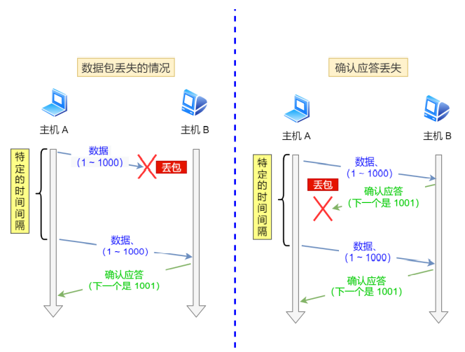
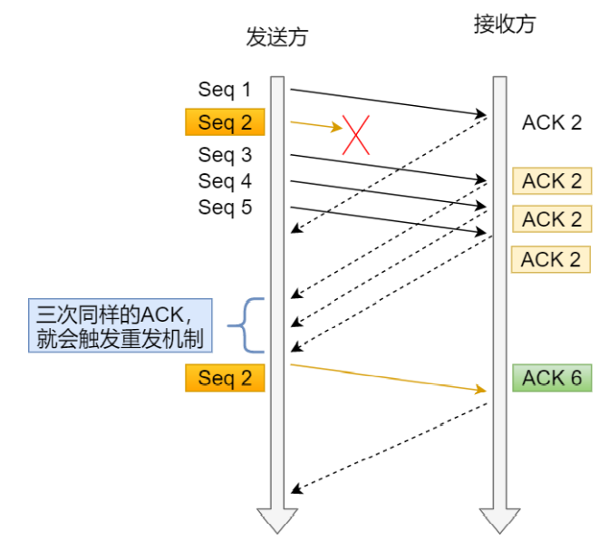
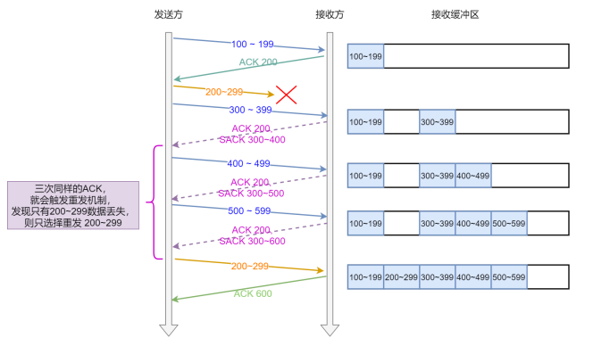
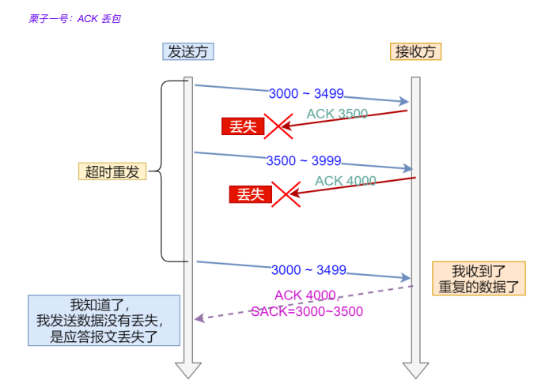
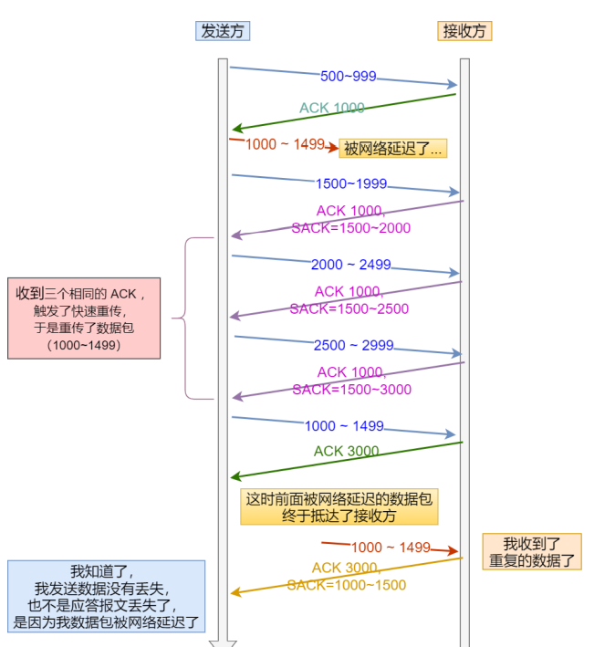

# 重传

### 超时重传

- 定义：在发送数据时，设定⼀个定时器，当超过指定的时间后，没有收到对⽅的 ACK 确认应答报⽂，就会重发该数据
- 两种情况：数据包丢失，确认应答丢失
- 
- RTT：表示从发送端发送数据开始，到发送端收到来自接收端的确认（接收端收到数据后便立即发送确认），总共经历的时延
- RTO：超时重传时间
  - RTO太大：网络的空隙时间增大，降低了网络传输效率
  - RTO太小：不必要的重传，会导致网络负荷增大
- Linux下计算RTO
  - 1
- 存在的问题：周期太长（用快速重传来解决）

### 快速重传

- 工作方式：当收到三个相同的ACK报文时，会在定时器过期之前，重传丢失的报文段
- 
- 存在的问题：重传的是时候，是重传之前的一个，还是重传所有的问题（解决办法SACK）

### SACK方法

- 选择性确认：需要在TCP头部字段里面加上一个SACK的东西，可以将缓存的地图发送给发送方，这样发送方就可以只重传丢失的数据
- 

### Duplicate SACK

- 使用SACK方法来告诉发送发有哪些数据被重复接收了
- situation1
  - 
- situation2
  - 

