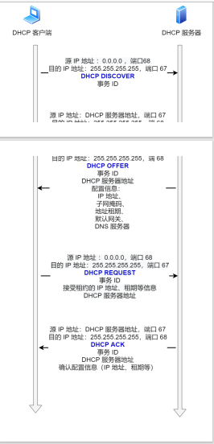

# 作用

- 动态主机配置协议（Dynamic Host Configuration Protocol）
- 允许一台计算机加入新的网络和获取IP地址而不用手工参与
- 属于应用层协议，其传输层用的是udp
- 接入网络的设备获取其在网络的ip地址

- 刚联网的client，通过DHCP协议获取其在局域网中的ip地址和dns服务器ip地址
  - dns服务器的IP地址有可能是动态的，每次上网时由网关分配，这叫做DHCP机制；也有可能是事先指定的固定地址
  - 上例DNS服务器的IP地址是`192.168.1.253`，这是一个内网地址
  - 有一些公网的DNS服务器也可以使用，其中最有名的就是Google的[`8.8.8.8`](https://developers.google.com/speed/public-dns/)和Level 3的[`4.2.2.2`](https://www.tummy.com/articles/famous-dns-server/)
  - Linux系统里面，DNS服务器的IP地址保存在`/etc/resolv.conf`文件

- 简短一点就是，client向全网广播，其对应的ip地址的局域网就会发出对应的信息，给它ip地址和dns地址（至于怎样才算是对应的，这个有待商酌）

# 流程

- 

- 客户端⾸先发起 DHCP 发现报⽂（DHCP DISCOVER） 的 IP 数据报，由于客户端没有 IP 地址，也不知道 DHCP 服务器的地址，所以使⽤的是 UDP ⼴播通信，其使⽤的⼴播⽬的地址是 255.255.255.255（端⼝ 67） 并且使⽤ 0.0.0.0（端⼝ 68） 作为源 IP 地址。DHCP 客户端将该 IP 数据报传递给链路层，链路层然后将帧⼴播到所有的⽹络中设备
- DHCP 服务器收到 DHCP 发现报⽂时，⽤ DHCP 提供报⽂（DHCP OFFER） 向客户端做出响应。该报⽂仍然使⽤ IP ⼴播地址 255.255.255.255，该报⽂信息携带服务器提供**可租约的 IP 地址、⼦网掩码、默认网关、 DNS 服务器ip以及 IP 地址租用期**
- 客户端收到⼀个或多个服务器的 DHCP 提供报⽂后，从中选择⼀个服务器，并向选中的服务器发送 DHCP 请求报⽂（DHCP REQUEST进⾏响应，回显配置的参数
- 最后，服务端⽤ DHCP ACK 报⽂对 DHCP 请求报⽂进⾏响应，应答所要求的参数

PS：如果租约的 DHCP IP 地址快期后，客户端会向服务器发送 DHCP 请求报⽂： 

- 服务器如果同意继续租⽤，则⽤ DHCP ACK 报⽂进⾏应答，客户端就会延⻓租期。 
- 服务器如果不同意继续租⽤，则⽤ DHCP NACK 报⽂，客户端就要停⽌使⽤租约的 IP 地址。

因为使用udp广播的，为了解决DHCP服务器和客户端不在同一个局域网下，使用DHCP中继代理

- DHCP 客户端会向 DHCP 中继代理发送 DHCP 请求包，⽽ DHCP 中继代理在收到这个⼴播包以后，再以单播的形式发给 DHCP 服务器
- 服务器端收到该包以后再向 DHCP 中继代理返回应答，并由 DHCP 中继代理将此包⼴播给 DHCP 客户端

# 参考

- http://blog.iis7.com/article/31938.html
- https://blog.csdn.net/tq08g2z/article/details/77311731
- 《计算机网络》谢希仁 第六章第六节
- 查看当前局域网的公网地址
  - http://httpbin.org/ip