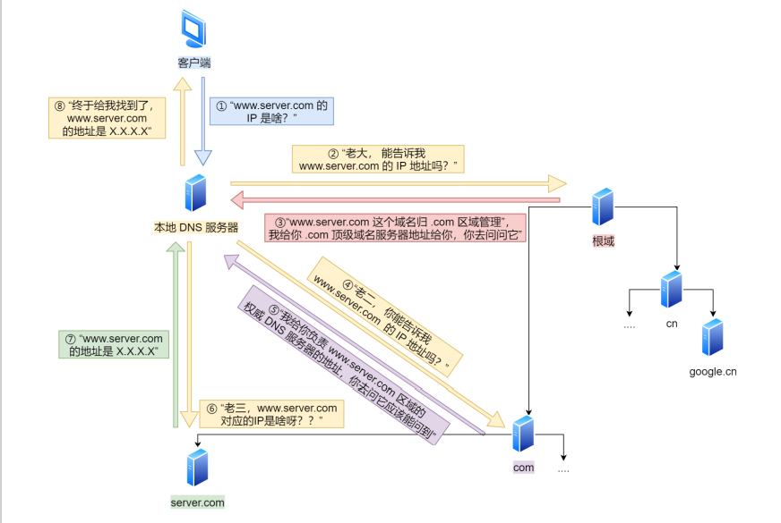

# 定义

- 域名系统（DomainNameSystem）
- **域名和IP地址相互映射**的一个**分布式数据库**
- 传输层用的是udp协议（而每个dns数据库之间用的是tcp）
- 域名解析：通过主机名，最终得到该主机域名转换为对应的IP地址
- PS：路由器是不提供dns服务的，但是会帮助主机dns解析，比如说可以在路由器中设置dns地址

# DNS的缓存时间

- windows的默认缓存时间是1day
- google浏览器的缓存时间是60s
- ie浏览器的缓存时间是30min

# 工作流程

- 

- 请求一旦发起，若是chrome浏览器，先在**浏览器**找之前有没有缓存过的域名所对应的ip地址
  - 有的话，直接跳过dns解析了
  - 若是没有，就会找**硬盘的hosts文件**，如果硬盘的hosts文件有的话，直接返回hosts文件里面的ip

- 如果本地的hosts文件没有能得到对应的ip地址，浏览器会发出一个dns请求到**本地dns服务器**
  - 本地dns服务器一般都是你的网络接入服务器商提供，比如中国电信，中国移动等。（本地的DNS服务器其实就是在当前的局域网中的一个server，比如我之前用手机开热点的本地dns的ip就是192.168.43.1；而校园网的就是222.200.115.251）
  - 本地dns服务器可能是局域网中的某个服务器，或者外网的dns服务器（比如8.8.8.8）

- ip地址到达本地DNS服务器后，会首先查询**本地DNS服务器的缓存**，如果缓存中有此条记录，就可以直接返回结果
  - 此过程是**递归的方式**进行查询
  - 如果没有，本地DNS服务器还要向**DNS根域名服务器**进行查询

- 本地DNS服务器继续向**DNS域服务器**发出请求
  - 在这个例子中，请求的对象是.com域服务器。.com域服务器收到请求之后，也不会直接返回域名和IP地址的对应关系，而是告诉本地DNS服务器，你的域名的解析服务器的地址

- 最后，本地DNS服务器向**域名解析服务器**发出请求，这时就能收到一个域名和IP地址对应关系
  - 本地DNS服务器不仅要把IP地址返回给用户电脑，还要把这个对应关系保存在缓存中，以备下次别的用户查询时，可以直接返回结果，加快网络访问

- 总结：浏览器缓存，系统缓存，路由器缓存，IPS服务器缓存，根域名服务器缓存，顶级域名服务器缓存，主域名服务器缓存
  - 从"根域名服务器"查到"顶级域名服务器"的NS记录和A记录（IP地址）
  - 从"顶级域名服务器"查到"次级域名服务器"的NS记录和A记录（IP地址）
  - 从"次级域名服务器"查出"主机名"的IP地址

# DNS的几个服务器

dns根域名服务器

- 用来管理互联网的主目录，全世界只有13台
- 负责全球互联网域名根服务器、域名体系和IP地址等的管理
- 同时，根域名服务器的NS记录和IP地址是不变的，所以都内置在DNS服务器里面

dns顶级域名服务器（TLD）

- 根域名服务器转到TLD，TLD再转到权威名称服务器（也叫做次级域名服务器）

dns次级域名服务器（权威名称服务器）

- TLD转到次级域名服务器，得到具体的ip地址后，再转到本地DNS服务器

# DNS的负载均衡

- 背景：当一个网站有足够多的用户的时候，假如每次请求的资源都位于同一台机器上面，那么这台机器随时可能会蹦掉
  - 处理办法就是用DNS负载均衡技术

- 它的原理是在DNS服务器中为同一个主机名配置多个IP地址，在应答DNS查询时，DNS服务器对每个查询将以DNS文件中主机记录的IP地址按顺序返回不同的解析结果，将客户端的访问引导到不同的机器上去，使得不同的客户端访问不同的服务器，从而达到负载均衡的目的
  - 例如可以根据每台机器的负载量，该机器离用户地理位置的距离等等
  - 可以理解为多个服务器分担压力

# DNS的查询方式

## 递归解析

- 当局部DNS服务器自己不能回答客户机的DNS查询时，它就需要向其他DNS服务器进行查询。此时有两种方式。**局部DNS服务器自己负责向其他DNS服务器进行查询**，一般是先向该域名的根域服务器查询，再由根域名服务器一级级向下查询。最后得到的查询结果返回给局部DNS服务器，再由局部DNS服务器返回给客户端
- 客户端和服务器之间的查询就是递归查询，即服务器必须给客户端一个明确的ip地址

## 迭代解析

- 当局部DNS服务器自己不能回答客户机的DNS查询时，也可以通过迭代查询的方式进行解析
- 局部DNS服务器不是自己向其他DNS服务器进行查询，而是**把能解析该域名的其他DNS服务器的IP地址返回给客户端DNS程序**，客户端DNS程序再继续向这些DNS服务器进行查询，直到得到查询结果为止。也就是说，迭代解析只是帮你找到相关的服务器而已，而不会帮你去查。比如说：baidu.com的服务器ip地址在192.168.4.5这里，你自己去查吧，本人比较忙，只能帮你到这里了
- 服务器和服务器之间就是迭代查询

# DNS拦截

- DNS拦截分为善意DNS拦截和恶意DNS拦截

## 善意DNS拦截

- 当我们在访问互联网时，由于地理原因或者其他原因，难免会遇到一些不稳定的、访问速度慢的服务器，CDN可以让用户更加快速地浏览互联网上的内容

## 恶意DNS拦截

- 恶意的其实就是在DNS翻译的过程中通过一切技术手段扰乱我们的电脑，使得DNS翻译成另一串数字，让我们连链接到其他的网页

本地DNS劫持

- 攻击者在用户的计算机上安装木马恶意软件，并更改本地DNS设置以将用户重定向到恶意站点

路由器DNS劫持

- 许多路由器都有默认密码或固件漏洞，攻击者可以接管路由器并覆盖DNS设置，从而影响连接到该路由器的所有用户

中间 DNS攻击人

- 攻击者拦截用户和DNS服务器之间的通信，并提供指向恶意站点的不同目标IP地址

流氓DNS服务器

- 攻击者攻击DNS服务器，并更改DNS记录以将DNS请求重定向到恶意站点

## 如何解决DNS恶意拦截

- 通过设置较小的TTL值，让递归服务器在较短时间间隙进行解析请求，从而获得最新的解析记录，可以有效防止DNS被劫持
- 安装SSL证书。SSL证书具备服务器身份认证功能，可以使DNS 劫持导致的连接错误情况及时被发现和终止
- 或者使用一些第三方的dns解析服务，例如奇虎360、诺顿、Comodo、百度、阿里、Google等企业，都有提供DNS解析服务

# 八股

## 为什么域名解析用UDP协议

- 因为UDP快，域名解析需要的是速度

- UDP的DNS协议只要一个请求、一个应答就好了。而使用基于TCP的DNS协议要三次握手、发送数据以及应答、四次挥手
- 但UDP协议传输内容不能超过512字节，不过客户端向DNS服务器查询域名，一般返回的内容都不超过512字节，用UDP传输满足需求

## 为什么区域传送用TCP协议

- 因为TCP协议可靠性好，并且发送的内容数量大
- 比如说DNS服务器间的主从复制，此时对速度是没有啥要求的，需要的是可靠性；并且udp发送的内容大小有限（只有512字节）

## DNS解析出错，如何排查

- https://zhuanlan.zhihu.com/p/541130113
- https://www.juming.com/zx/12624.html

# 参考

- https://www.ruanyifeng.com/blog/2016/06/dns.html
