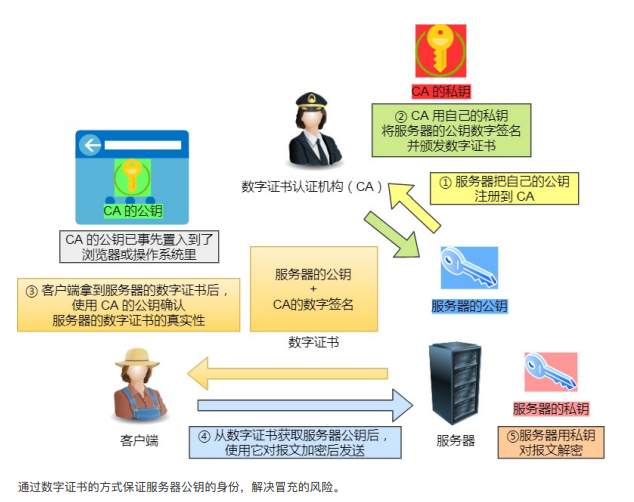

# 基础

## 加密方法

### 对称加密

- 使用单个密钥对数据进行加密和解密，发送方和接收方都需要相同的密钥才能进行通信

- 对称密钥加密（Symmetric-KeyEncryption），加密和解密使用同一密钥
- 优点：运算速度快
- 缺点：无法安全地将密钥传输给通信方

### 非对称加密

- 非对称密钥加密，又称公开密钥加密（Public-KeyEncryption），加密和解密使用不同的密钥

- 使用单独的密钥进行加密和解密，任何人都可以使用加密密钥（公钥）来加密信息，但是解密密钥（私钥）是私密的
- 所以只有预期的接收者才能解密该信息，最常见的非对称加密算法是RSA

- 公开密钥所有人都可以获得，通信发送方获得接收方的公开密钥之后，就可以使用公开密钥进行加密，接收方收到通信内容后使用私有密钥解密
- 非对称密钥除了用来加密，还可以用来进行签名。因为私有密钥无法被其他人获取，因此通信发送方使用其私有密钥进行签名，通信接收方使用发送方的公开密钥对签名进行解密，就能判断这个签名是否正确
- 优点：可以更安全地将公开密钥传输给通信发送方
- 缺点：运算速度慢

## SSL

- 是指安全套接字层，是一种基于TCP/IP上实现的安全协议
- 它是一种用于加密和验证应用程序（如浏览器）和Web服务器之间发送的数据的协议
- 它是**与应用层协议独立无关的**，高层的协议（http等）能透明的建立于SSL协议之上

## 数字证书

- 背景：如果有中间人对数据进行截取，即我想要和www.baidu.com进行交互，在只有ssl的情况下，我们很可能会和黑客进行交互
  - 比如说，我怎么知道我得到的必然是百度的公钥，它也可能是知乎的公钥

- 为了防止中间人攻击，引入CA（数字证书）
- 

- 数字证书认证机构（CA，CertificateAuthority）是客户端与服务器双方都可信赖的第三方机构
- 服务器的运营人员向CA提出公开密钥的申请，CA在判明提出申请者的身份之后，会对已申请的公开密钥做数字签名，然后分配这个已签名的公开密钥，并将该公开密钥放入公开密钥证书后绑定在一起
- 进行HTTPS通信时，服务器会把证书发送给客户端。客户端取得其中的公开密钥之后，先使用数字签名进行验证，如果验证通过，就可以开始通信了
- 数字签名、摘要是证书防伪非常关键的武器。“摘要”就是对传输的内容，通过hash算法计算出一段固定长度的串。然后，通过发送方的私钥对这段摘要进行加密，加密后得到的结果就是“数字签名”

- 有点公信力的感觉吧，如果有服务器欺骗了其他的服务器，那么就会被**吊牌**

# SSL全流程(简)

- 客户端向服务器端发送ssl连接请求
- 服务器 把 公钥 发送给 客户端，并且服务器端保存着唯一的密钥
- 客户端 用 服务器公钥 对 双方通信用的对称密钥 进行 加密，并发送给服务器端
- 服务端用本地的非对称密钥对发来的对称密钥进行解密
- 此时，双方都有了一个对称密钥，可以用这个密钥进行通信

# SSL全流程(繁)

- 属于TCP三次挥手之后的流程

step1：客户端 -> 服务端

- 首先客户端向服务端发起加密通信请求，也就是clienthello请求
- 包含的信息有：
  - 客户端⽀持的 SSL/TLS 协议版本，如 TLS 1.2 版本
  - 客户端⽣产的随机数（ Client Random ），后面用于生产「会话秘钥」
  - 客户端⽀持的密码套件列表，如 RSA 加密算法
- 这里应该是用服务端的公钥加密的

step2：服务端 -> 客户端

- 服务端收到客户端请求之后，向客户端发出请求，也就是serverhello
- 包含的信息有：
  - 确认 SSL/ TLS 协议版本，如果浏览器不⽀持，则关闭加密通信
  - 服务器⽣产的随机数（ Server Random ），后面用于生产「会话秘钥」
  - 确认的密码套件列表，如 RSA 加密算法
  - 服务器的数字证书
- 这里应该是用客户端的密钥加密的

step3：客户端 -> 服务端

- 客户端收到服务器的回应之后，⾸先通过浏览器或者操作系统中的 CA 公钥，确认服务器的数字证书的真实性
- 如果证书没有问题，客户端会从数字证书中取出服务器的公钥，然后使⽤它加密报⽂，向服务器发送如下信息：
  - ⼀个随机数（ pre-master key ）。该随机数会被服务器公钥加密
  - 加密通信算法改变通知，表示随后的信息都将⽤「会话秘钥」加密通信
  - 客户端握⼿结束通知，表示客户端的握⼿阶段已经结束。这⼀项同时把之前所有内容的发⽣的数据做个摘要，⽤来供服务端校验
- 这里用的是服务端的公钥加密的

step4：服务端 -> 客户端

- 服务器收到客户端的第三个随机数（ pre-master key ）之后，通过协商的加密算法，计算出本次通信的「会话秘钥」。然后，向客户端发⽣最后的信息：
  - 加密通信算法改变通知，表示随后的信息都将⽤「会话秘钥」加密通信
  - 服务器握⼿结束通知，表示服务器的握⼿阶段已经结束。这⼀项同时把之前所有内容的发⽣的数据做个摘要，⽤来供客户端校验

# HTTPS

- HTTPS并不是新协议，而是让HTTP先和SSL（SecureSocketsLayer）通信，再由SSL和TCP通信，也就是说HTTPS使用了隧道进行通信
- 通过使用SSL，HTTPS具有了加密（防窃听）、认证（防伪装）和完整性保护（防篡改）

# SSL和TLS的区别

- 简单的来说可以把**TLS看做是SSL3.0的升级版**，由于它们所支持的加密算法不同，所以TLS与SSL3.0不能互操作。另外SSL表示安全套接字层，而TLS表示传输层安全。虽然它们之间有些区别，但是SSL和TLS协议的目的都是为互联网通信提供安全及数据完整性保障
- 不过，HTTPS中的S是指SSL

# 八股

## 为什么有的时候刷新页面不需要重新建立SSL连接

- TCP连接有的时候会被浏览器和服务端维持一段时间，TCP不需要重新建立，SSL自然也会用之前的

## HTTPS采用的加密方式有哪些

- HTTPS采用混合的加密机制，使用**非对称密钥**加密用于传输对称密钥来保证传输过程的安全性，之后使用**对称密钥**加密进行通信来保证通信过程的效率
- 确保传输安全过程（其实就是rsa原理）
  - 1.Client给出协议版本号、一个客户端生成的随机数（Clientrandom），以及客户端支持的加密方法
  - 2.Server确认双方使用的加密方法，并给出数字证书、以及一个服务器生成的随机数（Serverrandom）
  - 3.Client确认数字证书有效，然后生成呀一个新的随机数（Premastersecret），并使用数字证书中的公钥，加密这个随机数，发给Server
  - 4.Server使用自己的私钥，获取Client发来的随机数（Premastersecret）
  - 5.Client和Server根据约定的加密方法，使用前面的三个随机数，生成”对话密钥”（sessionkey），用来加密接下来的整个对话过程

## 如何保证公钥不被篡改

将公钥放在数字证书中。只要证书是可信的，公钥就是可信的

## 公钥加密计算量太大，如何减少耗用的时间

每一次对话（session），客户端和服务器端都生成一个"对话密钥"（sessionkey），用它来加密信息。由于"对话密钥"是对称加密，所以运算速度非常快，而服务器公钥只用于加密"对话密钥"本身，这样就减少了加密运算的消耗时间。

（1）客户端向服务器端索要并验证公钥。（2）双方协商生成"对话密钥"。（3）双方采用"对话密钥"进行加密通信。上面过程的前两步，又称为"握手阶段"（handshake）。