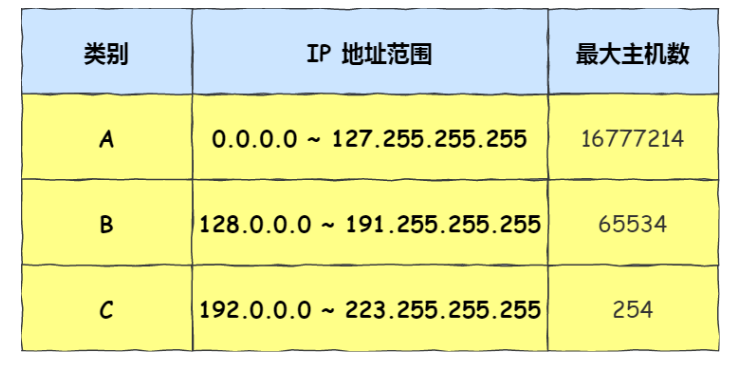
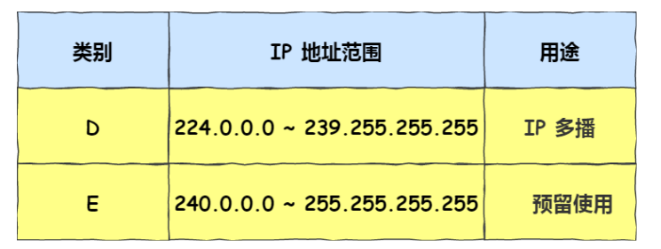
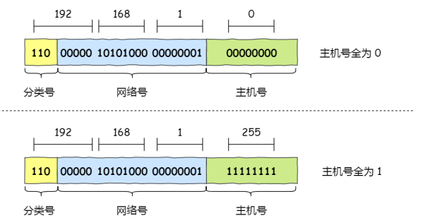
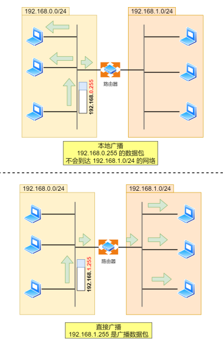

# ip地址定义

- 由 32 位二进制数组成，IP 地址在计算机是以二进制的⽅式处理的

- 32位ip地址，分为四组，再将每组转为十进制

# ip地址分类

- A类地址：**前8位是网络号（第一位为0）**，后24位是主机号，A类地址占总地址的50%
- B类地址：**前16位是网络号（第一位为1，第二位为0）**，后16位是主机号，B类地址占总地址的25%
- C类地址：**前24位是网络号（第一位为1，第二位为1，第三位为0）**，后8位是主机号
- D类地址：**前三位为1**，后28位为组播地址，没有主机地址，用于多播
  - 多播是将包发送给特定组内的所有主机
  - 224.0.0.0 ~ 224.0.0.255 为预留的组播地址，只能在局域⽹中，路由器是不会进⾏转发的
  - 224.0.1.0 ~ 238.255.255.255 为⽤户可⽤的组播地址，可以⽤于 Internet 上
  - 239.0.0.0 ~ 239.255.255.255 为本地管理组播地址，可供内部⽹在内部使⽤，仅在特定的本地范围内有效

- E类地址：**前四位为1**，后28位留用
- 
- 

- 

- IP地址的主机号全为0的网络地址名为**子网网络地址**，代表这个网络段本身
- IP地址的主机号全为1的地址是**广播地址**，专门用于同时向网络中所有地址发送数据的资治
  - 当发出一个目的地址为10.255.255.255 的分组（封包）时，它将被分发给该网段上的所有计算机
  - 用于在同⼀个链路中相互连接的主机之间发送数据包
  - 分为本地广播（在本网络内广播）和直接广播（在不同网络之间广播）
  - 

分离网络号和主机号的两种方法

- 子网掩码
- CIDR
  - ⽐如 10.100.122.2/24，这种地址表示形式就是 CIDR，/24 表示前 24 位是网络号，剩余的 8 位是主机号
  - 表示形式 a.b.c.d/x ，其中 /x 表示前 x 位属于网络号， x 的范围是 0 ~ 32 ，这就使得 IP 地址更加具有灵活性

# 公有ip和私有ip

- 
- 其中127.x.x.x是被保留的回环地址（就是本机地址）

# IP分类的优缺点

优点

- 简单明了，选路（基于网络地址）简单

缺点

- 同一网络下没有层次
