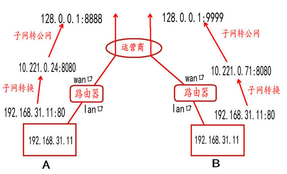

# ip地址定义

- 由 32 位二进制数组成，IP 地址在计算机是以二进制的⽅式处理的

- 32位ip地址，分为四组，再将每组转为十进制

# ip地址分类

- A类地址：**前8位是网络号（第一位为0）**，后24位是主机号，A类地址占总地址的50%
- B类地址：**前16位是网络号（第一位为1，第二位为0）**，后16位是主机号，B类地址占总地址的25%
- C类地址：**前24位是网络号（第一位为1，第二位为1，第三位为0）**，后8位是主机号
- D类地址：**前三位为1**，后28位为组播地址，没有主机地址，用于多播
  - 多播是将包发送给特定组内的所有主机
  - 224.0.0.0 ~ 224.0.0.255 为预留的组播地址，只能在局域⽹中，路由器是不会进⾏转发的
  - 224.0.1.0 ~ 238.255.255.255 为⽤户可⽤的组播地址，可以⽤于 Internet 上
  - 239.0.0.0 ~ 239.255.255.255 为本地管理组播地址，可供内部⽹在内部使⽤，仅在特定的本地范围内有效

- E类地址：**前四位为1**，后28位留用
- 
- 

- 

- IP地址的主机号全为0的网络地址名为**子网网络地址**，代表这个网络段本身
- IP地址的主机号全为1的地址是**广播地址**，专门用于同时向网络中所有地址发送数据的资治
  - 当发出一个目的地址为10.255.255.255 的分组（封包）时，它将被分发给该网段上的所有计算机
  - 用于在同⼀个链路中相互连接的主机之间发送数据包
  - 分为本地广播（在本网络内广播）和直接广播（在不同网络之间广播）
  - 

分离网络号和主机号的两种方法

- 子网掩码
- CIDR
  - ⽐如 10.100.122.2/24，这种地址表示形式就是 CIDR，/24 表示前 24 位是网络号，剩余的 8 位是主机号
  - 表示形式 a.b.c.d/x ，其中 /x 表示前 x 位属于网络号， x 的范围是 0 ~ 32 ，这就使得 IP 地址更加具有灵活性

# 公有ip和私有ip

- 
- 其中127.x.x.x是被保留的回环地址（就是本机地址）

# IP分类的优缺点

优点

- 简单明了，选路（基于网络地址）简单

缺点

- 同一网络下没有层次

# 八股

## 有了mac地址为什么还需要ip地址？

- 参考：https://www.zhihu.com/question/21546408
- 在网络比较小的时候，我们可以用一个交换机记录网络内所有的主机的mac地址，发送数据的时候直接发给交换机，通过地址的映射，再将数据传给目的主机即可
- 而随着网络的越来越大，一个事实就是单个交换机可能无法存储这个大的地址映射，因为需要借助路由器
  - 即交换机的数据传给路由器，路由器再分配给对应的交换机
- 可问题是，路由器如何对交换机的地址进行映射转发呢？首先要了解的是，交换机或是说各个设备的mac地址其实是没有规律的，很难说用一个统一归一的方法将数据包进行分类
  - 而且，还要面临的是海量的mac地址，以及这些mac地址会直接捣乱此时路由器上的顺序
  - 同时，mac地址都是烧在网卡上了的，无法改变
- 所以，为了能够归一化的管理设备，采用ip地址（ip以及内外网）对设备进行分配
- 也就是说，我们将数据直接发给路由器，接着让路由器帮我转发即可

路由器是如何转发发的？

- 如果源 IP 与目的 IP 处于一个子网，直接将包通过交换机发出去。
- 如果源 IP 与目的 IP 不处于一个子网，就交给路由器去处理
- 将源 IP 与目的 IP 分别同这个子网掩码进行**与运算，相等则是在一个子网，不相等就是在不同子网**

- 那路由器是如何知道当前的数据要给到哪一个子网呢？
- 通过路由表（是通过路由算法计算得来的）

主机是如何把数据传给路由器的？

- 实际上，我们的主机都是将数据传给默认网关（一个在主机上设置好了的ip地址）
- 而这个默认网关是路由器，还是主机，都无所谓，只要是个有mac地址的就行了

理解一下ip地址和mac地址的关系

背景：

- 传输过程中，网络层的数据（目的ip端口）其实是会发生变化的

- 目标：把数据从当前主机发送到目的ip地址的主机上
- 过程：
  - 当前主机将数据发送给默认网关（注意，默认网关可以是主机，也可以是路由器，对于当前主机来说，只要把数据传送出去即可），而如何才能知道默认网关的mac地址，就需要arp支持
  - 接着，如果是主机收到数据，那么它就会发给它对应的默认网关；如果是路由器收到数据，那么它就会根据目的ip地址查询对应的路由表，然后转发到对应的端口

- 那么在这一层，ip地址的作用，其实是为了更好的管理网络环境（mac地址不变且不方便管理，因此需要一个统一的方法对网络进行管理），mac地址是为了能在设备和设备之间进行传输

- 当年设计 IP 地址的目的是什么呢？当年设计出 IP 地址这个东西，就是因为随着网络中的设备逐渐增多，人们发现路由（也就是寻找数据包从发送方到接收方的路径）变得越来越困难了。于是人们想了一个办法，就是把网络划分成很多个子网。这样，在路由的时候，路由器可以把其他子网看成一个整体来进行计算。对于目的地在其他子网的数据包，路由器只需要让数据包到达那个子网即可，而剩下的工作就由子网内部解决了。虽然这种方法只能让寻找到的路径接近最优而不保证最优，不过它大大减少了路由器的计算量，利大于弊，所以被采用了。

那么为什么我们需要 IP 地址呢？因为如果我们只用 MAC 地址的话，我们会发现路由器需要记住每个 MAC 地址所在的子网是哪一个（不然每一次收到数据包的时候路由器都要重新满世界地去找这个 MAC 地址的位置）。而世界上有248个 MAC 地址，这就意味着即使我们给每个 MAC 地址只留 1 字节的储存空间，每个路由器也需要 256 TB 的内存！这显然是不可能实现的。

这就是我们需要 IP 地址的原因了。和 MAC 不同的是，IP 地址是和地域相关的。对于位于同一个子网上的设备，我们给他们分配的 IP 地址前缀都是一样的。这个前缀就像邮政编码一样。这样，路由器过 IP 地址的前缀就能知道这个设备在哪个子网上了。现在，路由器只需要记住每个子网的位置即可，大大减少了路由器所需要的内存。

既然 IP 地址不能去掉，那么能不能去掉 MAC 地址呢？也不能。因为 IP 地址是要设备上线以后，才能根据他进入了哪个子网来分配的，在设备还没有 IP 地址的时候（或者分配 IP 地址的过程中），我们还需要用 MAC 地址来区分不同的设备。

总之，MAC 地址就像自己的 ID 号，而 IP 地址就像带着邮政编码的住址，各有各的用途。所以我们需要两个地址，缺一不可。

https://www.zhihu.com/question/21546408

数据是如何在网络中传递的    https://blog.csdn.net/yebour/article/details/103459300

- 在内网中：
  - 在整个内网中跨域访问的过程中，链路层的数据帧源mac和目的mac是一直在变的
  - 在整个内网中跨域访问的过程中，网络层的ip数据包源ip和目的ip一直没有改变(跨域的过程源ip是可以修改的，这取决于我们是否开启了NAT转换，本例中我们是没有开启的，但目的ip是不能变的)
- 在跨网段中：
  - 在整个跨域访问外网的过程中，链路层的数据帧源mac和目的mac是一直在变的
  - 在整个跨域访问外网的过程中，网络层的ip数据包目的ip是一直不会变的，而在顶级路由器处需要把源ip转为公网ip使其可以正常上网(次顶级的路由器也可以修改数据包的源Ip，取决于是否开启NAT转换，本例中没有开启NAT)

https://blog.csdn.net/u011041241/article/details/109574509

**NAT**，在路由器上安装，当在专用网内部的一些主机本来已经分配到了本地IP地址（即仅在本专用网内使用的专用地址），但又想和因特网上的主机通信（并不需要加密）时，可使用NAT方法

将局域网的内网地址转换为公网地址，对外通信

端口映射：

- 内网：一般说的局域网
- 外网：局域网通过一台服务器或是一个路由器对外连接的网络，这个IP地址是惟一的。也就是说内网里所有的计算机都是连接到这一个外网IP上，通过这一个外网IP对外进行交换数据的。也就是说，一个局域网里所有电脑的内网IP是互不相同的,但共用一个外网IP。（用ipconfig/all查到的IP是你本机的内网IP；在www.ip138.com上看到的是你连接互联网所使用的IP，即外网）

- 你在内网的机子在上网时，都是在向网关发出请求，再由网关（一般为路由器）用外网IP转到INT网上
- 接受数据后，再分发到你的内网IP上

- 一个很有趣的现象就是：我们的ip（内网地址）都是相同的，但百度是如何辨别我们具体是哪个client呢？

由此要引入公网ip和内网ip

- 公有地址(Public address)：由 Inter NIC(Internet Network Information Center 因特网信息中心)负责。这些 IP 地址分配给注册并向Inter NIC提出申请的组织机构，公有 IP 全球唯一，通过它直接访问因特网(直接能上网)
- 私有地址(Private address)：属于非注册地址，专门为组织机构内部使用，说白了，私有 IP 不能直接上网
- 一个事实：我们用运营商上网，得到的都是私有（局域网）ip，运营商才有真正的公网ip
- 而我们都是用私网ip去访问公网ip，公网ip是如何辨别的呢？
- 因此要引入**端口映射**

- 端口映射是 NAT 的一种，它将外网主机的 IP 地址的一个端口（可以认为是该局域网对外的ip地址）  映射到  内网中一台机器，提供相应的服务。当用户访问该 IP 的这个端口时，服务器自动将请求映射到对应局域网内部的机器上
  - 简言之：就是将内网的机器映射为对外ip的一个端口号，那么我们的内网机器对外访问的时候，表现就是当前外网ip的端口

路由器：

- 至少有两个端口：WAN 口和 LAN 口
  - WAN：接外部 IP 地址用，通常指的是出口，转发来自内部 LAN 接口的 IP 数据包，这个口的 IP 是唯一的
  - LAN：接内部 IP 地址用，LAN 内部是交换机

- 
- 内网机器A的内网地址是192.168.31.11:80，经过路由器的端口映射为10.221.0.24:8080
- 然后再在运营商处再进行一次端口映射，转化为128.0.0.1:8888
