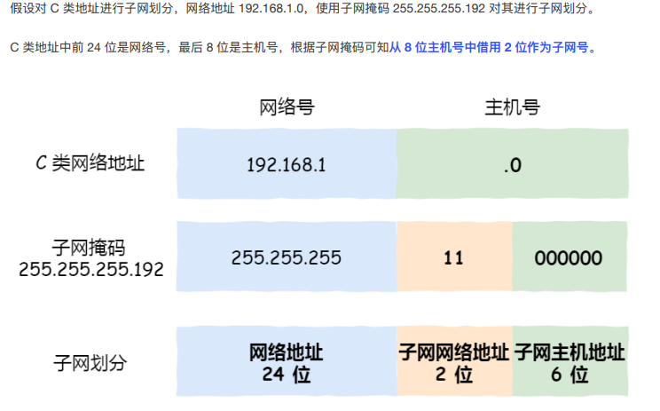

# 定义

- 又名网络掩码，地址掩码，子网络遮罩
- 用途：利用子网掩码将地址分为网络地址和主机地址，用于标识主机处于的子网以及主机号
  - 将一个大的IP网络划分为若干小的子网络
  - 说明该ip地址是在局域网上还是在广域网上
  - 两个ip地址及其对应的子网掩码，可以判断这两个ip地址是不是在同一网段上

- PS：子网内可以直接通信，跨子网不能直接通信（子网间通信应该使用路由器；所以跨子网的数据）

# 组成

- 子网掩码是由一串1和0组成的32位长度的地址，其中的1和0都是各自连续的

- 左边是网络位，用二进制数字“1”表示，1的数目等于网络位的长度

- 右边是主机位，用二进制数字“0”表示，0的数目等于主机位的长度

- 目的是为了让掩码与IP地址做按位与运算时用0遮住原主机数，而不改变原网络段数字

- 特殊的子网掩码
  - 主机号全为1的时候表示该网络的广播地址
  - 全为0时表示该网络的网络号

# 使用方法

- 将计算机十进制的IP地址和子网掩码转换为二进制的形式，然后进行二进制“与”(AND)计算
- 如果得出的结果是相同的，那么这两台计算机就属于同一网段
- 否则就不是同一网段的

# 为什么划分子网

- 减少了网络流量，子网定义了一个网络最大的广播空间（受限广播），可以减少网络流量
- 提高网络性能，如果不划分子网，那么我们的网络将是一个巨大的、扁平的网络空间，这将导致网络性能下降。（寻址变慢了）
- 便于网络管理。分层次的网络可以更加方便网络管理员对于网络的管理，就类似于学校要分年级，年级要分班。

- 背景
  - 总体来说，划分子网不但没有增加可用IP地址，而且减少了可用IP地址，因为每个子网中的全0网络地址和全1广播地址均不能作为主机ip来使用

- 如果不划分子网，那么每个路由器中路由表中信息量极大，会导致速度慢，性能差
  - 划分子网后，减少了广播所带来的负面影响，提高了整体性能

- 对于一些针对特定网段进行广播传输的事件，如果没有子网，那么就会极大的浪费资源
- 节省了ip资源
- 提高了安全性
- 易于维护

- 子网掩码决定了某个IP地址的网络号与主机号是什么，IP地址是要搭配子网掩码使用的

- 子网掩码不能割裂出来看。

  子网掩码、默认网关、MAC地址是需要一起解释的东西。

  1 计算机发送数据报的时候，知道对方IP是不够的，必须要知道接受者的MAC地址才可以。数据链路层上是没有IP地址概念的，只有发送者与接收者的MAC地址。

  2 MAC地址与IP地址的关系，在以太网上通过ARP维护。ARP简单的工作原理为：

  2.1 当有新设备加入网络时，会主动广播自己的MAC与IP。

  2.2 当接收到2.1的信息的时候，本机建立一张对照表维护这个信息。

  2.3 当需要发送数据报给一个IP时，到2.2建立的表中查询对应的MAC并发送。当查询不到信息的时候，广播一个查询申请，要求指定的IP的主机执行2.1动作，并在稍后重新执行本步骤。

  3 子网掩码结合本地IP地址后，用来确定目标IP是否在“逻辑上”与本计算机在同一个网络内（不管实际物理情况）。当目标地址同网（逻辑同网，即两个IP在与子网掩码进行AND计算后得出的网络名称相同），根据2.3策略直接发送数据；当目标地址不同网（逻辑不同网，即两个IP在与子网掩码进行AND计算后得出的网络名称不同），则根据2.3策略但将数据报发往默认网关IP对应的主机，由其负责路由代发（*）。

  （*）默认网关为一个默认路由，如果有更明确的路由记录，则直接发往路由指向的目标主机。

- 子网掩码的作用：确定ip地址的网段

- 子网掩码的作用就是用来告诉主机有哪些ip地址是跟自己在同一个广播域里，广播地址又是什么。

  这样当主机与同一个广播域里的其他主机通讯时就可以直接通讯，如果不在同一个广播域里，就发给默认网关

### 为什么要分离网络号和主机号

- 因为两台计算机要通讯，⾸先要判断是否处于同⼀个⼴播域内，即网络地址是否相同。如果网络地址相同，表明接受方在本网络上，那么可以把数据包直接发送到⽬标主机
- 路由器寻址⼯作中，也就是通过这样的⽅式来找到对应的网络号的，进⽽把数据包转发给对应的网络内

### 子网划分

- 利用子网掩码分离网络号和主机号，再将主机号分为子网网络地址和子网主机地址（方便路由器跳转发送）
- 
- 
