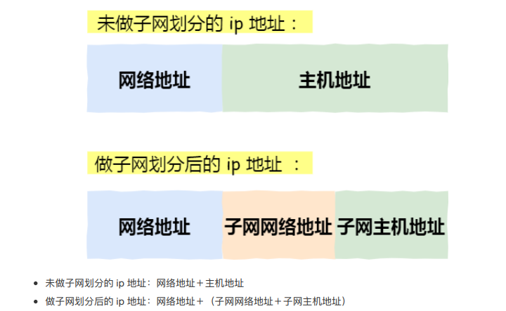

# 定义

- 又名网络掩码，地址掩码，子网络遮罩
- 用途：利用子网掩码将主机地址分为子网网络地址和子网主机地址，从而判断两个ip地址是否在同一个网段（子网）上
  - 子网内可以直接通信，跨子网不能直接通信（子网间通信应该使用路由器）
  - **用于区分给定ip是否属于当前子网，从而决定数据的走向**
  - PS：这也很好的解释了为什么要区分子网网络地址和子网主机地址，即**利用子网掩码将地址进行更细致的划分，从而方便分层管理**

- 
- 

# 组成

- 子网掩码是由一串1和0组成的32位长度的地址，其中的1和0都是各自连续的

- 左边是网络位，用二进制数字“1”表示，1的数目等于网络位的长度

- 右边是主机位，用二进制数字“0”表示，0的数目等于主机位的长度

- 目的：为了让掩码与IP地址做按位与运算时用0遮住原主机地址，而不改变原网络地址

- 特殊的子网掩码
  - 主机号全为1表示该网络的广播地址
  - 主机号全为0表示该网络的网络号

# 使用方法

- 将两个IP地址转为二进制，然后和其中的一个子网掩码进行与（and）运算
- 如果两个ip地址与得到的结果都相同，那么那么这两台计算机就属于同一网段；否则就不是同一网段的

# 为什么划分子网

背景

- 划分子网不但没有增加可用IP地址，而且减少了可用IP地址（因为每个子网中的全0网络地址和全1广播地址均不能作为主机ip来使用）

优点

- 减少了网络流量，子网定义了一个网络最大的广播空间（受限广播）
  - 如果不划分子网，那么每个路由器中路由表中信息量极大，会导致速度慢，性能差
  - 划分子网后，减少了广播所带来的负面影响，提高了整体性能（比如说我想给局域网内的主机发送数据，交换机通过子网掩码一下子就判断到是在子网内的，就可以提供性能，直接发送给target，而不是任由其在网络中肆游）

- 提高网络性能，如果不划分子网，那么我们的网络将是一个巨大的、扁平的网络空间，这将导致网络性能下降（寻址变慢了）
- 便于网络管理。分层次的网络可以更加方便网络管理员对于网络的管理，就类似于学校要分年级，年级要分班

- 对于一些针对特定网段进行广播传输的事件，如果没有子网，那么就会极大的浪费资源
- 提高了安全性
- 易于维护

# 有了子网掩码后数据的传输过程

- 计算机发送数据报的时候，知道对方IP是不够的，必须要知道接受者的MAC地址才可以。数据链路层上是没有IP地址概念的，只有发送者与接收者的MAC地址

- MAC地址与IP地址的关系，在以太网上通过ARP维护。ARP简单的工作原理为：
  - 当有新设备加入网络时，会主动广播自己的MAC与IP
  - 当接收到2.1的信息的时候，本机建立一张对照表维护这个信息
  - 当需要发送数据报给一个IP时，到2.2建立的表中查询对应的MAC并发送。当查询不到信息的时候，广播一个查询申请，要求指定的IP的主机执行2.1动作，并在稍后重新执行本步骤

- **子网掩码结合本地IP地址后，用来确定目标IP是否在“逻辑上”与本计算机在同一个网络内（不管实际物理情况）。当目标地址同网（逻辑同网，即两个IP在与子网掩码进行AND计算后得出的网络名称相同），根据2.3策略直接发送数据；当目标地址不同网（逻辑不同网，即两个IP在与子网掩码进行AND计算后得出的网络名称不同），则根据2.3策略但将数据报发往默认网关IP对应的主机，由其负责路由代发（*）**
  - （*）默认网关为一个默认路由，如果有更明确的路由记录，则直接发往路由指向的目标主机
