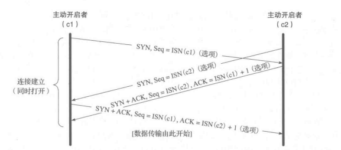
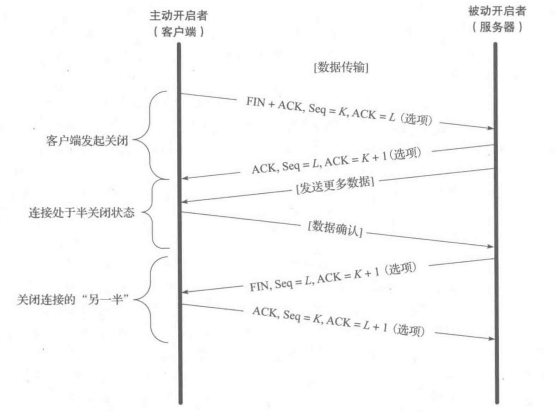

# 三次握手

一开始客户端和服务端都是 CLOSE 状态，然后服务端监听某个端口，进入 LISTEN 状态

## 第一次握手

主动开启者（通常称为客户端）发送一个 SYN 报文段，并指明自己想要连接的端口号和它的客户端初始序列号

客户端随机初始化序列号，并将 SYN 标志位置为1

不包含应用层数据

客户端发送第一次握手后处于 **SYN_SENT** 状态，服务端接收第一次握手后处于 **SYN_RCVD** 状态

## 第二次握手

服务端发送自己的 SYN 报文段作为响应，并包含了它自己的初始序列号

为了确认客户端的 SYN，服务器将其收到的初始序列号加一作为 ACK（确认应答号）的返回值

如果出现丢包的现象，就会重传

服务端随机初始化报文的序列号（记作 ISN(s)），并把 SYN 和 ACK 都设为1

不包含应用层数据

发送第二次握手时服务端处于 SYN-RCVD 状态，接收第二次握手时客户端处于 ESTABLISHED 状态

在第二次握手的时候，如果收到了主动打开方发来的重置信息而非 ACK，那么就会返回到 LISTEN 状态，并且等待另一个连接请求的到来

## 第三次握手

客户端->服务端

为了确认服务器的 SYN，客户端将收到的初始序列号加一作为返回的 ACK 数值

将 ACK 设为1

将收到的来自服务端的序列号+1，作为自己的确认应答号

可以携带应用层数据

发送后，客户端处于 ESTABLISHED状态 ；二服务端收到报文后，也会处于 ESTABLISHED 状态

## 同时三次握手

需要交换 **4 次**报文段（因为通信双方都扮演了客户端和服务端的角色）

## 连接建立超时

如果要建立连接的服务器关闭了，TCP会为了建立连接频繁的发送 SYN 报文段

第一次间隔 2s，第二次间隔 4s，第三次间隔 8s，称为指数回退

一些系统可以配置发送 SYN 的次数，但是通常选择一个相对较小的数值 5

在 linux 中，系统配置变量 `net.ipv4.tcp_syn_retries` 表示了在一次主动申请中尝试重新发送 SYN 报文段的最大次数

## 第一次握手失败

如果第一次的 SYN 传输失败，两端都不会申请资源

如果一段时间后之前的 SYN 发送成功了，这时客户端只会接收对方最后发送的 SYN 的 SYN+ACK 回应，其他的一概忽略

服务端也是如此，会将之前多申请的资源释放了

客户端：此时将会触发超时重传机制，一般不同版本的操作系统设置的超时时间不同，且一般超时时间都会写死在内核中，修改也比较麻烦，一般超时时间设置有 1s、3s 等（每次超时时间是上次超时时间的 2 倍）

## 第二次握手失败

客户端：会认为第一次握手失败，从而重传 SYN

服务端：会启动超时重传机制，重新传送 SYN-ACK 报文（重传次数默认为 5 次）

如果服务端发送的 SYN+ACK 传输失败，客户端由于没有收到这条响应，不会申请资源

虽然服务端申请了资源，但是迟迟收不到来自客户端的 ACK，也会将该资源释放

## 第三次握手失败

如果第三次握手的 ACK 传输失败，会导致服务端迟迟没有收到 ACK，就会释放资源

客户端：认为自己已经连接好了，就会给服务端发送数据，而服务端由于没有收到第三次握手，就会以 RST 包对客户端响应（**ACK是不会重传的**）

服务端：会因为没有收到客户端的 ACK 多次发送 SYN+ACK（重传次数是可以设置的），如果最后还是没有收到客户端的 ACK，则释放资源

## 八股

### 为什么要三次握手

一言蔽之，通过三次握⼿**能防止历史连接的建立**，**能减少双方不必要的资源开销**，**能帮助双方同步初始化序列号**

能防止历史连接的建立，**为了防止旧的重复连接初始化造成混乱**（主要原因）

试想下如下场景，假设是两次握手的话：

- 如果第一次报文超时，就会发送第二次报文，但是第一次报文却又先到达服务端，此时服务端又发送第二次报文
- 客户端在收到第一次报文后就直接确立连接了，但这不是我们想要的（因为这是历史连接，是过期或超时了的）

而如果是三次握手才确立连接的话，那么客户端通过上下文发现这是历史或超时了的连接，就直接发送 RST 报文中止这次连接

**避免资源的浪费**

试想下如下场景，假设是两次握手的话，第二次握手就确定连接了

但是，如果客户端发送的 SYN 请求在网络中阻塞，就会重新发送，而这些阻塞的请求后续服务端逐渐收到，服务端就会因此创建很多连接（但是这些连接都是冗余无效的），因此造成了资源不必要的浪费

同步双方初始序列号

- 序列号的作用
  - 接收方可以去除重复的数据
  - 接收方可以根据数据包的序列号按序接受
  - 可以标识发送出去的数据包中，哪些是已经被对⽅收到的
- 对于发送和接受的双方，都要确保自己发送的数据都能被对方接受
- 所以，当客户端发送携带「初始序列号」的 SYN 报⽂的时候，需要服务端回⼀个 ACK 应答报⽂，表示客户端的 SYN 报⽂已被服务端成功接收
- 那当服务端发送「初始序列号」给客户端的时候，依然也要得到客户端的应答回应
- 这样一来一回，就是四次握手，而其中的两次可以合并，所以就是三次握手了
- 
- 所以可以提炼为，三次握手是为了确保双方的发送和接受能力都没有问题

### 为什么第一二次握手不能携带数据，而第三次可以

第一次握手如果可以携带数据的话：若有人攻击服务器，就会从第一次握手的 SYN 报文中投放大量数据，服务器需要花费很多时间和内存空间来接收这些报文，**会使服务器更容易受到攻击**

第二次握手不能携带数据是因为握手还没有完成，没建立链接，不能发送数据

而对于第三次的话，此时客户端已经处于 **established** 状态，并且也已经知道服务器的接收、发送能力是正常的了**，所以携带数据是可以的**

- 能够发出第三次握手报文的主机，肯定接收到第二次（服务器）握手报文
- 因为伪造IP的主机是不会接收到第二次报文的
- 所以能够发出第三次握手报文的，应该是合法的用户

# 四次挥手

四次挥手中每个方向有一个 ACK 和 FIN

主动关闭连接的才会有 TIME_WAIT 状态

TCP 协议规定，通信的任何一方在完成数据发送任务后都能够发送一个 FIN

**四次挥手的 FIN 都要占用序列号**，但是其中不会有数据

## 第一次挥手

客户端打算关闭连接，此时会发送⼀个 TCP ⾸部 FIN 标志位被置为 1 的报⽂，之后客户端进⼊ FIN_WAIT_1 状态
- 客户端打算不发送信息并关闭连接，但是要先通知服务端
- 因为可能服务端后续需要发送一些信息，此时客户端是可以接受信息的

当前报文还可以包含一个 ACK 段，用于确认对方最近一次发送来的数据

## 第二次挥手

服务端收到该报⽂后，就向客户端发送 ACK 应答报⽂（服务端知道了客户端要关闭连接了，所以发送 ACK 报文）
- 服务端进⼊ CLOSED_WAIT 状态
- 客户端在收到服务端的 ACK 应答报⽂后，之后进⼊ FIN_WAIT_2 状态

连接的被动关闭者将 ACK 的数值加 1 作为响应的 ACK 值，以表明它已经成功接收到主动关闭者发送的 FIN

此时上层的应用程序会被告知连接的另一端已经提出了关闭的请求（此时被动关闭的一方是可以向主动关闭的一方发送数据的）

通常，这会导致应用程序发起自己的关闭操作，接着，被动关闭者将身份转变为主动关闭者，并发送自己的 FIN，该报文段的序列号为 L（这里就属于第三次挥手的内容了）

FIN_WAIT_2 状态不会持续太久，内核参数 `tcp_FIN_timeout` 控制其时长，默认是 60s 

CLOSE_WAIT 状态表示的就是内核在等待应用进程调用 `close()` 来关闭连接，至于应用进程什么时候 close，这完全取决于程序

所以，从理论上来讲，只要被动关闭端不断电，进程不退出，那么 CLOSE_WAIT 状态就会一直持续下去

CLOSE_WAIT 的最大持续时间从理论上来讲可以达到无限长

## 第三次挥手

等待服务端处理完数据后，服务端向客户端发送 FIN 报⽂，之后服务端进⼊ LAST_ACK 状态

服务端把信息都发送处理好了之后，就告诉客户端可以彻底关闭了

## 第四次挥手

客户端收到服务端的 FIN 报⽂后，回⼀个 ACK应答报⽂，之后进⼊ TIME_WAIT 状态

服务器收到了 ACK 应答报⽂后，就进⼊了 CLOSED 状态，⾄此服务端已经完成连接的关闭

客户端在经过 **2MSL** ⼀段时间后，⾃动进⼊ CLOSED 状态，⾄此客户端也完成连接的关闭
- 客户端知晓后，就关闭，并通知服务端

为了连接的关闭，最后发送的报文还包含一个 ACK 用于确认上一个 FIN

如果 FIN 丢失，那么发送方将重新传输直到接收到一个 ACK 确认为止

## 同时四次挥手

## 半关闭状态

指仅关闭数据流的一个传输方向
- 两个半关闭操作合在一起就能关闭整个连接

我已经完成了数据的发送工作，并发送一个 FIN 给对方，但是我仍然希望接收来自对方的数据，直到它发送一个 FIN 给我

调用 shutdown 代替 close 即可

## 第一次挥手失败

客户端会开启重传流程，重传次数由内核参数 `tcp_orphan_retries` 控制

当第一次挥手的 FIN 报文段达到最大重传次数后，客户端将停止重传，直接进入 CLOSE 状态

## 第二次挥手失败

客户端会重传 FIN 报文，直到收到 ACK 报文，或达到 FIN 的最大重传次数

因为 ACK 是不会重传的（等价于第一次挥手失败）

## 第三次挥手失败

服务端重传 FIN 报文

## 第四次挥手失败

因为 ACK 是不会重传的，所以服务端会在超时并未收到 ACK 后重传 FIN（等价于第三次挥手失败）

## 八股

### 为什么要四次挥手，可以三次挥手吗

**TODO**：这里的 client 和 server，我理解和三次握手的 client 和 server 不是同一个角色

关闭连接时，client 向 server 发送 FIN ，表示 client 不再发送数据（但还能接收数据）

server 收到 client 的 FIN 报⽂时，先回⼀个 ACK 报⽂（因为服务端可能还有数据需要处理和发送；即使没有数据要处理，也要告诉一声给客户端）

- 此时仅代表 client 就不会再发送数据，client -> server 这一个方向断开
- 而如果 server 还有数据要发送，就继续发送，即 server -> client 这个方向还没有断

等 server 不再发送数据时，才发送 FIN 报⽂给 client 表示同意现在关闭连接

- 在给 client 发送 FIN 后，才表示 server -> client这个方向断开了

最后，收到客户端发来的 ACK 之后，就可以真正断开了

其实在实际的网络环境下是**可以三次挥手**的：在一些抓包的情况下，可以看到 server 会将的 ACK 和 FIN 合并发送

- 即**延迟确认**，就是 Server 对 Client 的 FIN 报文的确认延迟到和 Server 的 FIN 一起发
- 这种情况下，server 在收到第一次挥手后，没有任何其他的数据需要再发送了
- 
- 参考：http://intronetworks.cs.luc.edu/current1/uhtml/tcp.html

### 为什么需要 TIME_WAIT

《unix网络编程》给出的答案

**优雅的关闭 TCP 连接，也就是尽量保证被动关闭的一端收到它自己发出去的 FIN 报文的 ACK 确认报文**

- 为了在一般的情况下保证报文的收到，所以才设置 2MSL
- 而**尽量（非常重要）**也说明了如果FIN一直重传且主动关闭方收不到，那么主动关闭方会直接关闭而不是继续等待

**处理延迟的重复报文，这主要是为了避免前后两个使用相同四元组的连接中的前一个连接的报文干扰后一个连接**

试想一个比较常见的场景：（unix 网络编程给出的第一个答案，为了在一般的情况下保证报文的收到）

如果没有 TIME_WAIT 或者 TIME_WAIT 太短了，客户端在收到 FIN 发送 ACK 之后立马关闭并开始新的连接

如果 ACK 的发送出现了丢包或者延迟的情况，会直接造成服务端重发 FIN（服务端一直处于 LAST_ACK 的状态）

此时服务端发送的 FIN 会被客户端新的连接给收到，直接结果就是客户端的现有连接断开

因此，客户端需要在发送之后等待一会，目的就是接收服务端重发的 FIN

.png)

造成的两个结果：

1. 服务端的端口和内存资源的浪费
2. 客户端有可能收到服务端的 FIN 报文，造成现有连接的终止

unix网络编程给出的第二个答案：即防止旧连接的数据包

如果不等待，有可能出现：之前重传的数据在某一时间内会被收到，而此时客户端的端口正在和另一个新的服务器进行连接

造成的直接结果就是数据的混乱

防止旧的数据包对后续的连接产生影响，所以需要一个持续 MSL 长度的 TIME_WAIT，保证将那些还在传输的数据在网络中消失，或者说被客户端完全接收

.png)

### 为什么 TIME_WAIT 是 2MSL

**背景**

MSL：报文最大生存时间，代表任何报文段在被丢弃前在网络中被允许存在的最长时间

- 要大于等于 TTL 消耗为 0 的时间
- 影响这个时间的两个因素：IP 数据报拥有 TTL 字段和跳数限制字段

TTL：在 IP 头中，是 IP 数据报可以经过的最大路由数，每经过⼀个处理他的路由器此值就减 1，当此值为 0 则数据报将被丢弃，同时发送 ICMP 报⽂通知源主机（单位：经过路由跳数）

2MSL 的时间是从客户端接收到 FIN 并发送 ACK 后开始计时的

 

既然要等待，那要等待多久呢？

一个很极端的场景：如果服务端第二次及以后重发的 FIN 遇到了网络拥塞（无论如何重传，最终都会在网络中消失，而无法到达对端），那么我们的客户端要一直等下去吗？

所以 TIME_WAIT 需要一个范围限制，所以一般选取比较常见的一种情况进行分析：

 

场景：B 是发送 FIN 报文的，A 是接收 FIN 报文的；A 发出 ACK 后（第四次挥手），等待一段时间 T，确保如果 B 重传 FIN 自己一定能收到

 

分析：

ACK 从 A 到 B 最多经过 1MSL，超过这个时间 B 会重发 FIN

B 重发的 FIN 最多经过 1MSL 到达 A

 

结论：

如果 B 重发了 FIN，且网络没有故障（重发的 FIN 被丢弃或错误转发），那么 A 一定能在 2MSL 之内收到该 FIN，因此 A 只需要等待 2MSL

所以在出现重传的情况下，对于 A 来说，发送 ACK 和收到重复的 FIN 的时间间隔就是 2MSL

 

问题：如果在 A 关闭连接后才接收到重传 FIN（可能网络非常的拥塞），此时 A 应该不会回复 ACK 吧？那么 B 不是会无法正常关闭吗？

- A 关闭了以后，不会回复任何报文了
- B 的确无法正常关闭
- B 会在重试一段时间后关闭连接，且重试的间隔会越来越长

参考：

https://www.zhihu.com/question/67013338

https://cloud.tencent.com/developer/article/1450264

### TIME_WAIT 过多的危害

1. **内存资源占用**，socket 本质上是文件（过多的占用内存）

2. **端口资源的占用**，一个 TCP 连接至少消耗一个本地端口（占满了所有端口资源，则会导致⽆法创建新连接）

# 一些小 tips

**ACK 是不会重传的**
