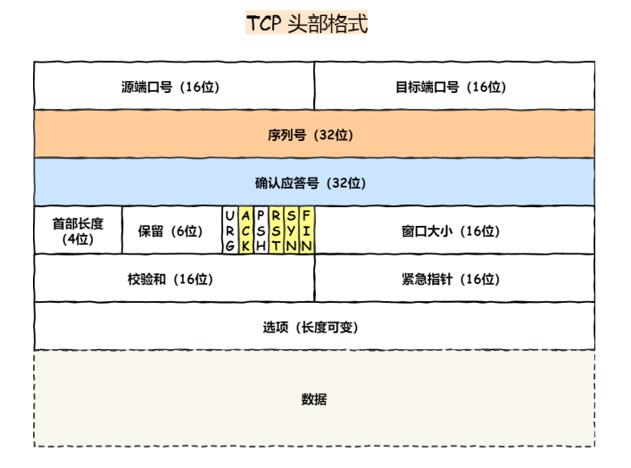

# TCP头部报文

- 

### 序列号

- 背景：TCP报文段在经过网络路由后可能会存在延迟抵达与排序混乱的情况，为了解决这一问题，需要序列号

  - 如果连接由于某个报文段的长时间延迟而被关闭，然后又以相同的4元组被重新打开，那么可以相信延迟的报文段又会被视为有效数据重新进入新连接的数据流中

  - 在建⽴连接时由计算机⽣成的随机数作为其初始值，通过 SYN 包传给接收端主机，每发送⼀次数据，就 「累加」⼀次该「数据字节数」的⼤小。⽤来解决⽹络包乱序问题

- 所以需要避免序列号重叠，降低风险
- 并且如果有人有合适的序列号，ip地址以及端口号，那么就可以伪造出TCP报文
- 现代系统通常采用半随机的方法选择初始序列号
  - linux采用基于时钟的方案，并且针对每个连接为时钟设置随机的偏移量（偏移量是在4元组基础上用加密散列函数得到的）

### 最大段(MSS)

- 最大段大小是指TCP协议所允许的从对方接收到的最大的报文段
- 只记录TCP数据的字节大小，不包括头部
- 默认是536字节
- IPV4模式是1460字节
- 不是TCP通信双方的协商结果，而是一个限定的数值，当通信的一方将自己的最大段大小选项发送给对方时，它表明自己不愿意接受在整个连接过程中接受任何大于该尺寸大报文段
- 是存放在选项里面的
- 当建立一条TCP连接的时候，通信的每一方都要在SYN报文段的MSS选项中说明自己允许的最大段大小

### 确认应答号

- 指下⼀次「期望」收到的数据的序列号，发送端收到这个确认应答以后可以认为在这个序号以前的数 据都已经被正常接收。⽤来解决不丢包的问题

### ACK

- 该位为 1 时，「确认应答」的字段变为有效
- TCP 规定除了最初建⽴连接时的 SYN 包之外该位必须设置为 1

### RST

- 该位为 1 时，表示 TCP 连接中出现异常必须强制断开连接
- 表示是否重置连接。如果 RST=1，说明 TCP 连接出现了严重错误（如主机崩溃），必须释放连接，然后再重新建立连接
- tcp三次握手如何检测rst报文（其实很容易碰上的，因为timeout的情况很常见），emm，header中6个标记位有一个rst字段，直接看出来
- 问题是：已经建立连接之后，服务器发来一个rst报文，客户端如何进行检测的
- https://blog.csdn.net/tianya_lu/article/details/121915855
- https://blog.csdn.net/lianhunqianr1/article/details/121113093

- RST位字段，一个将该字段置位的报文段被称作“重置报文段”
- 一般来说，当发现一个到达的报文段对于相关连接而言是不正常的时候，TCP会发送一个重置报文段

### SYN

- 该位为 1 时，表示希望建⽴连接，并在其「序列号」的字段进⾏序列号初始值的设定

### FIN

- 该位为 1 时，表示今后不会再有数据发送，希望断开连接。当通信结束希望断开连接时，通信双⽅的主机之间就可以相互交换 FIN 位为 1 的 TCP 段

### 首部长度

- 原因：因为报文中有选项的部分，长度会超过20字节

### 选择确认选项

- 背景：采用累计ACK确认，TCP不能正确地确认之前已经接受的数据
  - 由于接收的数据是无序的，所以接收到数据的序列号也是不连续的
  - TCP接收方的数据队列中因此会发现空洞的情况
- 作用：如果TCP发送方能够了解接收方当前的空洞，它就能在报文段丢失或被接收方遗漏时更好地进行重传工作
- SACK包含了接收方已经成功接受的数据块的序列号范围，每一个范围被称作一个SACK块，由一对32位的序列号表示
- 长度是8n+2字节

### 窗口缩放选项

- 窗口缩放选项能够有效地将TCP窗口广告字段的范围从16位增加到30位；另外，使用另一个选项作为这16位数值的比例因子，该比例因子能够使窗口字段值有效地左移
- 该选项只能出现在一个SYN报文段中，因此当连接建立以后比例因子是与方向绑定的

### UTO（用户超时选项）

- 用户超时数值指明了TCP发送者在确认对方未能成功接受数据之前原因等待该数据ACK确认的时间
