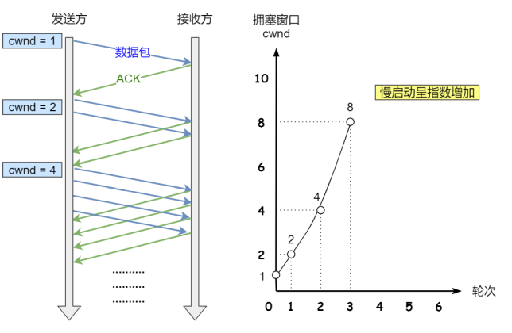
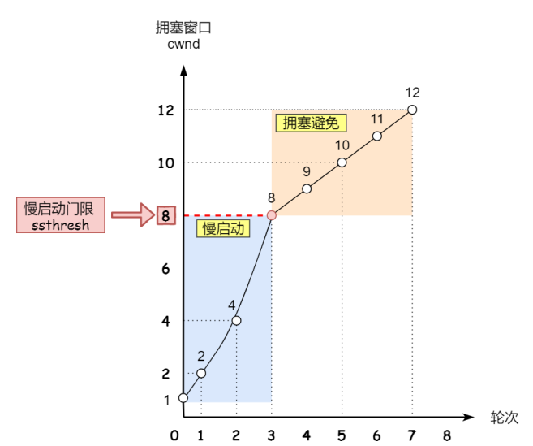
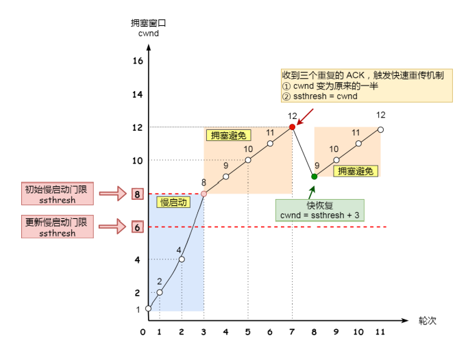

# 拥塞管理

- 背景：在⽹络出现拥堵时，如果继续发送⼤量数据包，可能会导致数据包时延、丢失等，这时 TCP 就会重传数据，但是一重传就会导致⽹络的负担更重，于是会导致更⼤的延迟以及更多的丢包，这个情况就会进⼊恶性循环被不断地放⼤
- 目的：避免发送方的数据填满整个网络
- 发生了超时重传，就认为发生了拥塞
- 拥塞窗口
  - 拥塞窗口cwnd是发送⽅维护的⼀个的状态变化，它会根据⽹络的拥塞程度动态变化的
  - 此时发送窗口的大小为是swnd = min(cwnd, rwnd)，也就是拥塞窗口和接收窗口中的最小值
- PS：没有慢恢复......

## 慢启动

- ⼀点⼀点的提高发送数据包的数量
- 当发送⽅每收到⼀个 ACK，拥塞窗口的大小是指数级增长
- 
- 慢启动门限（ssthresh）：
  - 当 cwnd < ssthresh 时，使⽤慢启动算法
  - 当 cwnd >= ssthresh 时，就会使用拥塞避免算法

## 拥塞避免

- 
- 窗口的增长为线性增长
- 触发重传机制后变为拥塞发生算法

## 拥塞发生

- 发生超时重传的拥塞发生算法
  - .png)
  - 将ssthresh设为cwnd/2
  - cwnd重置为1
  - 进入慢启动
- 发生快速重传的拥塞发生算法
  - cwnd=cwnd/2，变为原来的一半
  - ssthresh = cwnd
  - 进入快速恢复算法

## 快速恢复

- 拥塞窗口 cwnd = ssthresh + 3 （ 3 的意思是确认有 3 个数据包被收到了）
- 重传丢失的数据包
- 如果再收到重复的 ACK，那么 cwnd 增加 1
- 如果收到新数据的 ACK 后，把 cwnd 设置为第⼀步中的 ssthresh 的值，原因是该 ACK 确认了新的数据，说明从 duplicated ACK 时的数据都已收到，该恢复过程已经结束，可以回到恢复之前的状态了，也即再次进入拥塞避免状态
- 