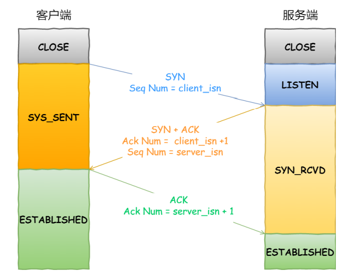
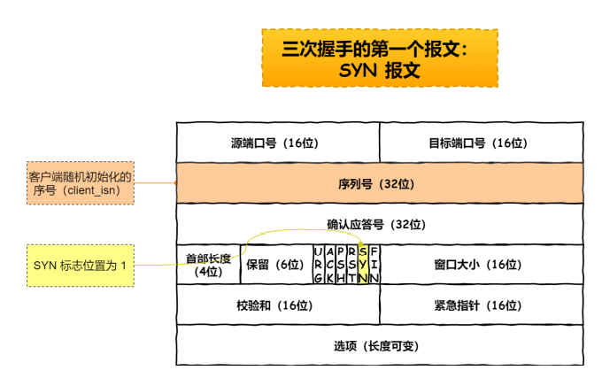
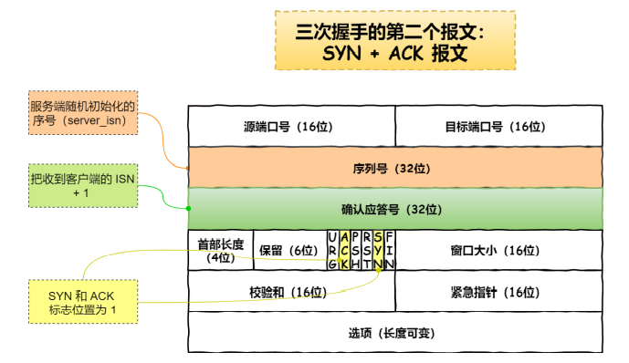
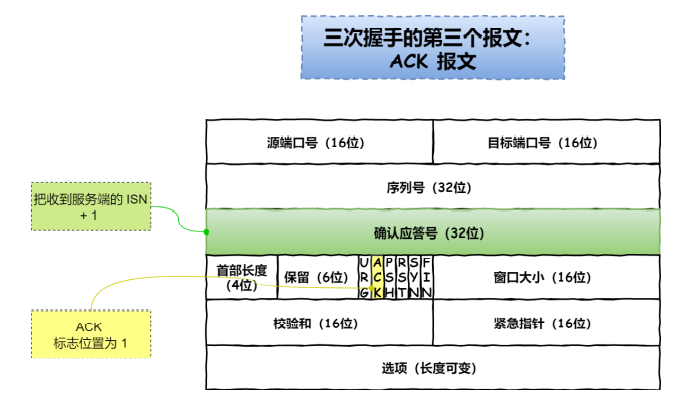
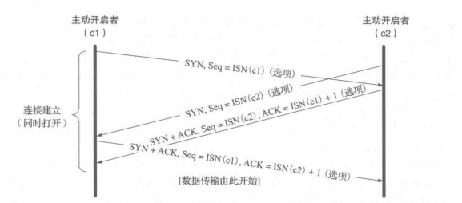
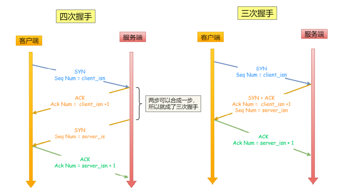
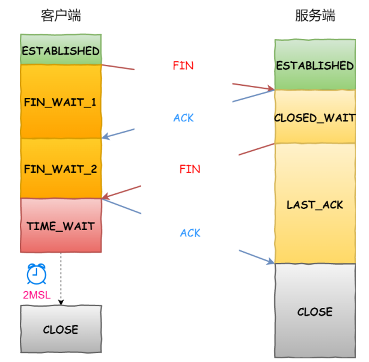
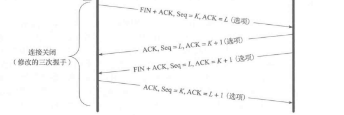
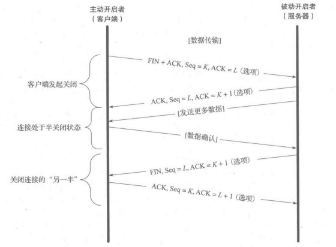
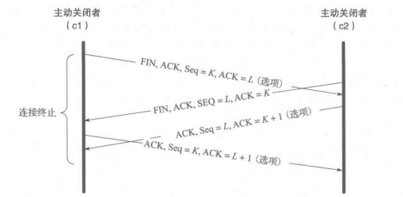

# 三次握手

- 
- 一开始客户端和服务端都是close状态，然后服务端监听某个端口，进入LISTEN状态

### 第一次握手

- 
- 主动开启者（通常称为客户端）发送一个SYN报文段，并指明自己想要连接的端口号和它的客户端初始序列号
- 客户端随机初始化序列号，并将SYN标志位置为1
- 不包含应用层数据
- 客户端发送第一次握手后处于SYN_SENT状态，而服务端接收第一次握手后处于SYN_RCVD状态

### 第二次握手

- 
- 服务端也发送自己的SYN报文段作为响应，并包含了它自己的初始序列号
- 为了确认客户端的SYN，服务器将其收到的初始序列号加一作为ACK（确认应答号）的返回值
- 如果出现丢包的现象，就会重传
- 服务端随机初始化报文的序列号（记作ISN(s)）
- 并把SYN和ACK都设为1
- 不包含应用层数据
- 发送第二次握手时服务端处于SYN-RCVD状态，接收第二次握手时客户端处于established状态
- 在第二次握手的时候，如果收到了主动打开方发来的重置信息而非ACK，那么就会返回到LISTEN状态，并且等待另一个连接请求的到来

### 第三次握手

- 
- 客户端->服务端
- 为了确认服务器的SYN，客户端将收到的初始序列号加一作为返回的ACK数值
- 将ACK设为1
- 将收到的来自服务端的序列号+1，作为自己的确认应答号
- 可以携带应用层数据
- 发送后，客户端处于ESTABLISHED状态；同时，服务端收到报文后，也会处于ESTABLISHED状态

### 同时三次握手

- 
- 需要交换4次报文段（由于通信双方都扮演了客户端和服务端的角色）

### 为什么三次握手

避免历史连接
- 三次握⼿的首要原因是**为了防止旧的重复连接初始化造成混乱**
- 试想一下场景：
  - 如果第一次报文超时，就会发送第二次报文，但是第一次报文却又先到达服务端，此时服务端发送第二次报文
  - 此时如果是两次握手的话，客户端收到报文后就直接确立连接了
  - 这就不是我们想要的（因为这是历史连接，是过期或超时了的）
  - 但，如果是三次握手才确立连接的话，那么客户端通过上下文发现这是历史或超时了的连接，就直接发送RST报文中止这次连接
- 所以最主要原因，就是防止历史连接初始化了连接

同步双方初始序列号

- 序列号的作用
  - 接收方可以去除重复的数据
  - 接收方可以根据数据包的序列号按序接受
  - 可以标识发送出去的数据包中，哪些是已经被对⽅收到的
- 对于发送和接受的双方，都要确保自己发送的数据都能被对方接受
- 所以，当客户端发送携带「初始序列号」的SYN报⽂的时候，需要服务端回⼀个ACK应答报⽂，表示客户端的SYN报⽂已被服务端成功接收
- 那当服务端发送「初始序列号」给客户端的时候，依然也要得到客户端的应答回应
- 这样一来一回，就是四次握手，而其中的两次可以合并，所以就是三次握手了
- 
- 所以可以提炼为，三次握手是为了确保双方的发送和接受能力都没有问题

避免资源的浪费
- 试想一个场景：如果只有两次握手的话，那么会发生什么？第二次握手就要确定连接了
- 但是，如果客户端发送的SYN请求在网络中阻塞，就会重新发送，而这些阻塞的请求后续服务端逐渐收到，服务端就会因此创建很多连接（但是这些连接都是冗余无效的），因此造成了资源不必要的浪费

小结

- 通过三次握⼿**能防止历史连接的建立**，**能减少双方不必要的资源开销**，**能帮助双方同步初始化序列号**

### 为什么第一二次握手不能携带数据，而第三次可以

- 第一次握手如果可以携带数据的话：若有人攻击服务器，就会从第一次握手的SYN报文中投放大量数据，会使服务器花费很多时间　内存空间来接收这些报文，**会使服务器更容易受到攻击**，所以第一次握手不能携带数据
- 第二次握手不能携带数据是因为握手还没有完成，没建立链接，不能发送数据
- 而对于第三次的话，此时客户端已经处于**established**状态，并且也已经知道服务器的接收、发送能力是正常的了**，所以携带数据是可以的**
  - 能够发出第三次握手报文的主机，肯定接收到第二次(服务器)握手报文
  - 因为伪造IP的主机是不会接收到第二次报文的
  - 所以，能够发出第三次握手报文的，应该是合法的用户

### 连接建立超时

- 如果要建立连接的服务器关闭了，TCP会为了建立连接频繁的发送SYN报文段，第一次间隔2s，第二次间隔4秒，第三次间隔8s，称为指数回退
- 一些系统可以配置发送SYN的次数，但是通常选择一个相对较小的数值5
- 在linux中，系统配置变量net.ipv4.tcp_syn_retries表示了在一次主动申请中尝试重新发送SYN报文段的最大次数

# 四次挥手

- 
- 
- 每个方向都有一个ACK和FIN，所以是四次挥手
- 主动关闭连接的才会有TIME_WAIT状态
- TCP协议规定，通信的任何一方在完成数据发送任务后都能够发送一个FIN

### 第一次挥手

- 客户端打算关闭连接，此时会发送⼀个TCP⾸部FIN标志位被置为1的报⽂，之后客户端进⼊FIN_WAIT_1状态
  - 客户端打算不发送信息，关闭连接了，但是要先通知服务端，因为可能服务端后续需要发送一些信息，此时客户端是可以接受信息的
- 连接的主动关闭者发送一个FIN段指明接收者希望看到的自己当前的序列号，FIN段还包含了一个ACK段用于确认对方最近一次发送来的数据

### 第二次挥手

- 服务端收到该报⽂后，就向客户端发送ACK应答报⽂，接着服务端进⼊CLOSED_WAIT状态；客户端收到服务端的ACK应答报⽂后，之后进⼊FIN_WAIT_2状态
  - 服务端知道了客户端要关闭连接了，所以发送ack报文
- 连接的被动关闭者将K的数值加1作为响应的ACK值，以表明它已经成功接收到主动关闭者发送的FIN
- 此时上层的应用程序会被告知连接的另一端已经提出了关闭的请求（此时被动关闭的一方是可以向主动关闭的一方发送数据的）
- 通常，这会导致应用程序发起自己的关闭操作，接着，被动关闭者将身份转变为主动关闭者，并发送自己的FIN，该报文段的序列号为L（这里就属于第三次挥手的内容了）

### 第三次挥手

- 等待服务端处理完数据后，服务端向客户端发送FIN报⽂，之后服务端进⼊LAST_ACK状态
  - 服务端把信息都发送处理好了之后，就告诉客户端可以彻底关闭了

### 第四次挥手

- 客户端收到服务端的FIN报⽂后，回⼀个ACK应答报⽂，之后进⼊TIME_WAIT状态；服务器收到了ACK应答报⽂后，就进⼊了CLOSED状态，⾄此服务端已经完成连接的关闭；客户端在经过2MSL⼀段时间后，⾃动进⼊CLOSED状态，⾄此客户端也完成连接的关闭
  - 客户端知晓后，就关闭，并通知服务端
- 为了连接的关闭，最后发送的报文还包含一个ACK用于确认上一个FIN
- 如果FIN丢失，那么发送方将重新传输直到接收到一个ACK确认为止

### 半关闭状态

- 

- 是指仅关闭数据流的一个传输方向，而两个半关闭操作合在一起就能关闭整个连接
- “我已经完成了数据的发送工作，并发送一个FIN给对方，但是我仍然希望接收来自对方的数据，直到它发送一个FIN给我”
- 调用shutdown代替close即可

### 同时四次挥手

- 

### 为什么四次挥手

- 关闭连接时，客户端向服务端发送FIN时，仅仅表示客户端不再发送数据了但是还能接收数据
- 服务器收到客户端的FIN报⽂时，先回⼀个ACK应答报⽂（因为服务端可能还有数据需要处理和发送）
- 等服务端不再发送数据时，才发送FIN报⽂给客户端来表示同意现在关闭连接
- https://www.zhihu.com/question/50646354/answer/122035678

### 为什么TIME_WAIT是2MSL

- MSL：报文最大生存时间，是任何报⽂在⽹络上存在的最⻓时间，超过这个时间报⽂将被丢弃
- TTL：在IP头中，是IP数据报可以经过的最⼤路由数，每经过⼀个处理他的路由器此值就减1，当此值为0则数据报将被丢弃，同时发送ICMP报⽂通知源主机（单位：经过路由跳数）
- MSL要大于等于TTL消耗为0的时间
- 原因：
  - ⽹络中可能存在来⾃发送⽅的数据包，当这些发送⽅的数据包被接收⽅处理后⼜会向对⽅发送响应，所以⼀来⼀回需要等待2倍的时间
  - 可能被动关闭方没有收到断开连接的ack报文，就会触发超时重传报文，被动关闭方重新发送FIN以后，主动关闭方收到，一来一回正好是2个MSL
- 2MSL的时间是从客户端接收到FIN后发送ACK开始计时的

### 为什么需要TIME_WAIT

防止旧连接的数据包
- .png)
- 如果没有TIME_WAIT或TIME_WAIT太短了的话，例如：之前发送的报文出现了网络延迟，直到下一次三次握手以后才接收到，就会产生数据错乱的问题（如上图）
- 所以才有TIME_WAIT状态，⾜以让两个⽅向上的数据包都被丢弃，使得原来连接的数据包在⽹络中都⾃然消失，再出现的数据包⼀定都是新建⽴连接所产⽣的

保证连接正确关闭

- .png)
- 如果没有TIME_WAIT或TIME_WAIT太短了的话，例如：最后一次ACK报文延迟或丢失了，那么服务端就会一直储在LAST_ACK的状态，那么后续再来一次三次握手的话。服务端就会中断连接的
- 足够长的话就刚好
  - 服务端正常收到四次挥⼿的最后⼀个ACK报⽂，则服务端正常关闭连接
  - 服务端没有收到四次挥⼿的最后⼀个ACK报⽂时，则会发FIN关闭连接报文并等待新的ACK报文

- 在该状态中，TCP将会等待两倍于最大段生存期的时间，有时也被称为加倍等待
- 每个实现都必须为最大段生存期选择一个数值
- 它代表任何报文段在被丢弃前在网络中被允许存在的最长时间
  - 影响这个时间的两个因素：IP数据报拥有TTL字段和跳数限制字段
- 规定：当TCP执行一个主动关闭并发送最终的ACK时，连接必须处于TIME_WAIT状态并连续两倍于最大生存期的时间
- 原因一：因为这样能够让TCP重新发送最终的ACK以避免出现丢失的情况（即最后发送的ACK可能会超时无法到达被动关闭方，导致另一方认为自己的FIN丢失了，所以就重传了它的FIN）
- 原因二：当在2MSL的状态的时候，通信双方将该连接定义为不可重新使用（2MSL状态能够防止新的连接将前一个连接的延迟报文段解释成自身数据的状况）

- 对于一些交互式应用程序来说，客户端通常执行主动关闭操作并进入TIME_WAIT状态，服务器通常执行被动关闭操作并且不会直接进入TIME_WAIT状态
  - 因为终止一个客户端后立刻重新启动同一客户端，那么新的客户端也不能重新使用相同的本地端口号
  - 而对于服务端来说，如果终止了一个已经建立了一条连接的服务器进程，然后立即尝试重新启动它，服务器不能为该系统的通信端分配端口号，因为此时的连接已占用（连接进入TIME_WAIT了，这个过程可能需要1-4分钟才能重新启动）

### TIME_WAIT过多的危害

- 对内存资源占用
- 对端口资源的占用，一个TCP连接至少消耗一个本地端口（占满了所有端⼝资源，则会导致⽆法创建新连接）

# 参考

- https://blog.csdn.net/qq_57653432/article/details/123826492

- https://www.zhihu.com/question/66407996