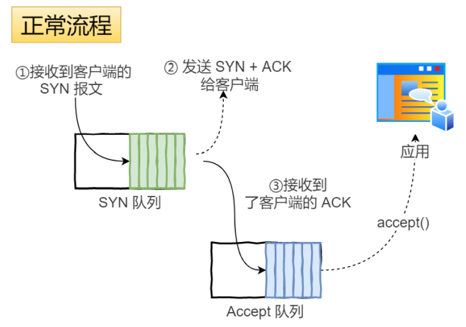

# DDOS攻击

## 定义

- 客户端向服务端发送请求链接数据包，服务端向客户端发送确认数据包，客户端不向服务端发送确认数据包，服务器一直等待来自客户端的确认没有彻底根治的办法，除非不使用TCP

## 预防

- 限制同时打开SYN半链接的数目

- 缩短SYN半链接的Timeout时间

- 关闭不必要的服务

# SYN攻击

## 背景

- 服务器端的资源分配是在二次握手时分配的，而客户端的资源是在完成三次握手时分配的，所以服务器容易受到SYN洪泛攻击
- 假设攻击者短时间伪造不同 IP 地址的 SYN 报⽂，服务端每接收到 ⼀个 SYN 报⽂，就进⼊ SYN_RCVD 状态
- 但服务端发送出去的 ACK + SYN 报⽂，⽆法得到未知 IP 主机的 ACK 应答
- 久⽽久之就会占满服务端的 SYN 接收队列（未连接队列），使得服务器不能为正常⽤户服务

## 定义

- SYN攻击就是Client在短时间内伪造大量不存在的IP地址，并向Server不断地发送SYN包，Server则回复确认包，并等待Client确认，由于源地址不存在，因此Server需要不断重发直至超时
- 这些伪造的SYN包将长时间占用未连接队列，导致正常的SYN请求因为队列满而被丢弃，从而引起网络拥塞甚至系统瘫痪。SYN攻击**是一种典型的DoS/DDoS攻击**
- 检测SYN攻击非常的方便，当你在服务器上看到大量的半连接状态时，特别是源IP地址是随机的，基本上可以断定这是一次SYN攻击。在Linux/Unix上可以使用系统自带的netstats命令来检测SYN攻击
- 常见的防御SYN攻击的方法有如下几种：
  - 缩短超时（SYNTimeout）时间
  - 增加最大半连接数
  - 过滤网关防护SYN
  - cookies技术
  - 1、通过修改 Linux 内核参数，控制队列⼤⼩和当队列满时应做什么处理
  - 2、（后续补上来）
- 
