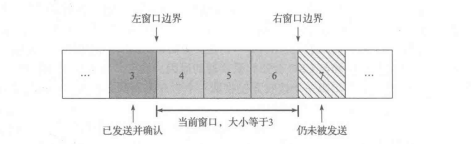
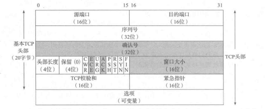

# 12.1 引言

编码理论提供不同的信息编码手段，从而使得信息能在通信信道里尽量免于出错

- 使用差错校正码（基本上是添加一些冗余的比特，使得即使某些比特被毁，真实的信息也可以被恢复过来）来纠正通信问题是处理差错的一种非常重要的手段
- 或是，简单的尝试重新发送，直到信息最终被接收，这种方法叫做自动重复请求（ARQ），构成了许多通信协议的基础

12.1.1 ARQ和重传

- 一个直接处理分组丢失的方法就是重传分组直到它被正确接收，这需要一种方法判断
  - 接收方是否已收到分组（解决：接收方给发送方发信号以确定自己已经接收到一个分组，这种方法称为确认，或ACK）
  - 接收方接收到的分组是否与之前发送方发送的一样

- 其他问题：

  - 发送方对一个ACK应该等待多长时间（决定去等待多长时间与发送方期望啊为一个ACK等待多长时间有关）

  - 如果ACK丢失了怎么办（此时，发送方是不能轻易把这种情况和原分组丢失的情况区分的，所以只能再次发送原分组）

  - 如果分组被接收到了，但里面有错怎么办（借助编码计数解决；然后，为了检测分组里的差错，还使用一种校验和形式；当一个接收方接收到一个含有差错的分组时，它不发送ACK；最后发送方重发完整到达的无差错的分组）

- 接收方可能接收到被传送分组的重复副本，这个问题可以用**序列号**来处理
- 基本上，在被源端发送时，每个唯一的分组都有一个新的序列号
- 这个序列号由分组一直携带着
- 接收者可以使用这个序列号判断它是否已经见过这个分组，如果见过则丢弃它

- 但如果一直是发送一个报文，等待ACK后再发送一个报文，效率会非常的慢
- 即使是发送一组报文，如果分组丢失或者损害的话，情况甚至更糟糕
- 所以，如果我们允许多个分组进入网络，就可以使它更繁忙，从而得到更高的吞吐量

12.1.2 分组窗口和滑动窗口

- 定义一个分组窗口作为已被发送方注入但还没完成确认的分组的集合，把这个窗口中的分组数量称为窗口大小
- 
- 窗口的这种滑动给这种类型的协议增加了一个名字，滑动窗口协议
- 一般来说，窗口结构在发送方和接收方都有
  - 发送方，记录了哪些分组可被释放，哪些分组正在等待ACK，以及哪些分组还不能被发送
  - 接收方，记录着哪些分组已经被接收和确认，哪些分组是下一步期望的，以及哪些分组即使被接收也将会因内存限制而被丢弃

12.1.3 流量窗口：流量控制和拥塞控制

- 流量控制：为了处理当接收方相对发送方太慢时产生的问题，两种方式解决
  - 一种是基于速率的流量控制，它是给发送方指定某个速率，同时确保数据永远不能超过这个速率发送（适合流应用程序，用于广播和组播发现）
  - 另一种是基于窗口的流量控制，即滑动窗口。窗口大小不是固定的，而是允许随时间而变动的；有一种方法让接收方可以通知发送方使用多大的窗口，名为窗口通告或窗口更新（实际上，窗口更新和ACK是由同一个分组携带的，意味着发送方往往会在它的窗口滑动到右边的同时调整它的大小）

- background：对于中间的网络，在发送方和接收方之间可能会有有限内存的路由器，它们与低速网络链路抗争着。当这种情况出现时，发送方的速率可能超过某个路由器的能力，从而导致丢包
- 这种情况由一种特殊的称为拥塞控制的流量控制形式来处理
- 拥塞控制涉及发送方减低毒素以至于不压垮其接收方之间的网络

12.1.4 设置重传超时

- 直观上看，发送方在重发一个分组之前应等待的时间量大概是下面时间的总和
  - 发送分组所用的时间
  - 接收方处理它和发送一个ACK所用的时间
  - ACK返回发送方所用的时间
  - 以及发送方处理ACK所用的时间
- 一个更好的策略：让协议实现尝试去估计它们，这称为往返时间估计，即RTT
- 选择一组RTT样本的样本均值作为真实的RTT是最有可能的

# 12.2 TCP的引入

12.2.1 TCP服务模型

- TCP提供一种面向连接的、可靠的字节流的服务
- 面向连接:使用TCP的两个应用程序必须在它们可交换数据之前，通过相互联系来建立一个TCP连接
- 字节流抽象概念：没有由TCP自动插入的记录标志或消息边界，一个记录标志对应着一个应用程序的写范围指示（如果应用程序在一段写入10字节，随后写入20字节，再随后写入50字节，那么在连接的另一端的应用程序是不知道每次写入的字节是多少，例如另一端可能会以每次20字节分四次写入这80字节或以其他一些方式读入）
  - 即一端给TCP输入字节流，同样的字节流会出现在另一端。每个端点独立选择自己的读和写大小
- TCP根本不会解读字节流里的字节内容，它不知道正在交换的数据字节是啥

12.2.2 TCP中的可靠性

- TCP把一个发送应用程序的字节流转换成一组IP可以携带的分组，即组包
- 分组包含序列号，该序列号在TCP中实际代表了每个分组的第一个字节在整个数据流中的字节偏移，而不是分组号
- 允许分组在传送中是可变大小的，并允许它们组合，称为重新组包
- 应用程序数据被打散成TCP认为的最佳的大小的块来发送，一般使得每个报文段按照不会被分片的单个IP层数据报的大小来划分
- 而，UDP是有多大写多大

- 强制的校验和，涉及它的头部、任何相关应用程序数据和IP头部的所有字段
- 用于检测传送中引入的比特差错
- 如果一个带无效校验和的报文段到达，那么TCP就会丢弃它，不为被丢弃的分组发送任何确认

- 当TCP发送一组报文时，它通常设置一个重传计时器，等待对方的确认接收
- TCP不会为每个报文段设置一个不同的重传计时器，而是，发送一个窗口的数据，它只设置一个计时器
- 当ACK到达时再更新超时，如果有一个确认没有及时接收到，这个报文段就会被重传

- 当TCP接收到连接的另一端数据时，它会发送一个确认，这个确认可能不会立即发送，而一般会延迟片刻
- TCP使用的ACK是累积的，从某种意义上来说，一个指示字节号N的ACK暗示着所有直到N的字节（但不包含N）已经被成功接收了
- 即，如果一个ACK丢失，很有可能后续的ACK丢失就足以确认前面的报文段

- 提供双工服务，即数据可向两个方向流动，两个方向相互独立
- 因此，连接的每个端点必须对每个方向维护数据流的一个序列号
- 一旦建立了一个连接，这个连接的一个方向上的包含数据流的每个TCP报文段也包含了相反方向上的报文段的一个ACK
- 每个报文段也包含一个窗口通过以实现相反方向上的流量控制

- 使用序列号，一个TCP接收端可丢弃重复的报文段和记录以杂乱次序到达的报文段

# 12.3 TCP头部和封装

- TCP头部的标准长度是20字节，除非出现选择
- 头部长度字段以32位字为单位给出头部的大小
- 带阴影的字段（确认号，窗口大小）用于与该报文段的发送方关联的相反方向上的数据流

- 每个TCP头部都包含了源和目的端口号

- 一个IP地址和一个端口的组合称为套接字
- 每个TCP连接由一对套接字或端点（四元组，由客户机IP地址、客户机端口号、服务器IP地址以及服务器端口号组成）

- 序列号字段标识了TCP发送端到TCP接收端的数据流的一个字节
- 该字节代表着包含该序列号的报文段的数据中的第一个字节
- 