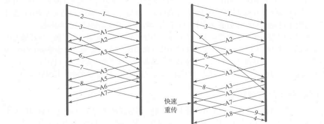

# 14.1 引言

# 14.2 简单的超时与重传举例

# 14.3 设置重传超时

背景

- TCP超时和重传的技术是怎样根据给定连接的RTT设置RTO
  - 若TCP先于RTT开始重传，可能会在网络中引入不必要的重复数据
  - 若延迟远大于RTT的间隔发送重传数据，整体网络利用率（及单个连接吞吐量）会随之下降

- TCP在收到数据后会返回确定信息，因此可在该信息中携带一个字节的数据来测量传输该确认信息所需的时间
- 每个TCP连接的RTT均独立估算，并且重传计时器会对任何占用序列号的在传数据计时

4.3.1 经典方法

- SRTT = α * (SRTT) + (1 - α) * RTT
- SRTT是基于现存值和新的样本值更新的结果，α是平滑因子
- 每次得到新的样本值，SRTT就会做出相应的更新
- 这种估算方法被称为指数加权移动平均或低通过滤器

14.3.2 标准方法

- 

时钟粒度与RTO边界

- TCP时钟通常为某个变量，该变量值随着始终而做出更新
- TCP时钟一个”滴答“的时间长度称为粒度，一般是500ms，linux下为1ms
- RTO有一个最小值的边界：RTO = max（srtt + max（G， 4（rttvar））， 1000）

初始值

- 系统预设初始值RTO为1s，而初始SYN报文段采用的超时间隔为3s

重传二义性与Karn算法

- 重传二义性：假设一个包的传输出现超时，该数据包就会被重传，接着收到一个确认信息，那么该信息是对第一次还是第二次传输的确认就存在二义性
- 解决办法：Karn算法：
  - 当接收到重复传输数据的确认信息时，不进行该数据包的RTT测量，可以避免重传二义性问题，另外，对该数据包之后的包采取退避策略，仅当接收到未经重传的数据时，该SRTT才用于计算RTO
  - 退避系数：每当重传计时器出现超时，退避系数增加，该过程一直持续至接收到非重传数据

# 14.4 基于计时器的重传

- 若在连接设定的RTO内，TCP没有收到被计时报文段的ACK，将会触发超时重传
- 此时TCP通过降低数据发送率来对此进行快速反应
  - 方法一：基于拥塞控制机制减小发送窗口大小
  - 方法二：每当一个重传报文段被再次重传时，则增大RTO的退避因子
  - 

# 14.5 快速重传

- 是基于接收端的反馈信息来引发重传，能及时有效地修复丢包情况

背景

- 当接收到失序报文段时，TCP需要立即生成确认信息（重复ACK），并且失序情况表明再后续数据到达前出现了丢段，即接收端缓存出现拿了空缺

- 当失序数据到达时，重复ACK应立即返回，不能延时发送，因为要使得发送端尽早知道有失序报文段，并告诉其空缺在哪儿

- 重复ACK到达一般表明发送端先前发送的某个分组已丢失

概述

- TCP发送端在观测到至少dupthresh个重复ACK后，即重传可能丢失的数据分组，而不必等到重传计时器超时。当然也可以同时发送新的数据
- 根据重复ACK推断的丢包通常与网络拥塞有关，因此快速重传会伴随拥塞控制机制

# 14.6 带选择确认的重传

- SACK功能：通过TCP头部的累积ACK字段来描述其接收到的数据

- TCP发送端的任务是通过重传丢失的数据来填补接收端缓存中的空缺，但同时也要尽可能保证不重传已正确接收到的数据
- 当采用SACK时，一个ACK可包含三四个告知失序数据的SACK信息，每个SACK信息包含32位的序列号，代表接收端存储的失序数据的其实至最后一个序列号

长度

- SACK一般来说最多有三个块，表明可向发送端报告3个空缺，若不受阻塞限制，利用SACK选项可在一个RTT时间填补3个空缺

### 14.6.1 SACK接收端行为

- 接收端在TCP连接建立期间收到SACK许可选项即可生成SACK

- 导致数据失序的原因：传输过程中丢失，也可能是新数据先于旧数据到达
- 第一个SACK块内包含的是最近接收到的报文段的序列号范围
  - 例如：当前已经接受了0-100，300-500的数据，那么sack就会使300-500，ack就会是200，三次ack之后发送方就会重传信息

- 其余的SACK块包含的内容也按照接收的先后依次排列，最新一块中包含的内容除了包含最近接收的序列号信息，还需重复之前的SACK块
- 在一个SACK内包含多个SACK块，并且在多个SACK中重复这些块信息的目的在于，为防止SACK丢失提供一些**备份**

### 14.6.2 SACK发送端行为

- SACK需要记录接受到的SACK信息，并利用该信息来避免重传正确接收的数据
- 一种方法是当接收到相应序列号范围的ACK时，则在其重传缓存中标记该报文段的选择重传成功

- 当SACK发送端执行重传时，通常是由于其收到了SACK或重复ACK，可以选择发送新数据或重传旧数据
- 而SACK信息提供接收端数据的序列号范围，因此发送端可据此推断需要重传的空缺数据
- 最简单的方法就是使发送端首先填补接收端的空缺，然后再继续发送新数据

- 举个例子，就像上面说的那样，sack是300-500，ack是200，则表明的是300-500之间的数据都收到了，而200后面一部分数据又没有收到，得出结论200-300的数据丢了

# 14.7 伪超时与重传

- 伪重传：即使没有出席那数据丢失也可能引发重传
- 伪超时：过早判定超时（包失序，包重复，或ACK丢失都可能导致）

- 处理伪超时问题包含检测算法与响应算法，检测算法用于判断某个超时或基于计时器的重传是否真实，一旦认定出现伪超时则执行响应算法，用于撤销或减轻该超时带来的影响

### 14.7.1 重复SACK（DSACK）

背景

- 基本的SACK机制对接收端收到重复数据段时怎样运行没有规定

做法

- 在SACK接收端采用DSACK，并结合通常的SACK发送端，可以在第一个SACK块中告知接收端收到的重复报文段序列号
- DSACK的主要目的是判断何时的重传是不必要的，并了解网络中的其他事项
- 如果一个非DSACK与DSACK的TCP共用一个连接，它们会交互操作，但非DSACK不能使用DSACK的功能

好处

- 可以让发送方知道，是发出去的包丢了，还是接收方回应的ACK包丢了
- 可以知道是不是发送方的数据包被网络延迟了
- 可以知道网络中是不是把发送方的数据包给复制了

总结

- 如果 网络延迟的包 被接收方收到，接收方就会发送一个DSACK（值是重复收到的包的范围），表示收到了重复的包
- 注意：当ACK大于SACK的时候，才意味着它是DSACK
- 一句话：DSACK告诉你哪些包是你发重复了的

### 14.7.2 Eifel 检测算法

简述

- 当发送一个重传后，保存其TSV值（TSV用于估计当前的RTT）
- 当接受到相应分组的ACK后，检查该ACK的TSER部分
- 若该TSER值小于之前存储的TSV值，则可判定该ACK对于的是原始的传输分组，即该重传是伪重传

### 14.7.3 前移RTO恢复

- 在超时重传后收到第一个ACK时，TCP会发送新数据，之后再响应后一个到达的ACK
- 如果上述的ACK其中有一个为重复ACK，则认为此次重传没问题
- 如果两个都不是重复ACK，就代表该重传为伪重传

### 14.7.4 Eifel 响应算法

# 14.8 包失序与包重复

### 14.8.1 失序

- 原因：IP层不能保证包传输是有序进行的（因为IP可以选择另一条传输路线，而不用担心新发送的分组会先于旧数据到达，这就导致了数据的接收顺序与发送顺序不一致）
- 如果失序发生在反向链路，就会使得TCP发送端窗口快速前移，接着又可能收到一些显然重复而应被丢弃的ACK（因为后面的ACK早到了，导致窗口快速前移），结果导致发送端出现不必要的流量突发
- 如果发生在正向链路，TCP可能无法正确识别失序和掉包，数据的丢失和失序都会导致接收端收到无序的包，造成数据间的空缺
  - 轻微的话可以自动回复（左图）
  - 严重的会造成伪重传（后面的数据先到，接收方就会认为中间的数据丢失了，所以引发快速重传）（右图）

- 

### 14.8.2 重复

- 背景：IP协议可能出现将单个包传输多次的情况，从而造成伪快速重传
- 解决：采用DSACK，每个A3（重复数据）的重复ACK都包含报文段已成功接收的信息，并且没有包含失序数据信息，意味着到达的包一定是重复数据

# 14.11 与TCP重传相关的攻击

低速率DoS攻击

- 在这类攻击中，攻击者向网关或主机发送大量数据，使得受害系统持续处于重传超时状态
- 由于攻击者可预知受害TCP何时启动重启，并在每次重传时生成并发送大量数据
- 导致，受害TCP总能感知到拥塞的存在，TCP就会根据算法不断减少发送速率并退避发送，导致无法正常使用网络带宽
- 解决办法：随机选择RTO，使得攻击者无法预知确切的重传时间

其他的攻击

- 减慢受害TCP的发送，使得RTT估值过大，从而在丢包后也不会立即重传
- 或者，攻击者在数据发送完成但还未到达接收端时伪造ACK，这样攻击者就能使受害TCP认为连接的RTT远小于实际值，导致过分发送，造成大量无效传输