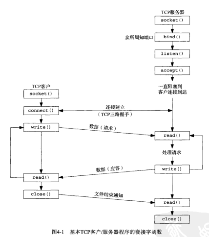
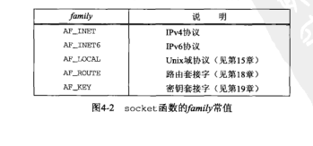
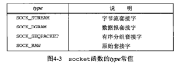
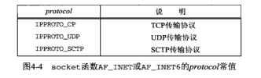
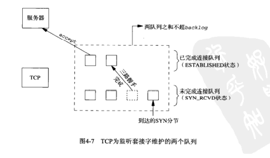
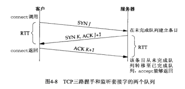
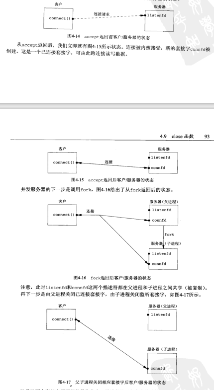

# 4.1 概述

- 


# 4.2 socket函数

- 为了执行网络I/O，一个进程必须做的第一件事情就是调用socket函数，指定期望的通信协议类型（使用IPV4的TCP，使用IPV6的UDP、UNIX域字节流协议等）

- ```cpp
  #include <sys/socket.h>
  
  int socket(int family, int type, int protocal);//若成功则为负描述符，若出错则为-1
  ```

- family参数指明协议族（比如说是IPV4，还是IPV6）

  - 

- type参数指明套接字类型（是字节流套接字还是数据报套接字）

  - 

- protocol参数设为某个协议类型常值，或者为0（比如说是tcp，还是udp）

  - 

- socket函数在成功时返回一个效得非负整数值，它与文件描述符类似，称为套接字描述符，简称sockfd


# 4.3 connect函数

- TCP客户端用connect函数来建立与TCP服务器的连接

- ```cpp
  #include <sys/socket.h>
  
  int connect(int sockfd, const struct sockaddr *servaddr, socklen_t addrlen);//若成功返回0，出错则返回-1
  ```
  
- sockfd是由socket函数返回的套接字描述符，第二个、第三个参数分别是一个指向套接字地址结构的指针和该结构的大小

- 如果是TCP套接字，调用connect函数将激发TCP的三路握手过程，而且仅在连接建立成功或者出错时才返回


出错的几种情况

- 若TCP客户没有收到SYN分节的响应，则返回ETIMEDOUT错误（超时）
- 若对客户的SYN的响应时RST，则表明该服务器主机在我们指定的端口上没有进程在与之等待，客户一接受到RST就马上返回ECONNREFUSED错误（服务器给客户端发送RST）
  - RST是TCP在发生错误时发送的一种TCP分节，产生RST的三个条件：目的地为某端口的SYN到达，然而该端口上没有正在监听的服务器；TCP想取消一个已有连接；TCP接收到一个根本不存在的连接上的分节
  - 是一种硬错误
- 若客户发出的SYN在中间的某个路由器引发了一个ICMP错误（目的地不可达）
  - 指一种软错误
  - 原因：
  - 按照本地系统的转发表，根本没有到达远程系统的路径
  - connect调用根本不等待就返回


-  connect函数导致当前套接字从CLOSED状态（该套接字自从由socket创建以来一直所处的状态）转移到SYN_SENT状态，若成功则再转移到ESTABLISHED状态
- 若是失败则该套接字不可再用，必须关闭，不能对这样的套接字再次调用connect函数


# 4.4 bind函数

- bind函数把本地协议地址赋予一个套接字，对于网际网协议，协议地址是32位的IPV4地址或128位的IPV6地址与16位的TCP或UDP端口号的组合

- ```cpp
  #include <sys/socket.h>
  
  int bind(int sockfd, const struct sockaddr *myaddr, socklen_t addrlen);
  //成功返回0，失败返回-1
  ```

- 第二个参数是一个指向特定于协议的地址结构的指针，第三个参数是该地址结构的长度

- 对于TCP，调用bind函数可以指定一个端口号，或者指定一个IP地址


- 服务器在启动时捆绑它们的众所周知的端口，如果一个TCP客户或服务器未曾调用bind捆绑一个端口，当调用connect或listen时，内核就要为对应的套接字选择一个临时端口
- 进程可以把一个特定的IP地址捆绑到它的套接字上，不过这个IP地址必须属于其所在主机的网络接口之一
  - 对于TCP客户，这就为在该套接字上发送的IP数据报指派了源IP地址
  - 对于TCP服务器，这就限定该套接字只接收那些目的地为这个IP地址的客户连接


- 从bind函数返回的一个常见错误时EADDRINUSE（地址已使用）


# 4.5 listen函数

- linsten函数仅由TCP服务器调用
  - 当socket函数创建一个套接字时，它被假设为一个主动套接字，也就是说，它是要给将调用connect发起连接的客户套接字。listen函数把一个未连接的套接字转换成一个被动套接字，指示内核应接受指向该套接字的连接请求。调用listen函数导致套接字从CLOSED状态转换到LISTEN状态
  
  - ```c
    #include <sys/socket.h>
    int listen(int sockfd, int backlog);
    //成功返回0，出错则返回-1
    ```
  
  - 本函数第二个参数规定了内核应该为相应套接字排队的最大连接个数
  
- 本函数通常应该在调用socket和bind这两个函数之后，并在调用accept之前调用


- 内核为任何一个给定的监听套接字维护两个队列：
- 未完成连接队列：每个这样的SYN分节对应其中一项：已由某个客户发出并达到服务器，而服务器正在等待完成相应的TCP三路握手，这些套接字处于SYN_RCVD状态
- 已完成连接队列：每个已完成TCP三路握手过程的客户对应其中意向，这些套接字处于ESRTABLISHED状态


- 
- 每当在未完成连接队列中创建一项时，来自监听套接字的参数就复制到即将建立的连接中，连接的创建机制时完全自动的，无需服务器进程插手
- 


连接到队列的全过程

- 当来自客户的SYN到达时，TCP在未完成连接队列中创建一个新项，然后响应以三路握手的第二个分节
- 服务器的SYN响应，其中捎带客户SYN的ACK。这一项一直保留在未完成连接队列中，直到三路握手的第三个分节到达或者该项超时位置
- 如果三路握手正常，该项就从未完成连接队列移到已完成连接队列的队尾
- 当进程调用accept时，已完成连接队列的对头项将返回给进程；如果该队列为空，那么进程将被被投入睡眠，直到TCP在该队列中放入一项才唤醒它


队列的注意事项

- 不要把backlog定义为0，因为不同的实现对此有不同的解释
- 在三路握手正常完成的前提下，未完成连接队列中的任何一项在其中的存留时间就是一个RTT；RTT的值取决于特定的客户于服务器
- backlog参数曾被规定为这两个队列总和的最大值
- 当一个客户SYN到达时，若这些队列是满的，TCP就忽略该分节，也就是不发送RST；因为这种情况是暂时的，客户TCP将重发SYN，期待不久就能在这些队列中找到可用空间；要是服务器TCP立即响应一个RST，客户的connect就会返回一个错误，强制应用进程处理异常，而不是让TCP的正常重传机制来处理
  - 另外：客户无法区别响应SYN的RST是意味着“该端口没有服务器在监听”，还是意味着“端口有服务器在监听，不过它的队列满了”


# 4.6 accept函数

- accept函数由TCP服务器调用，用于从已完成连接队列队头返回下一个已完成连接。如果已完成连接队列为空，那么进程被投入睡眠

- ```c
  #include <sys/socket.h>
  
  int accept(int sockfd, struct sockaddr *cliaddr, socklen_t *addrlen);
  //若成功则返回非负描述符，若出错则返回-1
  ```

- 参数cliaddr和addrlen用来返回已连接的对端进程（客户）的协议地址

- 调用前，*addrlen所引用的整数值设置为由cliaddr所指的套接字地址结构的长度，返回时，该整数值即为由内核存放在该套接字地址结构内的确切字节数


- 如果accept成功，那么其返回值是由内核自动生成的一个全新描述符，代表与所返回客户的TCP连接
- 在讨论accept函数时，我们称它的第一个参数是**监听套接字描述符**（由socket创建，随后用作bind和listen的第一个参数的描述符），称它的返回值为**已连接套接字描述符**
- 一个服务器仅仅创建一个监听套接字，它在该服务器的生命期内一直存在
- 内核为每个由服务器进程接受的客户连接创建一个已连接套接字
- 当服务器完成对某个给定客户的服务时，相应的已连接套接字就被关闭


- 本函数最多返回三个值，一个既可能是新套接字描述符也可能是出错指示的整数、客户进程的协议地址以及该地址的大小


# 4.7 fork和exec函数

- fork函数调用它一次，它会返回两次

  - 它在调用进程（父进程）中返回一次，返回值是新派生进程（子进程）的进程ID号
  - 在子进程又返回一次，返回值为0，因此返回值是告诉当前进程是父进程还是子进程

- ```c
  #include <unistd.h>
  
  pid_t fork(void);
  ```

- fork在子进程返回0而不是父进程的进程id是因为：

  - 任何子进程只有一个父进程，而子进程总是可以通过调用getppid取得父进程的进程ID（所以没必要返回父进程id，想要的话直接get即可）
  - 而父进程可以有许多子进程，而且无法获取各个子进程的进程ID，如果父进程想要跟踪所有子进程的进程ID，那么必须记录它每次调用fork的返回值

- 综合：子进程返回0，父进程返回子进程id


- 父进程中调用fork之前打开的所有描述符在fork返回之后由子进程分享
- 父进程调用accept之后调用fork，所接受的已连接套接字随后就在父进程与子进程之间共享


两个用法

- 一个进程创建一个自身的副本，这样每个副本都可以在另一个副本执行其他任务的同时处理各自的某个操作（服务器常见）
- 一个进程想要执行另一个程序，既然创建新进程的唯一办法是调用fork，该进程于是首先调用fork创建一个自身的副本，然后其中一个副本（子进程）调用exec把自身替换成新的程序（shell常见）


- 存放在硬盘上的可执行程序文件能够被Unix执行的唯一方法：由一个现有进程调用exec函数。exec把当前进程映像替换成新的程序文件，而且该新程序通常从main函数开始执行。进程ID并不改变
- 调用exec的进程为调用进程，新执行的程序为新程序


- 居然有6个exec函数....


# 4.8 并发服务器

- 简述：当一个连接建立时，accept返回，服务器接着调用fork，然后由子进程服务客户（通过已连接套接字connfd），父进程则等待另一个连接（通过监听套接字listenfd）。既然新的客户由子进程提供服务，父进程就关闭已连接套接字


- 有个坑：对一个TCP套接字调用close会导致发送一个FIN，随后是正常的TCP连接终止序列，那为什么并发服务器里面父进程对子进程的connfd调用close没有终止它与客户的连接
- 每个文件或套接字都有一个引用记数，引用计数在文件表项中芜湖，它是当前打开着的引用该文件或套接字的描述符的个数
- 所以fork后，上述的connfd就有两个引用计数了
- 
- 最终状态：子进程处理与客户的连接，父进程则可以在监听套接字上再次调用accept来处理下一个客户连接
- 其实这里我有点没想明白，就是fork中是copy on write，即一开始父进程和子进程的listenfd和connfd都是同一个东西（猜测：有可能是fork会触发fd中的引用计数，导致引用计数增加），然后当父进程close描述符connfd，子进程close描述符listenfd的时候，这两个listenfd和connfd才会不同，才会被真正的复制出来


# 4.9 close函数

- unix下使用close函数关闭套接字，并终止TCP连接

- ```c
  #include <unistd.h>
  
  int close(int sockfd);//成功就返回0，出错返回-1
  ```

- close一个TCP套接字的默认行为是把该套接字标记成已关闭，然后立即返回到调用进程

- 该套接字描述符不能再由调用进程使用，也就是说它不能再作为read或write的第一个参数

- 然而TCP将尝试发送已排队等待发送到对端的任何数据，发送完毕后发生的是正常的TCP连接终止序列


- 如果想要在某个TCP连接上发送一个FIN，那可以用shutdown函数代替close


- 如果父进程对每个accept返回的已连接套接字都不适用close，那么首先，父进程最终会耗尽可用描述符，因为任何进程在任何时刻可拥有的打开着的描述符树通常是有限制的
- 并且，没有一个客户连接会被终止，当子进程关闭已连接套接字时，它的引用计数值会变为1，因为父进程永不关闭任何已连接套接字，这将妨碍TCP连接终止序列的发生，导致连接一直打开着


# 4.10 getcockname和getpeername函数

- 这两个函数或者返回与某个套接字关联的本地协议地址，或者返回与某个套接字关联的外地协议地址

- ```c
  #include <sys/socket.h>
  
  int getsockname(int sockfd, struct sockaddr *localaddr, socklen_t *addrlen);
  int getpeername(int sockfd, struct sockaddr *peeraddr, socklen_t *addrlen);
  ```


场景

- 在一个没有调用bind的TCP客户上，connect成功返回后，getsockname用于返回由内核赋予该连接的本地IP地址和本地端口号
- 在以端口号0调用bind后，getsockname用于返回由内核赋予的本地端口号