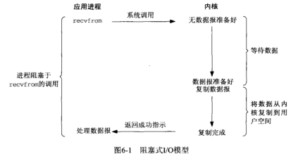

# 6.2 I/O模型

### 阻塞式IO

- 默认情形下，所有套接字都是阻塞的
- 
- 进程调用recvfrom，其系统调用直到数据报到达并且被复制到引用进程的缓冲区中或者发生错误才返回（最常见的错误就是系统调用被中断信号打断）
- 进程在从调用recvfrom开始到它返回的整段时间内是被阻塞的，recvfrom成功返回后，应用进程开始处理数据报
- 总结：进程一直阻塞在这个系统调用上，直到有数据可以处理位置


### 非阻塞式I/O模型

- 进程把一个套接字设置成非阻塞是在通知内核：当所请求的I/O操作非得把本进程投入睡眠才能完成时，不要把本进程投入睡眠，而是返回一个错误
- 
- 前几次调用recvfrom都没有数据返回，因此内核立即返回一个EWOULDBLOCK错误
- 第四次有数据，就被复制到应用进程的缓冲区，于是recvfrom成功返回，接着处理数据
- 当一个应用进程像这样对一个非阻塞描述符循环调用recvfrom时，称之为轮询
  - 应用进程持续轮询内核，以查看某个操作是否就绪，但会大量消耗CPU时间


### I/O复用模型

- 调用select或poll，使得进程阻塞在这两个系统调用某一个上，而不是阻塞在真正的I/O系统调用上
- 
- 阻塞在select调用上，等待数据报套接字变为可读，当select返回套接字可读这一事件时，调用recvfrom把所读数据包复制到应用进程缓冲区


### 信号驱动式I/O模型

- 让内核在描述符就绪时发送SIGIO信号通知进程
- 
- 首先开启套接字的信号驱动式I/O功能，并通过sigaction系统调用安装一个信号处理函数
- 该系统调用立即返回，进程继续工作，即没有阻塞
- 当数据报准备好读取时，内核就为该进程产生一个SIGIO信号
- 随后既可以在信号处理函数中调用recvfrom读取数据，并通知主循环数据已准备好待处理，也可以立即通知主循环，让他读取数据报
- 优势：等待数据报到达期间进程不被阻塞，主循环可以继续执行，只需要等待来自信号处理函数的通知；既可以是数据已准备好被处理，也可以是数据报已准备好被读取


### 异步I/O模型

- 工作机制：告知内核启动某个操作，并让内核在整个操作（包括将数据从内核复制到我们自己的缓冲区）完成后通知
- 与信号驱动的区别是：信号驱动式是由内核通知合适可以启动一个I/O操作，而异步I/O模型是由内核通知我们I/O操作何时完成
- 
- 调用aio_read函数，给内核传递描述符、缓冲区指针、缓冲区大小和文件偏移，并告诉内核当整个操作完成时如何通知进程
- 该系统调用立即返回，而且在等待I/O完成期间，进程不被阻塞


- 同步I/O操作：导致请求进程阻塞，直到I/O操作完成
- 异步I/O操作：不导致请求进程阻塞
- 


# 6.3 select函数

- 该函数允许进程指示内核等待多个事件中的任何一个发生，并只在有一个或多个事件发生或经历一段指定的事件后才唤醒它

- 即调用select告知内核对哪些描述符（读、写或异常条件）感兴趣及等待多长事件，任何描述符都可以使用select测试

- ```cpp
  #include <sys/select.h>
  #include <sys/time.h>
  
  int select(int maxfdpl, fd_set *readset, fd_set *writeset, fd_set *exceptset
            const struct timeval *timeout);
  // 返回：若有就绪描述符则为其数目，若超时则为0，若出错则为-1
  ```


- timeout告知内核等待所指定描述符中的任何一个就绪可花多长时间
- 有三种可能：
  - 永远等下去：仅在有一个描述符准备好I/O时才返回，为此可以将参数设置为空指针
  - 等待一段固定时间：在有一个描述符准备好I/O时返回，但是不超过由该参数所执行的timeval结构中指定的描述和微秒数
  - 根本不等待：检查描述符后立即返回，即轮询；为此该参数必须指向一个timeval结构，而且其中的定时器值必须为0


- 中间的三个参数readset，writeset和exceptset指定要让内核测试读、写和异常条件的描述符


描述符就绪条件

- 满足以下四个条件，一个套接字准备好读
  - 该套接字接收缓冲区中的数据字节数大于等于套接字接收缓冲区低水位标记的当前大小
  - 该连接的读半部关闭（也就是接收了FIN的TCP连接）
  - 该套接字是一个监听套接字且已完成的连接数不为0
  - 其上有一个套接字错误待处理（对这样的套接字的读操作将不阻塞并返回-1）