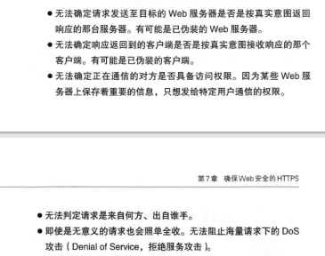
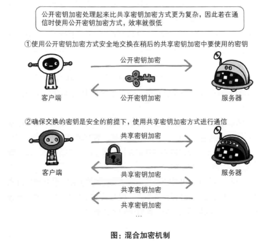
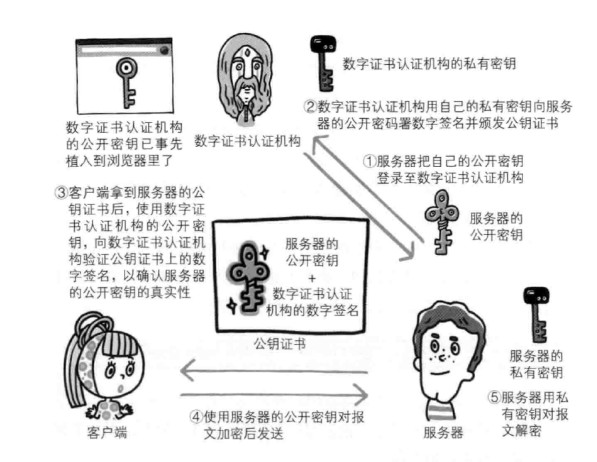
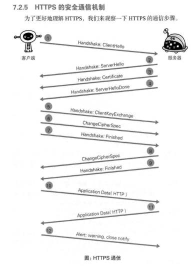
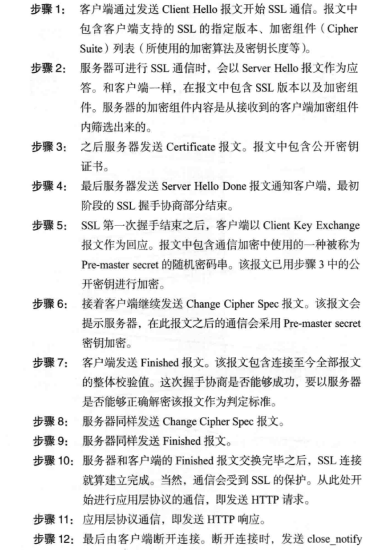

# 第7章 确保Web安全的HTTPS

### HTTP的缺点

通信使用明文（不加密），内容可能会被窃听
- 通过wireshark抓包工具可以获取互联网中的信息流（所以被加密了还是会被看到）
- 解决办法
  - 通信过程中的加密：SSL（安全套接层）或TSL（安全层传输协议）加密，组成HTTPS
  - 内容的加密：仅对通信报文主体进行加密

不验证通信方的身份就可能遭遇伪装
- 任何人都可以发送请求（如果是这样，那主机就会被很多的僵尸网络攻击导致瘫痪，参考**DOS攻击**）
- 
- 解决办法
  - 使用SSL，同时使用一种称为证书的手段，用于证明服务器和客户端是实际存在的

无法证明报文完整性，可能已经被篡改

- 像这样，请求或响应在传输途中，遭攻击者拦截并篡改内容的攻击称为**中间人攻击**
- 解决办法
  - md5和sha-1以及用来确认文件的数字签名，还有PGP创建的数字签名以及MD5算法生成的散列值，利用散列值进行校验

### MD5

- 定义：
  - 一种被广泛使用的密码散列函数，可以产生出一个128位（16字节）的散列值（hashvalue），用于确保信息传输完整一致
- 叙述：
  - MD5码以512位分组来处理输入的信息，且每一分组又被划分为16个32位子分组，经过了一系列的处理后，算法的输出由四个32位分组组成，将这四个32位分组级联后将生成一个128位散列值
- 缺点：
  - 存在碰撞（在对两个不同的内容使用MD5算法运算的时候，有可能得到一对相同的结果值）

### HTTPS

定义
- 超文本传输安全协议（英语：HyperTextTransferProtocolSecure，缩写：HTTPS；常称为HTTPoverTLS、HTTPoverSSL或HTTPSecure）是一种通过计算机网络进行安全通信的传输协议。HTTPS经由HTTP进行通信，但利用SSL/TLS来加密数据包。HTTPS开发的主要目的，是提供对网站服务器的身份认证，保护交换资料的隐私与完整性。这个协议由网景公司（Netscape）在1994年首次提出，随后扩展到互联网上
- HTTP+通信加密+证书+完整性保护
- 之前：http->tcp，现在：http->ssl->tcp

### SSL加密

- 定义：
  - 是为网络通信提供安全及数据完整性的一种安全协议
  - 是应用最广泛的网络安全技术
- 采用一种叫做**公开密钥加密**的方法
  - 最早，加密和解密都用同一个密钥的方式，称为**对称密钥加密**（可是把密钥发给别人的时候也会有危险啊！！）
  - 所以提出了公开密钥加密的办法，即信息用公钥加密（公钥全世界都知道的），要解密的话只能用我的私人密钥来解密
  - 换言之，就是我（接收方）做出公钥和密钥两把钥匙，然后我把公钥传播出去，让那些想要发送信息给我的人用公钥加密信息然后再发给我，我再用私钥解密
  - 同时，想根据密文和公开密钥恢复到原文信息是非常困难的，因为解密过程就是在对离散对数进行求值
- 问题：公开密钥也会在发布的时候被攻击者替换，同时拥有密钥的一方也不知道到底那一条信息是真正对方发来的

### HTTPS的加密机制

- HTTPS采用共享密钥加密和公开密钥加密两者并用的混合加密机制，若密钥能够实现安全交换，那么有可能会考虑仅使用公开密钥加密来通信
- 为什么要使用混合加密：因为公开密钥的加密和解密过程十分的负责，效率低下
- 

### SSL协议

- SSL协议位于TCP/IP协议与各种应用层协议之间，为数据通讯提供安全支持。SSL协议可分为两层：
  - SSL记录协议（SSLRecordProtocol）：它建立在可靠的传输协议（如TCP）之上，为高层协议提供数据封装、压缩、加密等基本功能的支持
  - SSL握手协议（SSLHandshakeProtocol）：它建立在SSL记录协议之上，用于在实际的数据传输开始前，通讯双方进行身份认证、协商加密算法、交换加密密钥等

### 证明公开密钥正确性的证书

背景

- 公开密钥加密方式的问题：无法证明公开密钥本身就是货真价实的公开密钥
- 比如：正准备和某台服务器建立公开密钥加密方式下的通信时，如何证明收到的公开密钥就是原本预想的那台服务器发行的公开密钥
- 或者有可能真正的公开密钥已经被攻击者替换掉了

- 数字证书认证机构处于客户端与服务器端双方都信赖的第三方机构的立场上

业务流程

- 服务器的运营人员向数字证书认证机构提出公开密钥的申请
- 数字认证机构在判明提出申请者的身份之后，会对已申请的公开密钥做数字签名，然后分配这个已签名的公开密钥，并将该公开密钥放入公钥证书后绑定在一起
- 服务器会将这份由数字证书认证机构颁发的公钥证书发送给客户端，以进行公开密钥加密方式通信
- 接到证书的客户端可使用数字认证机构的公开密钥，对那张证书上的数字签名进行验证
- 验证通过，则说明：认证服务器的公开密钥的是真实有效的数字证书认证机构，同时服务器的公开密钥是值得信赖的
- 

### 可证明组织真实性的EV SSL证书

- 证书的一个作用是用来证明作为通信一方的服务器是否规范，另一个作用就是可确认对方服务器背后运营的企业是否真实存在
- 拥有一个作用的证书就是EV SSL证书

### 用以确认客户端的客户端证书

- HTTPS中还可以使用客户端证书，以客户端证书进行客户端认证，证明服务器正在通信的对方始终是预料之内的客户端，起作用跟服务器证书一样

### 由自认证机构颁发的证书称为自签名证书

- 独立构建的认证机构叫做自认证机构，由自认证机构颁发的“无用”证书也被称为自签名证书

### https的安全通信机制

- 
- 

### ssl证书

- 定义：
  - SSL证书是数字证书的一种，类似于驾驶证、护照和营业执照的电子副本。因为配置在服务器上，也称为SSL服务器证书
  - SSL证书就是遵守SSL协议，由受信任的数字证书颁发机构CA，在验证服务器身份后颁发，具有服务器身份验证和数据传输加密功能
- 用途：
  - SSL证书通过在客户端浏览器和Web服务器之间建立一条SSL安全通道，即通过它可以激活SSL协议，实现数据信息在客户端和服务器之间的加密传输，可以防止数据信息的泄露，保证了双方传递信息的安全性，而且用户可以通过服务器证书验证他所访问的网站是否是真实可靠
  - Securesocketlayer(SSL)安全协议是由NetscapeCommunication公司设计开发。该安全协议主要用来提供对用户和服务器的认证；对传送的数据进行加密和隐藏；确保数据在传送中不被改变，即数据的完整性，现已成为该领域中全球化的标准。由于SSL技术已建立到所有主要的浏览器和WEB服务器程序中，因此，仅需安装服务器证书就可以激活该功能了

- 缺陷：
  - 加密太慢，所以只有重要的信息才会用https来传输（而且证书的费用昂贵）
    - 通信慢
    - 大量消耗CPU及内存资源（ssl加速器）

### MAC

- 定义
  - 在密码学中，消息认证码（英语：Messageauthenticationcode，缩写为MAC），又译为消息鉴别码、文件消息认证码、讯息鉴别码、信息认证码，是经过特定算法后产生的一小段信息，检查某段消息的完整性，以及作身份验证。它可以用来检查在消息传递过程中，其内容是否被更改过，不管更改的原因是来自意外或是蓄意攻击。同时可以作为消息来源的身份验证，确认消息的来源
- 信息鉴别码不能提供对信息的保密，若要同时实现保密认证，同时需要对信息进行加密。