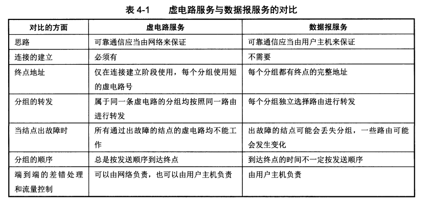

# 4.1 网络层提供的两种服务

- **网络层向上只提供简单灵活的、无连接的、尽最大努力交付的数据报服务**
- 网络在发送分组时不需要先建立连接，每一个分组（也就是IP数据报）独立发送，与其前后的分组无关（不进行编号）

- **网络层不提供质量的承诺**，也就是说所发送的分组可能出错、丢失、重复和失序（即不按序到达终点），当然也不保证分组交付的时限

- PS：电话等线路用的时虚电路服务，而网络用的是数据报服务
- 