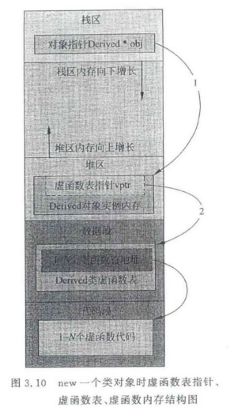

# 3.1 虚函数表指针位置分析

虚函数表指针位于对象内存的起始（上面开头）位置

- 类：有虚函数，这个类就会产生一个虚函数表
- 类对象，有一个指针，指针（vptr）会指向这个虚函数表的开始地址
- 经过代码验证发现，虚函数指针位于对象内存的开头

<br/>

<br/>

# 3.2 继承关系作用下虚函数的手工调用

父类对象调用的虚函数都是父类的

<br/>

<br/>

# 3.3 虚函数表分析

- 包含虚函数的类才会有虚函数表，同属于一个类的对象共享这个虚函数表，但是每个对象都有各自的vptr，当然每个该指针所指向的地址（虚函数表首地址）都相同
- 父类中有虚函数就等于子类中有虚函数，所以因此子类一定也有虚函数指针
- 如果子类中完全没有新的虚函数，则可以认为子类的虚函数表和父类的虚函数表内容相同，只是存储在内存的不同位置
- 超出虚函数表部分的内存内容不可预知

- 一个类只有包含虚函数才会存在虚函数表，同属于一个类的对象共享虚函数表，但是有各自的vptr，当然所指向的地址（虚函数表首地址）是相同的，即同一个类共用一个vtbl
- 父类中有虚函数就等于子类中有虚函数：父类中有虚函数表，则子类中也有虚函数表
  - 只要父类是虚函数，子类的同名函数也是虚函数（无论有没有virtual）
  - 但不管是父类还是子类，都是一个类配一个虚函数表
- 如果子类中完全没有新的虚函数，则我们可以认为子类的虚函数表和父类的虚函数表**内容相同**（内容相同的两张表）
  - 虚函数中的每一项，保存着一个虚函数的地址，但如果子类的虚函数表某项和父类的虚函数某项代表同一个函数（这表明子类没有覆盖父类的函数），则该表项所执行的该函数的地址应该相同
- 超出虚函数表的内容不可知
- 直接用子类对象给父类对象赋值，子类中属于父类那部分内容会被编译器自动区分（切割）出来并拷贝给了父类对象
  - 首先生成一个base对象
  - 其次用derive来初始化base对象
  - 编译器的一个操作是，derive的虚函数表指针并没有覆盖base对象的虚函数表指针值，编译器帮我们做到了这点

<br/>

<br/>

# 3.4 多重继承虚函数表分析

- 多重继承情况：A,B,C，C类分别继承了A类和B类
- 结论：
- 子类对象C有两个虚函数表指针
- 子类C有两个虚函数表，因为它继承自两个基类
- 子类和第一个基类共用一个vptr
- 子类中的虚函数覆盖了父类中的同名虚函数

- 一个对象，如果它的类有多个基类则有多个虚函数表指针（注意是两个虚函数表指针，不是有两个虚函数表）
  - 在多继承中，对应各个基类的vptr按继承顺序依次放置在类的内存空间中，且子类与第一个基类共用一个vptr（第二个基类有自己的vptr）
- 画图（一个类继承了两个类以后）
  - 子类对象有两个虚函数指针
  - 子类有两个虚函数表，因为它继承了两个基类
  - 子类和第一个基类共用一个vptr（因为vptr指向一个虚函数表，所以也可以说子类和第一个基类共用一个虚函数表vtbl）
    - 所以子类后续的虚函数（如无覆盖的话）都会加到这个表中
    - 如果出现覆盖了的话，子类就会把所有的表中的同名函数全给覆盖了
  - 子类中的虚函数覆盖了父类中的同名虚函数

<br/>

<br/>

# 3.5 辅助工具，vptr，vtbl创建时机

虚函数表的创建时机

- 在编译时候，编译器会往类的构造函数中安插为vptr赋值的语句
- 在编译期间（不是运行期间）就为每个类确定好了对应的虚函数表vtbl的内容

- 后续要好好学习gdb和gcc的调试
- vptr创建的时机
  - vptr跟着对象走，所以对象什么时候创建出来，vptr就什么时候创建出来，即运行的时候
  - 但实际上，对于这种有虚函数的类，在编译的时候，编译器会往相关的构造函数中增加为vptr赋值的代码，这是在编译期间编译器为构造函数所增加的（这都是编译器做的事情）
  - 当程序运行的时候，遇到创建对象的代码，执行对象的构造函数，那么这个构造函数里有给对象的vptr（成员对象）赋值的语句，自然这个vptr就被赋值了
  - 总结：vptr是类对象被创建的时候就创建了，而这个创建，是编译器在编译期间插入相关代码到构造函数中的
- vtbl创建的时机
  - 实际上，虚函数表是编译器在编译期间（不是运行期间）就为每个类确定好了对应的虚函数表vtbl的内容
  - 然后也是在编译期间在相应的类构造函数中添加给vptr赋值的代码，这样程序运行的时候，当运行到类对象的代码的时候，会调用类的构造函数
  - 总结：编译期间就确定了每个类的vtbl
- 

<br/>

<br/>

# 3.6 单纯的类不纯时引发的虚函数调用问题

- 静态联编：编译的时候就能确定调用哪个函数，把调用语句和被调用函数绑定到一起

- 动态联编：在程序运行的时候，根据实际情况，动态地把调用语句和被调用函数绑定到一起，动态联编一般只有在多态和虚函数情况下才存在

- ```cpp
  X x1;
  x1.test();
  x1.tesst();//tesst在X中为虚函数
  //这种直接以定义对象的方式来生成一个对象并通过该对象调用虚函数时根本用不到虚函数表
  ```

- 在栈上生成对象，直接调用虚函数；在堆上生成对象，是通过虚函数表指针找到虚函数表，在虚函数表中查询虚函数地址再调用该虚函数

- 所以，虚函数、多态是专门给指针和引用来使用的

- 不能在构造函数调用memset或在拷贝构造函数中使用memcpy等来覆盖类对象所在内存空间中的内容，否则一旦用到该类对象指针或引用去调用虚函数，那么一定会出问题甚至程序执行崩溃