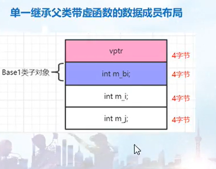
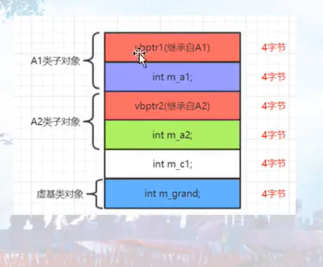

# 4.1 数据成员绑定时机

- 编译器对成员函数中的数据的解析，是整个类定义完毕后才开始的
  - 所以对类的函数里面的属性的解析和绑定，是在整个类定义后发生的
  - 即使是在类内定义，类外实现的函数，对于其中变量的解析还是会先在类内寻找，然后再到类外寻找
  - 提示：使用::符可以访问到全局变量
- 对于成员函数参数（在类内定义或实现）：是在编译器第一次遇到整个类型的时候被决定的
  - 所以特别是对于typedef，如果最近遇到的typedef是全局的，那函数的成员函数参数就会被定义为全局的那个类型
  - 所以，一个类中所有的typedef就要全部放在类的最前面
  - 特别的：在类内定义，类外实现的函数，对于成员函数参数的解析，是先到类内判断，再到类外判断的（有点违背了）
  - 结论：为了在类中尽早的看到类型mytype，所以这种类型定义语句typedef一定要挪到类的最开头定义；那后边的成员函数第一次遇到这个类型的时候，它就本着最近碰到原则来应用最近碰到的类型
- 成员函数函数体的解析时机（在整个类定义完毕后）
- 遇到成员函数体内的变量时，会先到类中去找，如果找不到，才会到全局范围内去找
- 在变量前面加上::就可以访问全局变量
- 总结：编译器对成员函数中的属性的解析是整个类定义完毕后才开始的

- 成员函数参数类型的确定时机（最近碰到原则）
- 成员函数的参数类型是在编译器最近一次遇到mytype时决定的，从上往下看代码

<br/>

<br/>

# 4.2 进程内存空间布局

- 不同的数据在内存中会有不同的保存时机和保存位置
- 当运行一个可执行文件时，操作系统就会把这个可执行文件加载到内存中，此时进程有一个虚拟的地址空间（内存空间）
- linux有一个nm命令，能够列出可执行文件中的全局变量存放的地址
- 从高地址往下到低地址
  - 堆栈段（栈，一般函数里面的临时变量都是放到这里的）
  - 空洞（未映射区域）
  - 堆（堆，申请才被使用的）
  - BSS段（存放未被定义了的全局数据和静态数据）
  - 数据段（存放定义了的全局数据和静态数据）
  - 代码段（存放代码）
- 
- 当把一个可执行文件加载到内存后，就变成了一个进程，以下是进程的虚拟地址空间
- 栈（堆栈/栈区）：局部变量等放在这里
- 堆（堆区）：new、malloc等申请的内存空间从这里分配
- BSS段：未初始化的全局变量，初始化为0的全局变量等放在这里
- 数据段：已初始化的全局变量
- 代码段：存放程序执行代码的一块内存区域

<br/>

<br/>

# 4.3 数据成员布局

- 类对象所占的内存是一块连续的内存


- 边界调整与字节对齐
- 引入1字节对齐，针对该类，要求其各个成员之间紧密排列，不允许做边界调整，不允许在成员之间留任何空隙


- 成员变量偏移值的打印

- 观察成员变量地址规律

  - 普通成员变量的存储顺序，是按照在类中的定义顺序从上到下来的
  - 后面出现的成员变量在内存中有更高的地址
  - 类定义中public，private，protected的数量，不影响类对象的sizeof

- 边界调整，字节对齐（padding）

  - 某些因素会导致成员变量之间排列不连续，就是边界调整（字节对齐），调整的目的是提高效率（是编译器自动调整）

    - 调整的定义：往成员之间填补一些字节，使用类对象的sizeof字节数凑成一个4的整数倍或8的整数倍

    - 为了统一字节对齐问题，引入一个该概念叫一字节对齐（不对齐）

    - ```cpp
      #pragma pack(1);//对齐方式设置为1字节对齐（不对齐）
      
      #pragma pack();//取消指定对齐，恢复缺省对齐；
      ```

    - ps：有虚函数时，编译器会往类定义中增加vptr（这个要视为内部数据成员）

- 成员变量偏移值的打印

  - 成员变量偏移值，是这个成员变量的地址，离对象首地址偏移多少

  - ```cpp
    printf("%d", &A::m_i);//输出十进制的偏移值
    //记录一种偏门的写法
    #define GET(A, m) (int)(&((A*)0) -> m)//其中A为类名，m为属性名
    ```

  - ```cpp
    int A::*mypointer = &A::m_i;//定义成员变量指针
    
    printf("%p", mypointer);//输出的是变量的偏移值
    ```

<br/>

<br/>

# 4.4 数据成员布局

- 静态成员变量的存取：静态成员变量的引用，可以用类名，也可以用对象名，还可以用对象指针，用类名后面加：：，用对象名后面加.，用对象指针后面加->


- 非静态成员便令的存取
- 对于成员函数，编译器会插入一个隐式的形参this，这个this就表示对象本身
- 当要访问一个成员便来给你时，编译器是把类对象的首地址加上该要访问的成员变量的偏移值
- 子类继承父类以后，偏移量要加上父类的大小

- 静态成员变量的存取

  - 静态成员变量，可以当做一个全局变量，但是它只在类的空间内可见
  - 可以通过类名，对象或对象指针来访问成员属性（查看反汇编后发现这几个都是一模一样的）
  - 静态成员变量只有一个实体，保存在可执行文件的数据段
    - 编译后，运行多次的情况下，静态成员的地址都是不变的
    - 即静态成员变量的地址是在编译为可执行文件后，就已经确定好了的（地址都写在了可执行文件上了）

- 非静态成员变量的存取（普通的成员变量）

  - 通过类对象或指针来存取

  - ```cpp
    class A{
        public:
        	int a;
        	void func() {
                a += 2;
            }
    };
    
    A a1;
    a1.a = 1;
    a1.func();//其实这里调用func函数的时候，编译器会隐含的传入一个this指针
    //编译器的视角
    void A::func(A* const this) {
        this -> a += 2;
    }
    
    a1.a;
    apointer->a;//这两个访问的效率上在单一继承中是无差别的，但是在虚基类中是有差别的（汇编中都是一样的）
    ```

  - 对于普通成员的访问，编译器是把类对象的首地址加上成员变量的偏移值（所以可以O(1)的访问任意对象）

    - 注意：这个偏移值已经写到了汇编代码里面了的

- 虚基类是个例外哦

<br/>

<br/>

# 4.5 单一继承下的数据成员布局

- 一个子类对象所包含的内容，是它自己的成员加上它父亲成员的总和
- 从偏移值看，在当前的编译器中，父亲成员是先出现的，然后才是子类成员
- 实际上，很多的padding会浪费很多的空间
- ps：编译器在不断进步和优化，不同厂商的编译器实现的细节可能很不相同，内存复制也必须谨慎

- 一个子类对象，所包含的内容，是他自己的成员，加上他父类的成员的总和

- 从偏移值上看，父类成员先出现，然后才是子类成员

- ```cpp
  class BB {//sizeof(BB) = 8
      int m_i1;
      char m_c1;
      char m_c2;
      char m_c3;
  };
  
  class Base {//8(msvc,g++,clang)
      public:
      	int m_i1;
      	char m_c1;
  };
  
  class Base1: public Base {//12(msvc,g++,clang)
    public:
      	char m_c2;
  };
  
  class Base2: public Base2 {//sizeof(Base2) = 16(msvc)/12(g++,clang)
      public:
      	char m_c3;
  }
  ```

  - 引入继承关系后，可能会带来内存空间的额外增加
  - 
  - 
  - linux和windows上数据布局不一样，说明：
    - 编译器在不断地进步和优化
    - 不同厂商编译器，实现细节也不一样
    - 内存拷贝就要谨慎（因为不同对象地内存布局是不一样的，比如base2在linux下就不能往base3下拷贝，因为这会覆盖掉原来base3的m_c3的位置的值）

<br/>

<br/>

# 4.6 单类单继承虚函数下的数据成员布局

单个类带虚函数的数据成员布局

- 编译时，编译器会产生类的虚函数表
- 对象中会产生虚函数表指针bptr，用以指向类的虚函数表
- 编译器会增加或拓展类的构造函数，增加给虚函数表指针vptr赋值的代码
- 如果是多重继承，如子类继承了两个父类，每个父类如果都有虚函数表，那么每个父类对象都要有一个虚函数表指针vptr，继承的时候子类就会把这两个vptr都继承过来
- 析构函数中似乎也被拓展增加了给虚函数表指针vptr赋值的代码，构造函数同理

- 虚函数指针放在最上面


单一继承父类带虚函数的数据成员布局

- 第一个是虚函数指针，父类对象是在子类对象的最上面


单一继承父类不带虚函数的数据成员布局

- 和单一继承父类带虚函数的数据成员布局一样

- 单个类带虚函数的数据成员布局（类中引入虚函数时，会有额外的成本付出）

  - 编译的时候，编译器会产生虚函数表
  - 对象中会产生虚函数指针vptr，用以指向虚函数表
  - 增加或者拓展构造函数，增加给虚函数表指针vptr赋值的代码，让vptr指向虚函数表
  - 如果出现多重继承，比如继承了两个父类，每个父类都有虚函数的话，每个父类都会有vptr，那继承时，子类就会把这两个vptr给继承过来（如果子类还有自己额外的虚函数的话，子类与第一个基类共用一个vptr）
  - 析构函数中也被拓展增加了虚函数表指针vptr相关的代码
  - 

- 单一继承父类带虚函数的数据成员布局

  - 
  - 基类带虚函数，派生类继承基类，派生类有虚函数

- 单一继承父类不带虚函数的数据成员布局

  - ```cpp
    class A {
        public:
            int a;
    };
    
    class B: public A {
        public:
            virtual ~B() {}
            int b;
            int c;
    };
    
    int main() {
        printf("%d\n", &B::a);//0
        printf("%d\n", &B::b);//12
        printf("%d\n", &B::c);//16
    }
    ```

  - 这里如果只是看偏移值的话，会觉得虚函数指针是在父类对象下面的，但是实际上从内存中来看的话，虚函数指针还是在对象的第一个位置的

  - 

  - ps：右边才是正确的

<br/>

<br/>

# 4.7 多重继承数据布局与this调整深谈

单一继承数据成员布局this指针偏移知识补充

- 父类没有虚函数，子类有虚函数，那么父子类的指针是不同的，访问数据就需要调整
- 父类有虚函数，子类也有，那么父子类的指针是相同的，不用调整


ps：偏移值是相对对象指针来说的


多重继承且父类都带虚函数的数据成员布局

- 尽管偏移值相同，但是它们分属两个不同的基类子对象，经过this指针调整后，偏移值相同的两个成员变量也可以被正常访问

- 当要访问一个类对象中的成员变量时，成员变量的定位是由两个因素定位的：this指针（根据情况编译器知道是否做调整）和该成员的偏移值

- 单一继承数据成员布局this指针偏移知识补充

  - 对于具有继承关系的类来说，如果要调用父类的成员变量，就要调整this指针的位置

- 多重继承且父类都带虚函数的数据成员布局

  - 通过this指针打印，发现访问A类的成员不用改变this指针，访问B类的成员要偏移指针

  - 看到偏移值，发现a1和g1的偏移值是一样的

  - this指针，加上偏移值 就能够访问对应的成员变量

  - 结论：我们要访问一个类对象中的成员，成员的定位是通过：this指针（编译器会自动调整）以及该成员的偏移值来决定的（这种this指针的偏移，都需要编译器介入来处理完成）

  - ```cpp
    class A {//4(int)+8(vptr)+4(padding)
    public:
        A() {
            printf("A的地址%p\n", this);
        }
        int a1;
        virtual ~A() = default;
    };
    
    class B {//4(int)+8(vptr)+4(padding)
    public:
        B() {
            printf("B的地址%p\n", this);
        }
        int b1;
        virtual ~B() = default;
    };
    
    class C:public A, public B {
    public:
        C() {
            printf("C的地址%p\n", this);
        }
        int c1, c2;
        virtual ~C() = default;
    };
        /*
         * C的内存布局
         * 8    vptr1
         * 4    a1
         * 8    vptr2
         * 4    b1
         * 4    padding
         * 4    c1
         * 4    c2
         * 4    padding(要变为8的倍数)
         * */
    ```

  - 上述注释是在clang下的布局，下图是在msvc下的布局

  - 

  - ps：当父类指针指向子类的时候，父类指针会发生偏移，父类指针会指向到子类中属于父类的那一部分

    - ```cpp
      Base2 *pbase2 = &base;
      Base2 *pbase2 = (Base2 *)(((char*)&base) + sizeof(Base1));//站在编译器的角度来看
      ```

    - 所以，如果用父类指针来析构对象，但是析构函数没有写为虚函数的话，就会造成内存泄漏（因为这个父类指针只析构了自己这个对象，却没有析构掉整个子类对象）

<br/>

<br/>

# 4.8 虚基类问题的提出和初探

虚基类（虚继承、虚派生）问题的提出

- 避免空间问题，效率问题，二义性问题（名字冲突）

- 注意初始化列表的写法


虚基类初探

- 虚基类表，虚基类表指针
- 虚继承子类里面都会被编译器插入一个虚基类表指针
- 与常规继承不一样，编译器把虚基类的爷爷辈grand子类对象犯到了最后，虚基类表指针放到了最前面
- 例如：Grand，A1，A2，B；A1和A2都继承自Grand，B又继承了A1和A2
- 那么B的对象模型是A1，A2，B，Grand

- 虚基类（虚继承/虚派生）问题的提出

  - 传统多重继承造成的：空间问题，效率问题，二义性问题

  - ```cpp
    class Grand{
        public:
        	int m_grand;
    };
    
    class A: virtual public Grand {
        
    };
    
    class B: virtual public Grand {
        
    };
    
    class C: public A, public C {
        int m_a1;
    };
    
    C c1;
    c1.m_grand = 12;//出现二义性，访问不明确，名字冲突
    c1.A::m_grand = 12;
    c1.B::m_grand = 13;
    //使用虚基类，让grand只被继承一次
    ```

  - 注意：引入虚基类之后，只能让子类调用爷爷类的构造函数

  - 

- 虚基类初探

  - 虚基类表 vbtable，虚基类表指针 vbptr（用来指向虚基类表）
  - virtual虚继承之后，父类就会被编译器插入一个虚基类表指针，这个指针有点成员变量的感觉
  - 
  - 上图的右图是A2的布局
  - 
  - 上图是子孙类的布局（虚基类何时何地都是放到最后面的）

<br/>

<br/>

# 4.9 两层结构时虚基类标内容分析

<br/>

<br/>

# 4.10 三层结构时虚基类表内容分析

<br/>

<br/>

# 4.11 成员变量地址、偏移、指针重申

- 对象成员变量内存地址及指针

- 成员变量的偏移值及其指针（和具体的对象是没有关系的）

  - ```cpp
    //打印对象的偏移值
    //方法一
    printf("%p", &A::m_i);
    //方法二，用成员指针来打印偏移量
    int A::*my = &A::m_i;
    printf("%p", my);//as we all know，成员变量指针里边保存的，实际上是偏移量（不是实际内存地址）
    ```

- 没有指向任何数据成员变量的指针

  - 通过一个对象名或者对象指针后边跟 成员变量指针 来访问某个对象的成员变量
  - 成员变量指针感觉一般用不到，不仔细看了