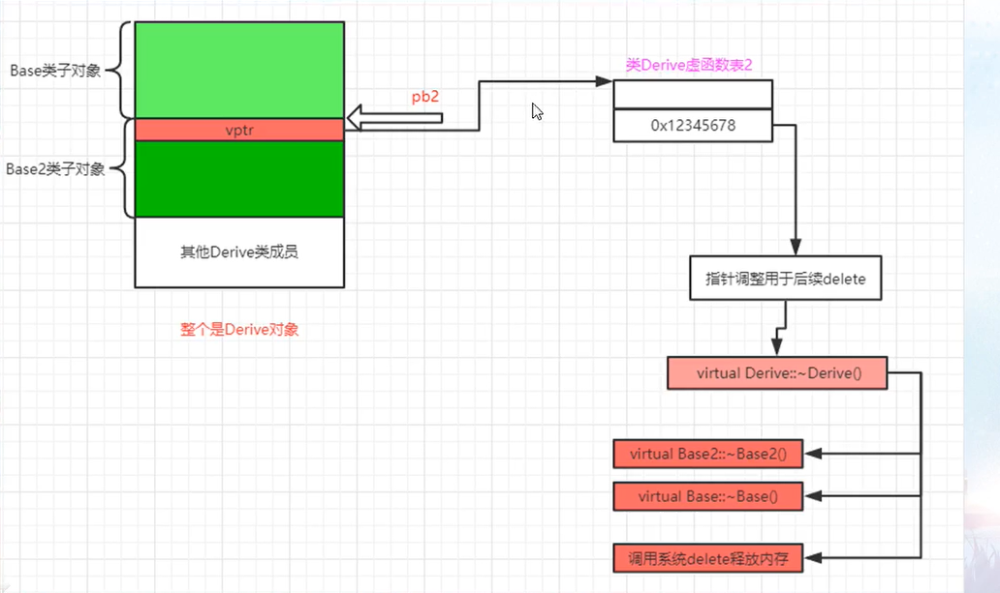

# 5.1 普通成员函数调用方式

- cpp语言设计的要求：对普通成员函数的调用不应该比对全局函数的调用效率低
- 所以对于成员函数，编译器把其转换成了一种对全局函数的调用
- 编译器额外增加了一个叫做this的形参，是一个指针类型，指向的其实就是生成的那个对象，该形参对于确定对象所属的某个成员变量在内存中的位置有用
- 无论是成员函数还是成员变量，在处理它们的名字的时候，编译器都会向名字中混合其他的内容

- cpp语言设计的一个要求：要求对这种普通成员函数的调用不能比全局函数效率差
- 基于这种设计要求，编译器内部实际上是将成员函数的调用转换成了对全局函数的调用
- 成员函数有独立的内存空间，是跟着类走的，并且成员函数的地址，是在编译的时候就确定好了的
  - 编译器额外增加了一个叫做this的形参，是个指针，指向的是生成的地址
  - 常规成员变量的存取，都通过this形参来进行
  - 查看反汇编发现，当调用成员函数的时候，会把该对象的地址放到寄存器上
  - 编译器在内部一般都会将函数名给重命名一遍，防止重名

<br/>

<br/>

# 5.2 虚成员函数、静态成员函数调用方式

虚成员函数调用方法

- 在成员函数中调用虚函数有两种方式，第一种方式是直接调用，可以理解为是通过this调用虚函数，即本质上还是虚函数的调用，需要查询虚函数表；而通过类名加上：：的调用，即`Myacls::myvirfunc()`，这种写法就是直接调用，更有效率，压制住了虚拟机制，不再通过查询虚函数表来调用
- 总结：类范围操作符：：虚函数名（参数），这种明确调用虚函数的方法等价于直接调用一个普通的成员函数


静态成员函数调用方法

- 静态成员函数没有this指针
- 无法直接存取类中普通的非静态成员变量
- 静态成员函数不能在末尾增加const后缀，也不能设置为virtual
- 可以用类对象来调用，但不要求一定要用类对象来调用
- 静态成员函数等同于全局函数
- 静态成员函数有地址，并且在编译时就确定了的

- 虚成员函数的调用

  - 直接通过对象调用虚函数，就像调用普通成员函数一样，不需要通过虚函数表

  - 而指针+对象就要通过虚函数表指针查找虚函数表，通过虚函数表在找到虚函数的入口地址，完成对虚函数的调用

    - 注意，这里如果发生了多态，最开始是要先调整this指针的位置的

    - ```cpp
      pmycals -> func();
      //编译器视角
      (*pmycals -> vptr[0])(pmycals);
      //vptr表示编译器生成的虚函数表指针，下标[0]是表中的第一项，后面传入的相当于this参数
      ```

  - ```cpp
    //在虚函数里面用类调用虚函数，会压制住虚拟机制，不再通过查询虚函数表来调用
    virtual void test() {
        Base::func();//这里func是虚函数，而通过类调用的话走的就不是虚函数表了
    }
    //这种明确调用虚函数的方法等价于直接调用一个普通的成员函数
    ```

- 静态成员函数的调用

  - 调用静态成员函数时编译器是不会插入 this 作为形参的

  - 指针或对象调用静态函数，汇编都一样的

  - ```cpp
    //一种特殊的写法
    ((Base*)0) - >mystfunc(); //调用静态函数
    ```

  - 特点总结：

  - 1、静态成员函数没有this指针

  - 2、无法直接存取类中普通的非静态成员变量

  - 3、静态成员函数不能在末尾增加 const 后缀 也不能设置为virtual

  - 4、可以用类对象来调用，但不要求一定要用类对象来调用（查看反汇编发现，即使是用类对象来调用，实际上还是被转换为了直接调用）

  - 5、静态成员函数等同于全局函数(非成员函数)所以一般提供回调函数的场合，可以将这种函数提供为回调函数

  - 6、静态成员函数有地址，并且是在编译的时候就确定好了的

<br/>

<br/>

# 5.3 虚函数地址问题的vcall引入

- ```cpp
  printf("%p", &Base::test);//这里打印的是vcall函数地址，而不是真正的虚函数
  ```

- vcall的作用

  - 调整this
  - 跳转到真正的虚函数中去

<br/>

<br/>

# 5.4 静动态类型、绑定、坑点、多态体现深谈

静态类型和动态类型

- 静态类型：对象定义时的类型，编译期间就确定好的
- 动态类型：对象目前所指的类型（运行的时候才决定类型的）
  - 一般只有指针或引用才有动态类型的说法，而且一般都是指父类的指针或引用
- ps：一个指针或引用时同时有静态类型和动态类型的，对于一个指针，静态类型就是定义的时候定义的类型，动态类型就是后面指向的类型


静态绑定和动态绑定

- 静态绑定：绑定的是静态类型，所对应的函数或属性依赖于对象的静态类型，发生在编译期
- 动态绑定：绑定的是动态类型，所对应的函数或属性依赖于对象的动态类型，发生在运行期
- 普通成员函数是静态绑定，而虚函数是动态绑定
- 缺省参数一般是静态绑定


继承的非虚函数坑

- 普通成员函数是静态绑定，所以调用哪个成员函数取决于调用者的静态类型
- 所以，如果一个父类指针指向一个子类（父类和子类都有一个同名的函数），希望通过这个父类指针调用子类的该函数，会因为静态绑定，导致调用到父类的该函数
- 结论：不应该在子类中重新定义一个继承来的非虚成员函数


虚函数的动态绑定

- 虚函数是动态绑定，所以要调用虚函数，取决于调用者的动态类型


重新定义虚函数的缺省参数坑

- 父类和子类都有一个同名的虚函数，并且都有缺省参数，然后通过父类指针调用子类的虚函数的时候，用到的却是父类的缺省参数
- 因为缺省参数是静态绑定的，所以因为父类指针，绑定到的就是父类的缺省参数
- ps：cpp主要考虑的是执行期间的效率问题
- 结论：不要在子类中重新定义虚函数缺省参数的值


C++中的多态性

- 从代码上实现
  - 当调用一个虚函数的时候，调用的路线是不是通过查询虚函数表来找到虚函数人口地址然后去执行虚函数？如果调用的是这个路线，就是多态；如果调用的不是这个路线（而是直接调用）那就不是多态
- 从表现形式上
  - 有父类子类，父类中必须含有虚函数，子类重写父类中的虚函数
  - 父类指针指向子类对象或者父类引用绑定（指向）子类对象
  - 当以父类的指针或者引用调用子类中重写了的虚函数时，就能看出来多态的表现了，因为调用的是子类的虚函数

- 静态类型和动态类型

  - 静态类型：对象定义的时候，编译期间就确定好了的

  - 动态类型：对象目前所指向的类型（运行的时候才决定的类型）

    - 一般只有指针和引用才有动态类型的说法，而且一般都是指父类指针或者引用
    - 动态类型在执行过程中可以改变

  - ```cpp
    class Base {};
    class Derive: public Base {};
    class Derive2: public Base {};
    
    Base base;//静态类型是Base，没有动态类型
    Derive derive;//静态类型是Derive，没有动态类型
    Base *pbase;//静态类型依旧是Base*，至少现在没有动态类型
    Base *pbase2 = new Derive();//静态类型依旧是Base*，动态类型是Derive
    Base *pbase2 = new Derive2();//静态类型依旧是Base*，动态类型是Derive2
    ```

- 静态绑定和动态绑定

  - 静态绑定：绑定的是静态类型，所对应的函数或者属性依赖于对象的静态类型，发生在编译期
  - 动态绑定：绑定的是动态类型，所对应的函数或者属性依赖于对象的动态类型，发生在运行期
  - 普通成员函数是静态绑定，而虚函数是动态绑定
  - 缺省参数一般是静态绑定（大坑！）（所以如果是用子类指针指向父类的话，缺省参数绑定的就是子类的那个参数，就不是父类的了）
    - 函数参数缺省值是静态绑定，所以缺省参数绑定到了父类函数的缺省参数上了

- 继承的非虚函数坑

  - 因为普通函数是静态绑定，是在编译器就决定好了的，所以看的是指针或引用是啥类型，而不是指向的是啥类型
  - 结论：不应该在子类中重新定义一个继承来的非虚函数（即使在子类中重新定义了该函数，最终调用的时候还是要看是谁（指针的类型）调用的）

- 虚函数的动态绑定

  - 虚函数是动态绑定，到底执行谁就要看指针指向的是谁

- 不要重新定义虚函数的缺省参数的值

- cpp中的多态性体现

  - 多态，必须是存在虚函数，没有虚函数，绝不可能存在多态，有虚函数并且调用虚函数

  - 从代码实现上：

    - 当我们调用一个虚函数的时候，走的是不是通过查询虚函数表来找到虚函数入口地址，如果是，就是多态（否则就不是）

    - ```cpp
      class A {
          public:
          virtual void func() {}
      };
      
      A a1;
      a1.func();//这不是多态
      
      A *a2 = new A();
      a2 -> func();//这是多态
      ```

  - 从表现形式上：

    - 有继承关系，有父类有子类，父类中必须有虚函数（这意味着子类中一定有虚函数），派生类重写基类的虚函数
    - 父类指针或引用指向子类对象
    - 当以父类指针 或 引用调用子类中重写了的虚函数时，我们就能看出来多态的体现了，因为调用的是子类的虚函数

<br/>

<br/>

# 5.5 单继承虚函数趣味性测试和回顾

单继承下的虚函数

- 关于子类对象继承父类对象的对象模型上的区别，子类后续的虚函数都是放在父类模型的下面的（即是说是与父类同名的虚函数，位置也是放在和父类一样的位置的）


回顾和一些小试验

- 即便子类不重写任何虚函数（父类有虚函数），子类仍旧有自己的虚函数表，和父类Base的虚函数表不是一个表，但是它们的表项相同
- 即便是纯虚函数也是在虚函数表中占据一个表项的

- 唯一需要在执行期间知道的东西就是，通过，哪个虚函数表来调用虚函数（是父类还是子类）
- 回顾
  - 虚函数地址：编译期间知道，写在了可执行文件中，编译期间已经构建出来
  - vptr编译期间产生，编译器在构造函数中插入了给vptr赋值的代码，当创建对象时，因为要执行对象的构造函数，此时vptr就被赋值

<br/>

<br/>

# 5.6 多继承深释、第二基类，虚析构比加

- 多继承下的虚函数

  - ```cpp
    Base2 *pb2 = new Derive();
    
    //编译器视角
    Derive *temp = new Derive();
    Base2 *pb2 = (Base*)((char*)(temp) + sizeof(Base));//这里涉及到指针的调整，即这个父类的指针指向的是子类中属于这个父类的部分
    ```

- 如何成功删除用第二基类指针new出来的子类对象

  - 如果Base2中没有析构函数，那么编译器会直接删除指针指向的内存，报异常
  - 如果Base2中有普通析构函数，Base2析构函数被调用（因为是静态绑定的），也是删除指针指向的内存，报异常
  - 如果Base2中有虚析构函数（子类没有虚析构函数），或者子类有虚析构函数（父类没有虚析构函数），那么就会删除指针指向的整个对象，不会报错
    - 如果子类有虚析构函数，那么编译器在处理 delete pb2 代码时，因为多态的特性，查虚函数表去执行析构函数时执行的肯定是子类的虚析构函数
    - 然后编译器会向子类虚析构函数中插入调用两个父类的析构函数
    - PS：如果父类有虚析构函数，而子类没有，那么编译器就会为子类合成虚析构函数（用于调用父类的虚析构函数）
    - PS：如果子类的是普通析构函数，那么编译器也会把它变为虚析构函数的，目的同上
  - 只要这个析构函数是虚函数，那么他就支持多态
  - 总结：如果要防止内存泄漏，父类的析构必然要是虚析构；而为了统一，所有的析构最好都写为虚析构
  - 
  - 

- 父类非虚析构函数时导致的内存泄漏展示

  - 如果父类的析构函数不是虚函数，则不会触发动态绑定，结果就是只会调用父类的析构函数而不会调用子类的析构函数，从而可能会导致内存泄漏
  - 如果父类的析构函数是虚函数，则子类的析构函数一定是虚函数，会触发系统的动态绑定

<br/>

<br/>

# 5.7 多继承第二基类虚函数支持、虚继承带虚基类

<br/>

<br/>

# 5.8 RTTI运行时类型识别回顾与存储位置介绍

<br/>

<br/>

# 5.9 函数调用、继承关系性能说

- 函数调用中编译器的循环代码优化
  - 在 Debug 版本编译器会往里插入很多信息用于程序调试目的；而 Release 版本是发布版(一般用于商业环境中实际使用) ，编译器不会插入调试信息，而且还会进行优化， 执行效率一般比较高
  - 编译器将一些简单的循环优化为一条语句，而有些编译器在编译期间就替程序员完成了运算
- 继承关系深度增加，开销也增加
  - 深度增加，要调用的函数也增加，性能降低
- 继承关系深度增加，虚函数导致的开销增加
  - 每个类的构造函数中都要增加用于给虚函数表指针赋值的代码

<br/>

<br/>

# 5.10 指向成员函数的指针及vcall进一步说

<br/>

<br/>

# 5.11 inline函数回顾和拓展细节说

- inline函数回顾

  - 使用inline之后，编译器内部会有一个比较复杂的测试算法来评估这个inline函数的复杂程度
  - 会统计这个inline函数中，赋值次数，内部函数调用，虚函数调用次数等--权重
  - 开发者写inline只是对编译器的一个建议，但如果编译器评估这个inline函数的复杂程度过高，这个inline建议就被编译器忽略掉
  - 如果inline被编译器采纳，那么inline函数的拓展，就要在调用这个inline函数的那个点上进行（可能带来额外的问题，比如参数求值，可能产生临时对象的生成和管理）

- inline拓展细节

  - 形参被对应实参取代

  - ```cpp
    inlint int test(int t) {
        return t * t + 9;
    }
    
    int i = test(1 + 2);//这里会先计算1+2，然后再放入拓展后的代码里面进行计算
    
    int a = 90;
    int j = test(a + 98);//同上
    
    int i = test(func() + 15);//会先计算func()，然后得到返回值再相加
    ```

  - 局部变量的引入（局部变量能少用就少用，能不用就不用）

    - 因为inline会在用到的时候拓展代码，导致局部变量的产生

  - inline失败情形（比如递归，其实成功与否，主要看编译器的）
