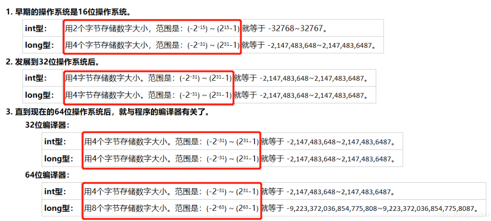

# char

- char，一个字节，范围是-128到127
- unsigned char，一个字节，0-255（最高位不是符号位）


面试题

- ```cpp
  for (char i = 0; i < 256; ++ i) {
      cout << i << endl;
  } // 求该代码运行的结果
  ```

- 会死循环，因为char只占用1个字节，即八位，所以char的取值范围是-128 到 127，一旦127+1就会变为-128


# short

- short，最少是两个字节，即-32768到32767
- unsigned short，也是两个字节，0~65535


# int型

- 

- long long，八个字节，取值范围为（-2^63） ~ (2^63 - 1)

- unsigned int（32编译器或系统上就是0 到 4294967295，同样是4个字节）

  - PS：当有一个数是unsigned int的时候，整体就会变为unsigned int

  - ```cpp
    unsigned int x = 5;
    x > -1 + -2;// 按照基本的顺序，这里是先计算-1+-2，即变为x > -3
    // 而这里会把-3转换为unsigned int类型，会变为4294967293，从而导致 5 > 4294967293
    
    // 而如果是int的会就会是这种情况了...（被今晚的笔试给坑了.）
    ```

  - 

- unsigned long（0~4294967295）

- unsigned long long


# 浮点型

- double，双精度，8个字节，其数值范围为-1.79769313486232E308 ～1.79769313486232E308
- float，单精度，4个字节，其数值范围为-3.4E38～3.4E+38


## 如何判断浮点数是否相等

- 不能用==判断（二进制记录小数，会有误差的）
- 对于两个浮点数比较只能通过相减并与预先设定的精度比较，记得要取绝对值
- 浮点数与0的比较 也应该注意。与浮点数的表示方式有关


# size_t

- https://www.zhihu.com/question/24773728/answer/66535663
- 为了跨平台，使用宏高效的封存了底层细节

- 无符号整数

- 一点小trick

  - ```cpp
    int main() {
        std::vector<int> f(0, 0);
        for (int i = 0; i < f.size() - 1; i++) {
            std::cout << "i = " << i << std::endl;
        }
    }
    ```

  - 因为f.size()得到的是一个size_t无符号整数，就会导致f.size()-1变成一个很大的正数，就会出现意想不到的结果


# 为什么会出现int8_t等类型？

- 因为对于c语言的标准，不同的平台都有自己的实现（windows上32位和64位的long都是32位的，但是在unix中32位的是16位，64位的是32位）
- 所以为了方便跨平台，使用stdint库，统一标准


char16_t，char32_t，char

https://blog.csdn.net/qq_26405165/article/details/123647492