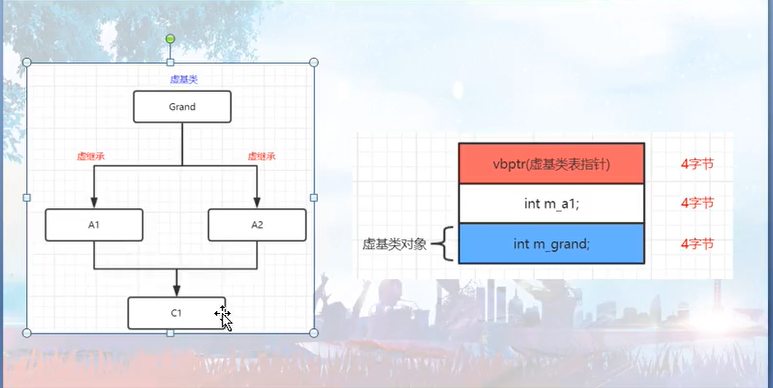

# virtual function

- 背景：为了实现动态多态
- 会在类的首地址加上虚函数指针（继承的时候也会将该指针给继承下去）
  - 在单继承的情况下，子类和子类中的父类是共用虚函数指针的
  - 而多继承的情况下，不同父类的虚函数指针是分开的


# virtual function and template

- 在模板类中可以使用虚函数，也可以继承模板类通过虚函数实现多态
- 但是模板成员函数不可以是虚函数
  - 因为在实例化模板类时，需要创建virtual table
  - 在模板类被实例化完成之前不能确定函数模板会被实例化出多少个
  - 因为虚函数必须要知道有多少个实例化出来的例子，方便存储函数的地址，而模板成员函数是不知道有多少个实例化出来的例子的，所以模板就不支持虚函数


# virtual inheritance

- 背景：最早是为了解决菱形继承的问题的

- 会在类首地址的位置放置一个虚基类表指针

  - 
  - 为什么会出现虚基类指针：因为虚基类派生出来的类中,虚基类的对象不在固定位置(应该是在尾部),需要一个中介才能访问虚基类的对象.所以子类需要有一个vbptr,对应的table中需要有一项指向虚基类

- 虚继承下加上虚函数（虚基类指针会放在整个类的最前面）

  - ```cpp
    #include <iostream>
    
    class s1 {
        char ss[3];
        virtual void f(){}
    }; // 8（virtual 函数 point） + 3（char[3]） + 5（padding）
    
    class s2: public virtual s1 {
        char jj[3];
    }; // 8（virtual 基类 point） + 16（s1） +  3（char[3]） + 5（padding）
    
    class s3: public virtual s1 {
        char cc[3];
        virtual void ff(){}
    }; // 8（virtual 基类 point） + 16（s1） +  3（char[3]） + 5（padding）// 单继承下父类和子类是共用虚函数指针的
    
    int main() {
        std::cout << "sizeof s1 = " << sizeof(s1) << std::endl; // 16
        std::cout << "sizeof s2 = " << sizeof(s2) << std::endl; // 32
        std::cout << "sizeof s3 = " << sizeof(s3) << std::endl; // 32
    }
    ```

  - https://www.zhihu.com/question/313033224

  - http://baiy.cn/doc/cpp/inside_rtti.htm

  - https://blog.csdn.net/xiaxzhou/article/details/76576516
  
- 出现的一些情况是虚函数指针和虚表的那个指针变为了同一个指针了


# 八股

## virutal function一定走vtbl吗

- 其实调用虚函数不一定会走虚函数表的逻辑，如果在子类函数中调用父类虚函数，是可以直接调用不走虚函数

- ```cpp
  class A {
  public:
      virtual void tt() {
          cout << "A" << endl;
      }
      void test() {
          tt();
      }
  };
  
  class B: public A {
  public:
      virtual void tt() {
          cout << "B" << endl;
      }
  };
  
  int main() {
      B *b1 = new B();
      b1 -> test(); // B
  }
  ```


## virtual function为什么慢

- 虚函数其实最主要的[性能开销](https://mp.weixin.qq.com/s?__biz=MzkyODE5NjU2Mw==&mid=2247485056&idx=1&sn=5a3e5b93f6d8872aa5fdfeee4e509a9f&chksm=c21d343cf56abd2a6abfaef8caff16dd6fb835bdaf3d4901f55e26eea45a059411c1d1bd94ea&mpshare=1&scene=1&srcid=0218A758oDsFaQngFjuWy7zZ&sharer_sharetime=1613619319357&sharer_shareid=054214e3287ede8cff93de9018c6d7da#rd)在于它**阻碍了编译器内联函数和各种函数级别的优化，导致性能开销较大**


实验一

- ```cpp
  #include <cmath>
  #include "timer.h"
  #include <iostream>
  
  using namespace std;
  
  struct Base {
     public:
      virtual int f(double i1, int i2) { return static_cast<int>(i1 * log(i1)) * i2; }
  };
  
  int main() {
  	TimerLog t("timer");
      Base *a = new Base();
      int ai = 0;
      for (int i = 0; i < 1000000000; i++) {
          ai += a -> f(i, 10);
      }
      cout << ai << endl;
  }
  
  //////////////////////////////////////////////////////////////
  
  #include <cmath>
  #include "timer.h"
  struct Base {
     public:
      int f(double i1, int i2) { return static_cast<int>(i1 * log(i1)) * i2; }
  };
  
  int main() {
      TimerLog t("timer");
      Base *a = new Base();
      int ai = 0;
      for (int i = 0; i < 1000000000; i++) {
          ai += a->f(i, 10);
      }
      cout << ai << endl;
  }
  
  //	上面两份代码的运行时间都差不多（都是12、13s的样子）
  //	结论：虚函数表的查询基本不会影响程序的性能
  ```


实验二

- ```cpp
  #include <cmath>
  #include "timer.h"
  struct Base {
     public:
      virtual int f(double i1, int i2) { return static_cast<int>(i1 * log(i1)) * i2; }
  };
  
  int main() {
      TimerLog t("timer");
      Base *a = new Base();
      int ai = 0;
      for (int i = 0; i < 1000000000; i++) {
          ai += a->f(10, i); // 这里有改动
      }
      cout << ai << endl;
  }
  
  ////////////////////////////////////////////////////////////////
  
  #include <cmath>
  #include "timer.h"
  struct Base {
     public:
      int f(double i1, int i2) { return static_cast<int>(i1 * log(i1)) * i2; }
  };
  
  int main() {
      TimerLog t("timer");
      Base *a = new Base();
      int ai = 0;
      for (int i = 0; i < 1000000000; i++) {
          ai += a->f(10, i); // 这里有改动
      }
      cout << ai << endl;
  }
  
  //	第一个代码运行时间为436ms，而第二个代码运行时间为154ms
  ```


总结

- 第一二个代码的对比：实际开销的时间几乎一样，所以虚函数表导致的那一次函数间接调用并不浪费时间，即**虚函数的开销并不在重定向上**
- 第三四个代码的对比：实际开销的时间相差3倍，发现实际上的性能开销在于**虚函数阻碍了编译器内联函数和各种级别函数的优化**，导致性能开销过大
  - 即在普通函数中log(10)会被优化掉，它就只会被计算一次，而如果使用虚函数，log(10)不会被编译器优化，它就会被计算多次

- 所以虽然查虚函数表固然需要不少的时间，但是主要的开销还是因为编译器没能对函数进行优化
  - 真正原因是编译器在编译时通常并不知道它将要调用哪个函数，所以它不能被内联优化和其它很多优化，因此就会增加很多无意义的指令（准备寄存器、调用函数、保存状态等），而且如果虚函数有很多实现方法，那分支预测的成功率也会降低很多，分支预测错误也会导致程序性能下降


背景：正常的函数调用

- 复制栈上的一些寄存器，以允许被调用的函数使用这些寄存器；
- 将参数复制到预定义的位置，这样被调用的函数可以找到对应参数；
- 入栈返回地址；
- 跳转到函数的代码，这是一个编译时地址，因为编译器/链接器硬编码为二进制
  - 但是如果是虚函数调用的话，就要先从对象那里得到虚表指针，根据虚表（一个存放函数地址的数组）找到对于的函数地址，最后再放到寄存器中，接着再跳转到该函数中
- 从预定义的位置获取返回值，并恢复想要使用的寄存器


## virutal function为什么不能和缺省参数一起调用

- 函数的缺省参数和类是静态绑定的，所以就会导致如果通过动态绑定的虚函数调用，就会造成缺省参数的错乱

- ```cpp
  #include <iostream>
  #include <string>
  #include <cstdio>
  
  using namespace std;
  
  class A {
  public:
      virtual void func(int i = 1) {
          cout << "A" << " " << i << endl;
      }
      void test() {func();}
  };
  
  class B: public A{
  public:
      void func(int i = 0) {
          cout << "B" << " " << i << endl;
      }
  };
  
  int main() {
      A* a1 = new B();
      a1 -> test();// B 1
  }
  ```


## virtual destructor抛出异常

- 《effective cpp》中第八条

- 不能让析构函数吐出异常，因为这可能会使程序**提前结束**或**出现不明确行为**

- 解决办法：

  - 在析构函数中运用try catch，即如果抛出了异常就结束程序，通常通过调用abort完成

  - ```cpp
    DBConn::~DBConn(){
        try{db.close();}
        catch(...){
            std::abort();
        }
    }
    ```

  - 或者不用abort，直接记录下此次异常


## 父类对象（指针）调用子类虚函数

- CRTP，这是一种设计模式，主要是用于父类从子类中提取相关信息

- ```cpp
  template <typename T>
  class Base
  {
  public:
      virtual ~Base() = default;
      virtual void fun()
      {
          cout << "Base::fun()" <<endl;
      }
      
      void callChildMethod()
      {
          static_cast<T&>(*this).show();
      }
  };
  
  class Sub : public Base<Sub>
  {
  public:
      virtual void fun()
      {
          cout << "Sub::fun()" <<endl;
      }
      
      virtual void show()
      {
          cout << "Sub::show()" <<endl;
      }
  };
  
  Sub sub;
  Base<Sub>& base = sub;
  base.callChildMethod();
  ```


## 子类调用父类虚函数

- ```cpp
  class a1 {
  public:
      virtual ~a1() = default;
      virtual void show() {std::cout << "a1" << std::endl;}
  };
  
  class b1: public a1 {
  public:
      virtual void show() {std::cout << "b1" << std::endl;}
  };
  
  int main() {
      b1 b;
      static_cast<a1>(b).show();
  }
  ```


# to do list

- ```cpp
  #include <algorithm>
  #include <iostream>
  #include <vector>
  
  class C {
  public:
      C() {std::cout << "c" << std::endl;}
      virtual ~C() {std::cout << "~C" << std::endl;} 
  };
  
  class D:public C {
  public:
      D() {std::cout << "d" << std::endl;}
      virtual ~D() {std::cout << "~d" << std::endl;}
  };
  
  int main() {
      C* d = new D();
      d -> ~C();
      std::cout << "----" << std::endl;
      delete d;
  }
  
  /*
  c
  d
  ~d
  ~C
  ----
  ~C
  */
  ```

- 为什么通过父指针调用父函数的析构函数，会造成指针的移动（后面delete都不会调用d的析构函数了...）