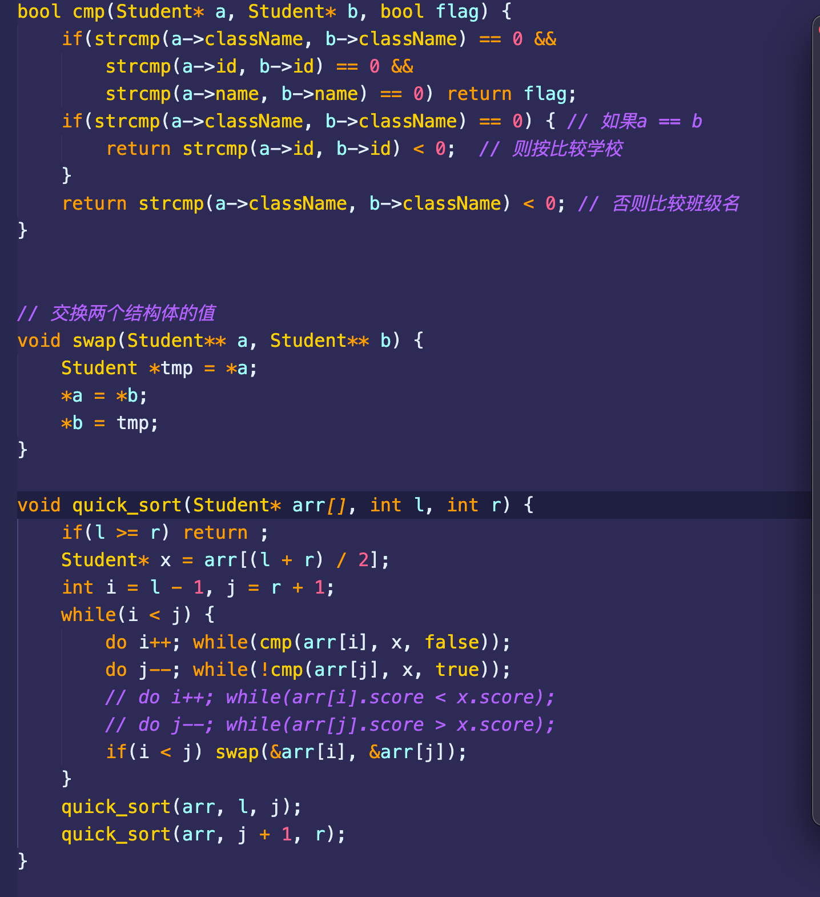

# main函数的参数

- 参数的含义是程序在命令行下运行的时候，需要输入argc 个参数，每个参数是以char 类型输入的，依次 存在数组里面，数组是 argv[]，所有的参数在指针 
- char * 指向的内存中，数组的中元素的个数为 argc 个，第一个参数为程序的名称

# 在main函数执行之前的代码

- 设置栈指针
- 初始化静态变量和全局变量，即.data的内容
- 将未初始化的全局变量赋值，数值型short，int，long等为0，bool为FALSE，指针为NULL等等，即.bss段的内容
- 全局对象初始化，在main函数之前调用构造函数
- 将main函数的参数argc，argv等传递给main函数，然后才执行main函数
- __ attribute __((constructor))

# 在main函数执行之后的代码

- 全局对象的析构函数会在main函数之后执行
- 可以用 atexit 注册一个函数，它会在main 之后执行
- __ attribute __((destructor))

# main函数的返回值

- main函数的返回值必须是int，这样返回值才能传递给程序激活者，表示程序正常退出

# 定义和声明的区别

对于变量来说

- 声明仅仅是告诉编译器，有个某类型的变量会被使用，但是编译器并不会为它分配任何内存
- 定义就是为了分配内存

对于函数来说

- 声明：一般在头文件里，编译器说：这里我有一个函数叫function() 让编译器知道这个函数的存在。
- 定义：一般在源文件里，具体就是函数的实现过程 写明函数体。

# cout和printf的区别

- cout是一个函数，并对<<针对各种数据进行了重载，所以能够识别不同的数据
- 输出过程时将输出字符放入缓冲区，然后输出到屏幕
- cout是缓冲输出，flush是立即强迫缓冲输出
- printf是无缓冲输出，有输出时立即输出

# Printf函数的实现原理

- 在C/C++中，对函数参数的扫描是从后向前的。 
- C/C++的函数参数是通过压入堆栈的方式来给函数传参数的（堆栈是一种先进后出的数据结构），最先 压入的参数最后出来，在计算机的内存中，数据有2块，一块是堆，一块是栈（函数参数及局部变量在 这里），而栈是从内存的高地址向低地址生长的，控制生长的就是堆栈指针了，最先压入的参数是在最 上面，就是说在所有参数的最后面，最后压入的参数在最下面，结构上看起来是第一个，所以最后压入 的参数总是能够被函数找到，因为它就在堆栈指针的上方
- printf的第一个被找到的参数就是那个字符指针，就是被双引号括起来的那一部分，函数通过判断字符串 里控制参数的个数来判断参数个数及数据类型，通过这些就可算出数据需要的堆栈指针的偏移量了，下 面给出printf("%d,%d",a,b);（其中a、b都是int型的）的汇编代码.

# endl和\n的区别

"\n"

- 表示搜索一个字符串，回车符

'\n'

- 表示一个字符

endl

- 用endl时会刷新缓冲区，使得栈中的东西刷新一次
- 但使用"\n"不会刷新，他只会换行，栈内的数据没有改变
- endl除了写’\n’进外，还调用flush函数，刷新缓冲区，把缓冲区里的数据写入文件或屏幕.考虑效率就用’\n’
- cout << endl;除了往输出流中插入一个’\n’还有刷新输出流的作用.
- cout << endl; 等价于: cout << ‘\n’ << flush;
- 在没有必要刷新输出流的时候应尽量使用cout << ‘\n’, 过多的endl是影响程序执行效率低下的因素之一

# 定义和声明

- 声明仅仅是把变量的声明的位置及类型提供给编译器，并不分配内存空间（存疑，因为我声明的时候，他好像还是提供了内存空间）
- 定义，在定义的地方为其分配存储空间
- 相同变量可以在多处声明，但只能在一处定义

# 重载运算符

- 只能重载已有的运算符；对于一个重载的运算符，其优先级和结合律与内置类型一致才可以；不能改变运算符操作数个数
- 两种重载方式：
  - 成员运算符和非成员运算符，成员运算符比非成员运算符少一个参数（this）
  - 下标运算符、箭头运算符必须是成员运算符
- 当重载的运算符是成员函数时，this绑定到左侧运算符对象；成员运算符函数的参数数量比运算符对象的数量少一个
- 下标运算符必须是成员函数，下标运算符通常以所访问元素的引用作为返回值，同时最好定义下标 运算符的常量版本和非常量版本
- 箭头运算符必须是类的成员，解引用通常也是类的成员；重载的箭头运算符必须返回类的指针；

# switch 的底层实现

 C++ 代码到可执行文件的过程。可执行文件执行的过程

# C++和Python的区别

- Python是一种脚本语言，是解释执行的，而C++是编译语言，是需要编译后在特定平台运行的。 
- python可以很方便的跨平台，但是效率没有C++高。 
- Python使用缩进来区分不同的代码块，C++使用花括号来区分 
- C++中需要事先定义变量的类型，而Python不需要，Python的基本数据类型只有数字，布尔值，字符 串，列表，元组等等 
- Python的库函数比C++的多，调用起来很方便

# C++和C的区别

- C++中new和delete是对内存分配的运算符，取代了C中的malloc和free。 
- 标准C++中的字符串类取代了标准C函数库头文件中的字符数组处理函数（C中没有字符串类型）。 
- C++中用来做控制态输入输出的iostream类库替代了标准C中的stdio函数库。 
- C++中的try/catch/throw异常处理机制取代了标准C中的setjmp()和longjmp()函数。 
- 在C++中，允许有相同的函数名，不过它们的参数类型不能完全相同，这样这些函数就可以相互区别 开来。而这在C语言中是不允许的。也就是C++可以重载，C语言不允许。 
- C++语言中，允许变量定义语句在程序中的任何地方，只要在是使用它之前就可以；而C语言中，必 须要在函数开头部分。而且C++允许重复定义变量，C语言也是做不到这一点的 
- 在C++中，除了值和指针之外，新增了引用。引用型变量是其他变量的一个别名，我们可以认为他们 只是名字不相同，其他都是相同的。 
- C++相对与C增加了一些关键字，如：bool、using、dynamic_cast、namespace等等
- C不支持函数重载

# C++和Java的区别

语言特性 

Java语言给开发人员提供了更为简洁的语法；完全面向对象，由于JVM可以安装到任何的操作系统 上，所以说它的可移植性强 Java语言中没有指针的概念，引入了真正的数组。不同于C++中利用指针实现的“伪数组”，Java引入 了真正的数组，同时将容易造成麻烦的指针从语言中去掉，这将有利于防止在C++程序中常见的因为 数组操作越界等指针操作而对系统数据进行非法读写带来的不安全问题 C++也可以在其他系统运行，但是需要不同的编码（这一点不如Java，只编写一次代码，到处运 行），例如对一个数字，在windows下是大端存储，在unix中则为小端存储。Java程序一般都是生成 字节码，在JVM里面运行得到结果 Java用接口(Interface)技术取代C++程序中的抽象类。接口与抽象类有同样的功能，但是省却了在实现 和维护上的复杂性 

垃圾回收 

C++用析构函数回收垃圾，写C和C++程序时一定要注意内存的申请和释放 Java语言不使用指针，内存的分配和回收都是自动进行的，程序员无须考虑内存碎片的问题 

应用场景

 Java在桌面程序上不如C++实用，C++可以直接编译成exe文件，指针是c++的优势，可以直接对内存 的操作，但同时具有危险性 。（操作内存的确是一项非常危险的事情，一旦指针指向的位置发生错 误，或者误删除了内存中某个地址单元存放的重要数据，后果是可想而知的） Java在Web 应用上具有C++ 无可比拟的优势，具有丰富多样的框架 对于底层程序的编程以及控制方面的编程，C++很灵活，因为有句柄的存在

# Cpp为什么没有垃圾回收机制

- 实现一个垃圾回收器会带来额外的空间和事件的开销
  - 需要空间保存指针的引用计数和对他们进行标记mark，还需要开一个线程在空闲的时候进行free
- 使得cpp不能进行很多底层的操作

# CPP标准库是什么

- 标准函数库： 这个库是由通用的、独立的、不属于任何类的函数组成的。函数库继承自 C 语言。
- 面向对象类库： 这个库是类及其相关函数的集合
- 输入/输出 I/O、字符串和字符处理、数学、时间、日期和本地化、动态分配、其他、宽字符函数
- 标准的 C++ I/O 类、String 类、数值类、STL 容器类、STL 算法、STL 函数对象、STL 迭代器、STL  分配器、本地化库、异常处理类、杂项支持库

# 组合与继承

继承

- 优点：
  - 子类可以重写父类的方法来方便地实现对父类的拓展
- 缺点：
  - 父类内部细节对子类是可见的
  - 子类从父类继承的方法在编译时就确定下来了，所以无法在运行期间改变从父类继承的方法的行为
  - 如果对父类的方法做了修改，则子类的方法必须做出相应的修改
  - 父子类高度耦合

组合

- 优点：
  - 当前对象只能通过所包含的那个对象去调用其方法，所以所包含的对象的内部细节对当前对象时不 可见的
  - 当前对象与包含的对象是一个低耦合关系，如果修改包含对象的类中代码不需要修改当前对象类的代码
  - 当前对象可以在运行时动态的绑定所包含的对象。可以通过set方法给所包含对象赋值
- 缺点：
  - 容易产生过多的对象
  - 为了能组合多个对象，必须仔细对接口进行定义

# 如何判断浮点数是否相等

- 不能用==判断（二进制记录小数，会有误差的）
- 对于两个浮点数比较只能通过相减并与预先设定的精度比较，记得要取绝对值
- 浮点数与0的比较 也应该注意。与浮点数的表示方式有关

# 全局变量和局部变量

- 生命周期不同：全局变量随主程序创建和创建，随主程序销毁而销毁；局部变量在局部函数内部，甚至 局部循环体等内部存在，退出就不存在； 使用方式不同：通过声明后全局变量在程序的各个部分都可以用到；局部变量分配在堆栈区，只能在局 部使用。 操作系统和编译器通过内存分配的位置可以区分两者，全局变量分配在全局数据段并且在程序开始运行 的时候被加载。局部变量则分配在堆栈里面 。

# 实现排序

- struct AdItem {
  std::string ad_id;
  int priority;
  int score;
  };

  实现一个函数，按照如下规则排序

  - 按照priority升序排列
  - 如果priority一样大，则按照score降序排列
  - 如果priority一样，则随机排序

- 感觉就普通的快排，然后自己重写一遍swap和cmp函数

- 这里考察的是排序的 strick weaken order

- 

# sfinae

# cpp traits