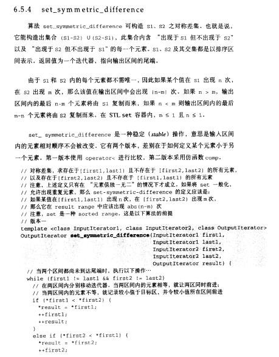
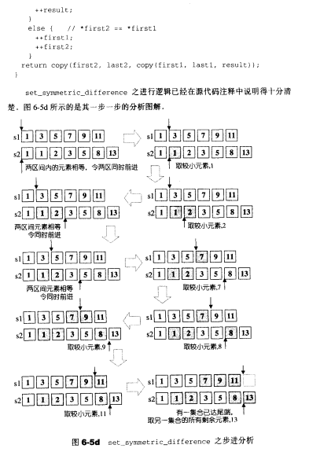
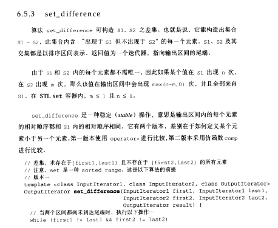
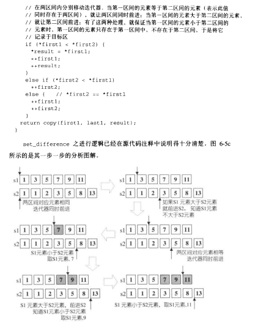
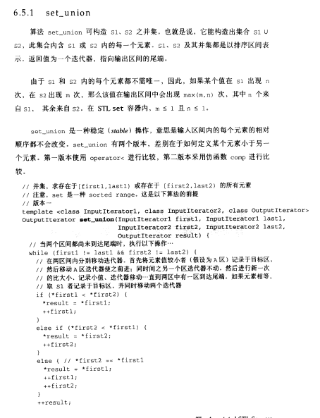
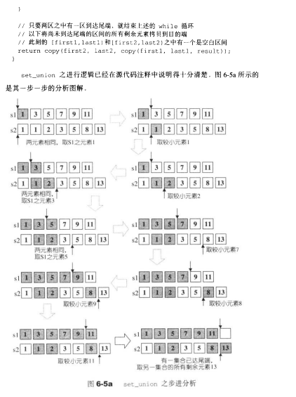
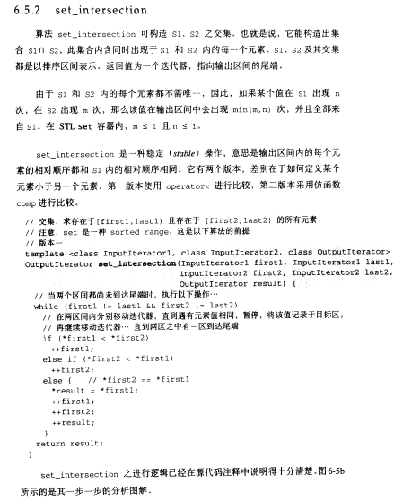
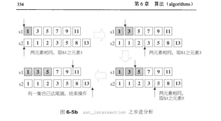

# set_symmetric_difference

- 
- 


# set_difference

- 出现在s1但不出现在s2内的每个元素
  - 也是用双指针，如果当前指向s2的元素大于s1，那么就将s1的元素放入，同时调整s1的位置
  - 如果相同，同时移动指针
  - 如果s1大于s2的元素，就要移动s2的指针（因为可能后面有元素和s1的元素相等）
- 
- 


# set_union

- 双指针实现并集

- 
- 


# set_intersection

- 求两个set的交集（因为set是rbtree实现的，所以数据内部是已经排好序了的，就可以用**双指针寻找数据**）
  - 当二者相同的时候就将数据记录到result中（一旦有一个指针指向last了，就退出）
- 所以事件复杂度一般是o(m+n)，最佳的话能够到达min(m,n)
- 
- 


# distance

- std::distance对于RandomAccessIterator迭代器实现的，即对于连续的容器，是可以通过O(1)实现的，而对于普通的ForwardIterator显然是要O（n）来实现（比如set的底层是红黑树，所以如果使用std::lower_bound的话，就等价于从头再找了...）
- 所以，如果能够使用特化版的算法，就使用特化版的，避免低效


# upper_bound

- ```cpp
  template <class ForwardIterator, class T>
    ForwardIterator upper_bound (ForwardIterator first, ForwardIterator last, const T& val)
  {
    ForwardIterator it;
    iterator_traits<ForwardIterator>::difference_type count, step;
    count = std::distance(first,last);
    while (count>0)
    {
      it = first; step=count/2; std::advance (it,step);
      if (!(val<*it))                 // or: if (!comp(val,*it)), for version (2)
        { first=++it; count-=step+1;  }
      else count=step;
    }
    return first;
  }
  
  //简化版
  lo = 0, hi = n;
          // upper_bound
          while (lo < hi) {
              int mid = (lo + hi) / 2;
              if (A[mid] <= target) {
                  lo = mid + 1;
              } else {
                  hi = mid;
              }
          }
          return lo;
  ```


# sort

- ```cpp
  #include <algorithm>
  #include <iterator>
  #include <forward_list>
   
  template <class ForwardIt>
  void quicksort(ForwardIt first, ForwardIt last)
  {
      if(first == last) return;
      auto pivot = *std::next(first, std::distance(first,last)/2);
      ForwardIt middle1 = std::partition(first, last, 
                           [pivot](const auto& em){ return em < pivot; });
      ForwardIt middle2 = std::partition(middle1, last, 
                           [pivot](const auto& em){ return !(pivot < em); });
      quicksort(first, middle1);
      quicksort(middle2, last);
  }
  ```

- https://zhuanlan.zhihu.com/p/364361964

- https://blog.csdn.net/qq_34039018/article/details/100781444

- sort对数据进行排序，存在数据拷贝的过程，所以最好给它加上一个移动拷贝构造，或者在容器中存储指针

- 八股规则：

  - 当返回值是true的时候，第一个参数会放在前面的位置，第二个参数会放在后面的位置；false则反之
  - **当a=b的时候，必须要返回false**


# tie

```cpp
tie(t1, t2) = t2, t1; // 不能够交换t1和t2的值（这里最后都会变成t1）
// 因为左边其实本质上是左值引用，他会先给t1f
```

- 但是适合批量的赋值

- ```cpp
  dp1 = dp2;
  dp2 = dp3;
  
  // 等价于
  tie(dp1, dp2) = {dp2, dp3};
  ```


# max_element

- 返回容器的最大值


# accumulate

- 累积求和


# nth_element

- 求解区间中第k小的元素
- https://zh.cppreference.com/w/cpp/algorithm/nth_element
- https://sugar.blog.csdn.net/article/details/88050145


# lower_bound

- 二分查找

- https://blog.csdn.net/qq_40160605/article/details/80150252

- std::lower_bound二分查找的话，是通过std::distance确定中间点的，显然时间复杂度很高，所以容器有特化版本时，一定要使用特化版本

- 说白了，lower_bound就是在模拟我们的二分模板

- ```cpp
  template<class ForwardIt, class T>
  ForwardIt lower_bound(ForwardIt first, ForwardIt last, const T& value)
  {
      ForwardIt it;
      typename std::iterator_traits<ForwardIt>::difference_type count, step;
      count = std::distance(first, last); //	返回两个迭代器之间的距离（左闭右开），表明左边的迭代器要加多少才能到右边的迭代器
   
      while (count > 0) {
          it = first; 
          step = count / 2; 
          std::advance(it, step); //	将迭代器往后移动n位
          if (*it < value) {
              first = ++it; 
              count -= step + 1; 
          }
          else
              count = step;
      }
      return first;
  }
  
  //简化版
  count = last - start;
  while (count > 0) {
      step = count/2;
      int* it = first + step;
      if (*it < target) {
          count = count - (step + 1);
          first = it + 1;
      } else {
          count=step;
      }
  }
  return first;
  ```


# remove

- std::remove(first,last,val)，移除[first, last)范围内等于val的元素
- 在vector里面用就类似于：iter = std::remove(vec.begin(), vec.end(), val)
  - 但这个函数只是把val移到vec的末尾，并不真正删除
- 真正删除还是要调用一次erase函数