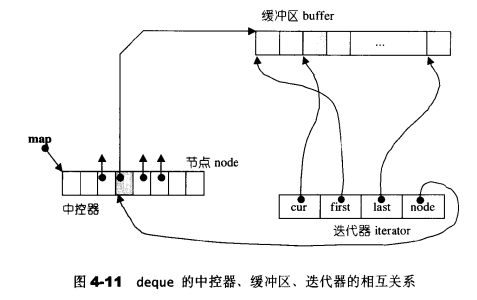
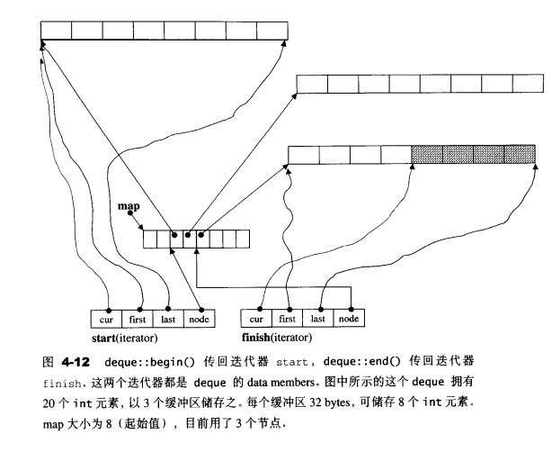
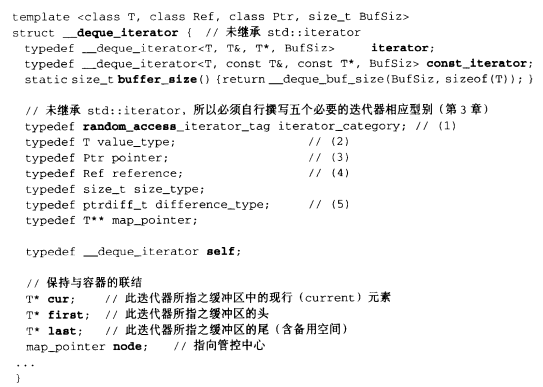
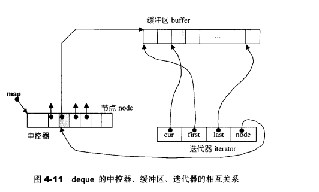
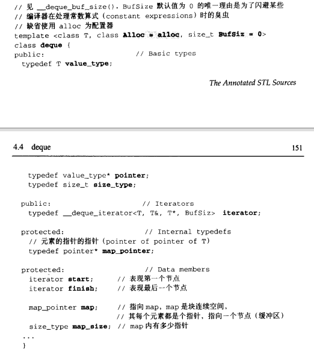

# 用法

- ```cpp
  //构造函数的四种方式
  deque<string> words1{"the", "is", "deque"};
  deque<string> words2(words1.begin(), words1.end());
  deque<string> words3(words1);
  deque<string> words4(5, "YES");
  
  //front获取第一个元素
  std::cout << words1.front() << std::endl;
  
  //back返回最后一个元素
  std::cout << words1.back() << std::endl;
  
  //size返回容器的大小
  std::cout << "words contains : " << words4.size() << std::endl;
  
  //push_back把元素放入末尾
  words4.push_back("NO");
  
  //pop_back移除最后一个元素
  words4.pop_back();
  
  //push_front把元素放到开头
  words4.push_front("SS");
  
  //pop_front移除第一个元素
  words4.pop_front();
  
  //erast移除元素
  words4.erase(words4.begin());//移除某个位置的元素
  words1.erase(words1.begin()+2, words1.end());//移除某个区间的元素
  
  //insert插入元素
  words1.insert(words1.begin()+1, words4.begin(), words4.end());//第一个参数是位置，后面是要插入的容器的内容
  words1.insert(words1.begin()+3, "strat");//指定位置插入元素
  words1.insert(words1.begin()+3, 5, "IS");//位置，重复次数，重复的数据
  
  //iterator正向迭代器，+1是向右边走
  for (deque<string>::iterator it = words1.begin(); it != words1.end(); it++) {
  	cout << *it << " ";
  }
  
  //reverse_iterator反向迭代器，+1向左走
  for (deque<string>::reverse_iterator it = words1.rbegin(); it != words1.rend(); it++) {
  	cout << *it << " ";
  }
  
  //empty
  bool flag = d1.empty();
  
  //size
  int sizee = d1.size();
  
  //max_size
  
  //shrink_to_fit
  
  //at
  
  //assign
  
  //emplace_back
  
  //emplace_front
  
  //swap
  ```


# 实现

- 是一种双向开口的连续线性空间，可以在头尾两端分别做元素的插入和删除
  - 所以允许在常数时间内对头端进行元素的插入或移除操作
- 没有容量观念，动态地以分段连续空间合成，随时可以增加一段新的空间并连接起来
- 非必要不使用deque，如果要对deque进行排序，就要先把deque复制到vector上，将vector排序，再复制会deque
- deque系由一段一段的定量连续空间构成。一旦有必要在deque的前端或尾端增加新空间，便配置一段定量连续空间，串接在整个deque的头端或尾端
- deque的最大任务，便是在这些分段的定量连续空间上，维护其整体连续的假象，并提供随机存取的借口。避开了“重新配置、复制、释放”的轮回，代价则是复杂的迭代器架构
- deque采用一块所谓的map（注意，不是STL的map容器）作为主控。这里所谓map是一小块连续空间，其中每个元素（此处称为一个节点，node）都是指针，指向另一段（较大的）连续线性空间，称为缓冲区。缓冲区才是deque的储存空间主体。SGI STL 允许我们指定缓冲区大小，默认值0表示将使用512bytes缓冲区
- 在g++10.3中，deque的大小为80（64位机器），deque::iterator的大小为32（依然是4个指针）
  - iterator的组成：cur（指向当前元素在buffer中的位置），first（指向当前buffer的头部），last（指向当前buffer的尾部），node（指向当前迭代器对应的缓冲区在中控器中的位置，是指向中心的位置）（因此iterator的大小为4 * 8）
  - deque的组成：start（头iterator，32，deque的第一个元素），finish（尾iterator，32，deque最后一个元素的下一个节点），pointer（map_pointer，一个指针，是一个指向数据的二级指针，挖坑，8字节，一个双重指针 一个存放指针的数组 数组里的每个元素指向一个存放元素的数组（就是一个缓冲区），指向map，map是块连续空间，其内部的每个元素都是一个指针(称为节点)），map_size（size_type，map中继器的大小，8字节，map的大小），刚好80字节

https://blog.csdn.net/qq_15041569/article/details/110943325

https://blog.csdn.net/CHYabc123456hh/article/details/121449313


deque大体图

- 


迭代器

- 有四个指针，分别指向连续空间的开始地址，结束地址，空间中当前元素的地址以及连续空间地址在map中的位置（该节点在map中的位置）
- 
- 


deque中中控器、缓冲区、迭代器的相互关系

- 


deque本身的数据结构

- 
- 现在的deque最少10个指针？？（大小为80）