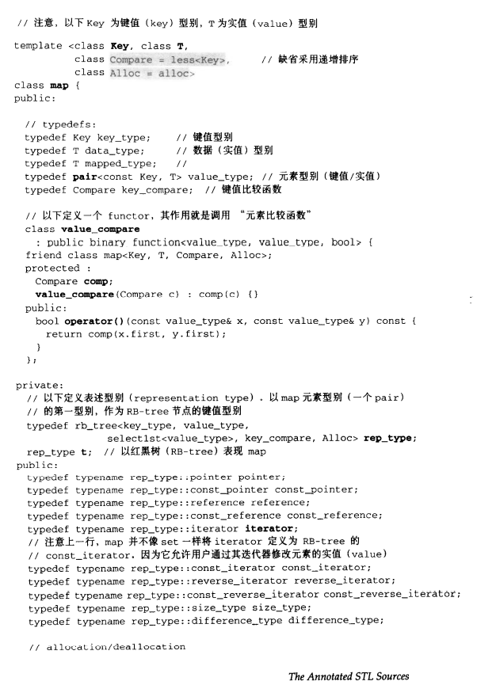
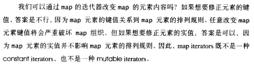
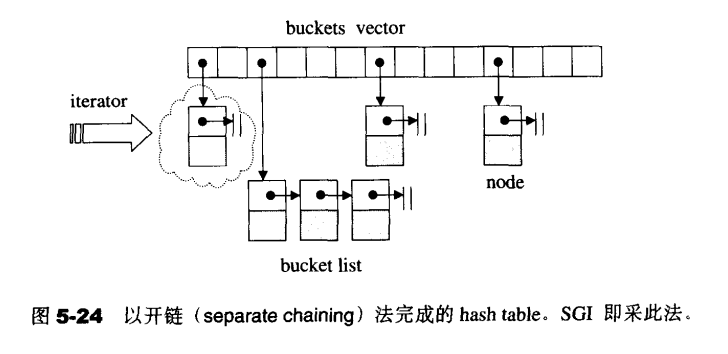
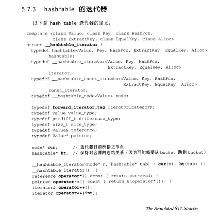
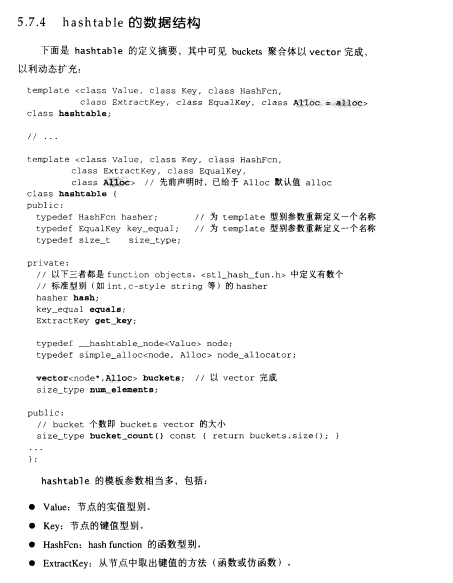
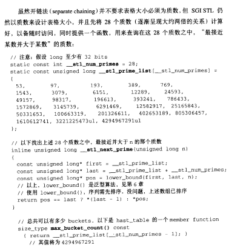
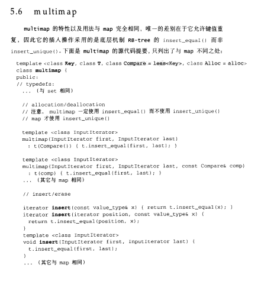

# 前置知识

- stl的红黑树


# map

## 实现

- 


- 底层是以**红黑树**的结构实现，插入删除查找都在$O(logn)$时间内完成
  - 注意这里的value_type是pair<const Key, T> value_type;
- 对于红黑树，其中定义了一个模版参数，如果它是key那么它就是set，如果它是map，那么它就是map
  - 实现map的红黑树的节点数据类型是key+value
  - 实现set的节点数据类型是value
- 特性：所有元素都会根据元素的键值自动被排序，map的所有元素都是pair，同时拥有实值（value）和键值（key）；map不允许两个元素拥有相同的键值
- 对map中的元素进行操作时，之前元素的迭代器不会因此失效
- PS：红黑树的每个节点都需要记录当前节点的value，color，left，right，parent（所以比链表更加占用内存）


- 关于map的迭代器
- 


## 用法

```cpp
#include <map>
#include <iostream>
#include <string>
using namespace std;

int main() {
    map<string, int> maps;
    //插入若干元素
    maps["jack"] = 1;
    maps["jane"] = 2;
    maps["july"] = 3;

    //以pair形式插入
    pair<string, int> p("david", 4);
    maps.insert(p);

    //迭代输出元素
    map<string, int>::iterator iter = maps.begin();
    for (; iter != maps.end(); ++iter) {
        cout << iter->first << " ";
        cout << iter->second << "--";
        // david 4--jack 1--jane 2--july 3--
    }
    cout << endl;

    //使用subscipt操作取实值
    int num = maps["july"];
    cout << num << endl; // 3

    //查找某key
    iter = maps.find("jane");
    if (iter != maps.end()) cout << iter->second << endl; // 2

    //修改实值
    iter->second = 100;
    int num2 = maps["jane"]; // 100
    cout << num2 << endl;

    // 几种插入数据的方式
    std::map<int, std::string> mapStudent;
	// 1) 用insert函数插入pair数据
	mapStudent.insert(pair<int, string>(1, "student_one"));

	// 2) 用insert函数插入value_type数据
	mapStudent.insert(map<int, string>::value_type(1, "student_one"));

	// 3) 在insert函数中使用make_pair()函数
	mapStudent.insert(make_pair(1, "student_one"));

	// 4) 用数组方式插入数据
	mapStudent[1] = "student_one";
    
    //	删除元素
    map<int, int> map1;
    auto i = map.find(1);
    map.eraset(i)
}
```


## at、[]和find的区别

- []
  - 将关键码作为下标去执行查找，并返回对应的值
  - 如果不存在这个关键码，就将一个具有该关键码和值类型的默认值的项插入这个map
  - 所以不能通过[]判断元素是否在容器中
- find函数
  - 用关键码执行查找，找到了返回该位置的迭代器
  - 如果不存在这个关键码，就返回尾迭代器
- at
  - 将关键码作为下标去执行查找，并返回对应的值
  - 如果不存在就会报错


# unordered_map

## 实现

- unordered_map中的bucket所维护的list是其自己定义的由hashtable_node数据结构组成的linked-list

- bucket聚合体本身使用vector进行存储（**所以说本质是数组**）

- hashtable的迭代器只提供前进操作，不提供后退操作

- 在hashtable设计bucket的数量上，其内置了28个质数[53, 97, 193,...,429496729]，在创建hashtable时，会根据存入的元素个数选择大于等于元素个数的质数作为hashtable的容量（vector的长度），其中每个bucket 所维护的linked-list长度也等于hashtable的容量。如果插入hashtable的元素个数超过了bucket的容量，就要进行重建table操作，即找出下一个质数，创建新的buckets vector，重新计算元素在新hashtable的位置

- 什么时候扩容：当向容器添加元素的时候，会判断当前容器的元素个数，如果大于等于阈值---即当 前数组的长度乘以加载因子的值的时候，就要自动扩容啦

- 

- unordered_map是基于**hash_table**实现，一般是由一个大vector，vector元素节点可挂接链表来解决冲突来实现。hash_table最大的优点，就是把数据的存储和查找消耗的时间大大降低，几乎可以看成是常数时间；而代价仅仅是消耗比较多的内存。然而在当前可利用内存越来越多的情况下，用空间换时间的做法是值得的

- hash_table节点的定义

  - ```cpp
    template<class Vaule>
    struct __hashtable_node {
        __hashtable_node* next;
        Value val;
    };
    ```

- hash_table的迭代器

  - 
  - hashtable的迭代器没有后退操作，hashtable也没有定义所谓的逆向迭代器

- hashtable的数据结构

  - 

- 


# unordered_map和map的区别

map

- 底层实现是红黑树，所以可以支持键值的自动排序，所以在查询和维护的时间和空间复杂度上都为$O(logn)$
  - 内部元素有序

- 但是空间占用比较大，因为每个节点要保持父节点、孩子节点及颜色的信息
- 相比哈希表，没有了rehash的过程


unordered_map

- 底层机制是哈希表，通过hash函数计算元素位置，查询时间复杂度为O(1)
  - 内部元素无序
- 维护时间与bucket桶所维护的list长度有关
- 但是建立hash表耗时较大，同时rehash耗时较大


总结

- map适用于有序数据的应用场景，unordered_map适用于高效查询的应用场景
- map 底层数据结构为红黑树，有序，不重复
- multimap 底层数据结构为红黑树，有序，可重复
- unordered_map 底层数据结构为hash表，无序，不重复
- unordered_multimap 底层数据结构为hash表，无序，可重复


# multimap

- 


# to do list

- https://mp.weixin.qq.com/s?__biz=MzkyMjIxMzIxNA==&mid=2247483656&idx=1&sn=a204fedfbf2cf7f2023979c56b756c8a&scene=19#wechat_redirect
- https://mp.weixin.qq.com/s?__biz=MzkyMjIxMzIxNA==&mid=2247483848&idx=1&sn=d459a04730a4e56653452eae9f71d424&scene=19#wechat_redirect
