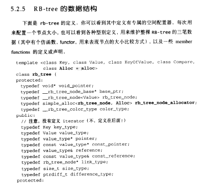
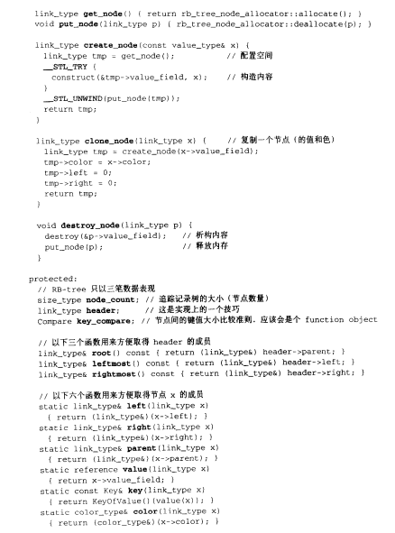
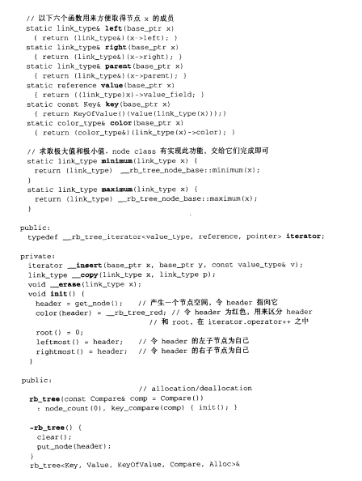
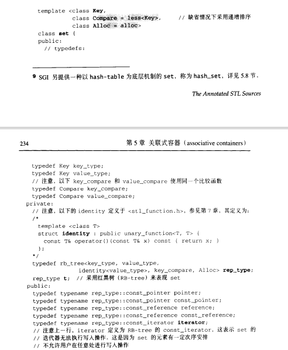
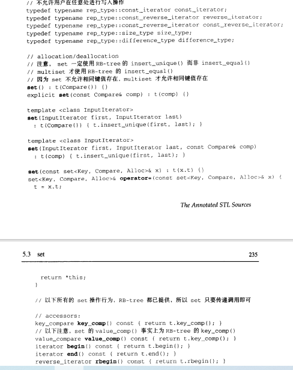
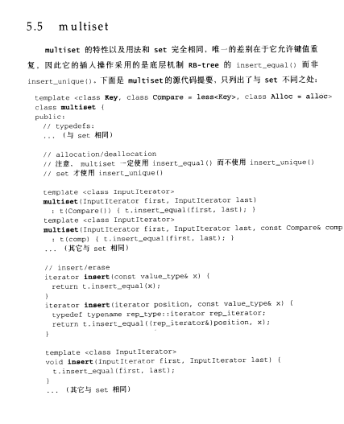

# 前置知识

- stl中的红黑树
- 
- 
- 


# set

## 用法

- ```cpp
  //默认初始化
  set<int> seet;
  
  //插入元素
  i.insert(9);
  
  // 插入元素，和上面等价
  i.emplace(9);
  
  // 删除元素
  i.erase(9);
  
  // 查找元素
  i.find(9);
  
  //initializer_list构造函数
  set<string> s{"why", "always", "me"};
  
  //copy构造函数
  set<string> c(s);
  
  // 判断是否set为空
  c.empty();
  
  // 返回set的大小
  c.size();
  
  // 	从容器擦除所有元素，此后的size为0，时间复杂度为o(n)
  c.clear();
  
  // 返回键值在set中出现的次数，对数时间复杂度
  i.count(9);
  
  // 返回首个不小于key元素的迭代器，对数时间复杂度
  auto it = i.lower_bound(9);
  ```


## 定义

- 所有元素都会根据元素的键值自动被排序，set元素的键值就是实值，实值就是键值，不允许有两个元素有相同的键值

- **不能通过迭代器修改元素**（因为元素的修改会影响元素的顺序）
  - set<T>::iterator被定义为底层RB-tree的const_iterator，杜绝写入操作
  
- 和list有相同的性质：当客户端对它进行元素insert或erase时，操作之前的所有迭代器，在操作完成之后都依然有效

- set的底层是红黑树实现的，插入删除查找都是**对数**的时间复杂度

- ```cpp
  template< class Key, class Compare = std::less<Key>, class Allocator = std::allocator<Key> >
  class set;
  ```

- 第一个参数是数据的类型，第二个参数是数据排序的函数，第三个参数是内存空间的分配函数

- 注意这里的value_type是Key，即传入的参数类型

- 

- 

- 可以看出set底层就是一颗rb-tree


## emplace和insert效率的问题

- emplace的一般实现是用的args去创建（构造）一个新的对象，然后将这个对象去实施真正的insert操作
- 可如果用的unordered_set，那么很可能因为不能出现重复key的原因出现拒绝添加，那么就会析构这个对象，这样这个构造+析构的操作就是浪费的了
- 而insert只会在发现可以添加的时候才创建一个对象，因此少了对象的构造和拷贝


结论：

- emplace在vector，list等容器上效率会高很多，因为新增元素的位置与元素本身无关
- 而set，map等容器需要依据元素本身的比较结果才能确定插入位置，因此无论如何都要先构造出元素，确定位置后才能把元素移过去


# unordered_set

## 定义

- 底层是哈希表实现
- 搜索、插入和移除拥有平均**常数时间复杂度**

- ```cpp
  template< class Key, class Hash = std::hash<Key>, class KeyEqual = std::equal_to<Key>, class Allocator = std::allocator<Key> >
  class unordered_set;
  ```


## 用法

- 和set基本一致


## 有关传入的参数

- 对于vector<int>，unordered_set无法实现去重的功能，而set才可以
  - 因为unorder_set是根据std::hash来计算key的，而**std::hash**没有给vector<int>做特定的hash函数，所以vector<int>，pair<int, int>等不能做unordered系列的键值
  - 而map是**根据操作符`<`**，vector<int>，pair<int,int>是可以比较大小的


# multiset

- 
- multiset使用的insert是insert_equal，即如果遇到相同的，插入便是
