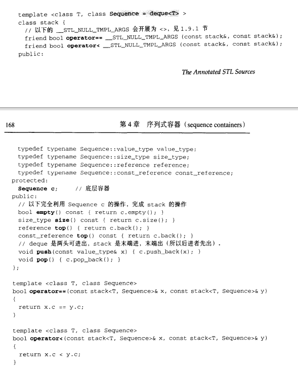

# 用法

- ```cpp
  int main() {
      std::vector<std::string>
          v1{"1","2","3","4"},
          v2{"Ɐ","B","Ɔ","D","Ǝ"};
   
      std::stack s1{std::move(v1)}; // 可以用vector来构造stack
      std::stack s2{std::move(v2)};
   
      s1.swap(s2); // 可以用swap交换栈
      s1.push("dsf");
      s1.emplace("dsf");// 等价于s1.push("dsf");
      s1.top();// 返回栈顶元素
      s1.pop();// t
  }
  ```


# 定义

- 栈，先进后出

- 


- stack默认的底部容器是deque（所以它的大小和deque的大小一样），也可以用list作为底部容器

  - ```cpp
    template<class T, class Container = std::deque<T>>
    class stack;
    ```

  - 底层容器必须要有back()，push_back()，pop_back()等函数接口

  - 标准容器 std::vector、std::deque和std::list满足这些要求。若不为特定的 stack 类特化指定容器类，则使用标准容器std::deque

- stack不提供迭代器（因为先进后出，所以不需要也不能有迭代器）

- 大小也是80