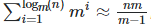

# vector

### 用法

- ```cpp
  //构造函数的四种方式
  vector<string> i1(2, "hi");
  vector<string> i2{"why", "always", "me"};
  vector<string> i3(i2.begin(), i3.end());
  vector<stirng> i4(i3);
  
  vector<int> f(4); // 保证得到的元素都是0
  
  // operator= 赋值运算符
  i4 = i3;
  
  // assign
  vector<char> i5;
  i5.assign(5, 'x');               // 第一个参数是数字，第二个参数是变量，即数量*变量
  i5.assign(i4.begin(), i4.end()); // 也可以用迭代器
  i5.assign({'1', '2', '3'});      // 还可以用initializer_list
  
  // at(索引)
  vector<int> i6{1, 2, 3};
  i6.at(1); //等价于i6[1]
  
  // operator[]，返回第几个值
  i6[1] = 10;
  
  // front容器首元素
  std::cout << i7.front() << std::endl;
  
  // back容器最后一个元素
  std::cout << i7.back() << std::endl;
  
  // begin返回指向容器的第一个元素的迭代器，end返回指向容器尾端的迭代器
  for (vector<string>::reverse_iterator it = sv.begin(); it != sv.end(); it++)
  {
      std::cout << *it << " ";
  }
  
  // rbegin返回一个指向容器最后一个元素的反向迭代器，rend返回一个指向容器前端的反向迭代器（反向迭代器+1会往前面移动）
  for (std::vector<int>::reverse_iterator it = test_vector.rbegin(); it != test_vector.rend(); it++)
  {
      std::cout << *it << " ";
  }
  
  // empty若容器为空则为true，否则为false
  bool flag = i6.empty();
  
  // size容器中的元素个数
  std::cout << i6.size() << std::endl;
  
  // max_size返回容器可容纳的元素最大数量
  std::cout << i6.max_size() << std::endl;
  
  // capacity返回当前分配存储的容量
  std::cout << i6.capacity() << std::endl;
  
  // resize重设容器大小以容纳count个元素
  i6.resize(10);
  
  // shrink_to_fit请求移除未使用的容量,将容量由capacity()减少为size()
  i6.shrink_to_fit();
  
  // clear从容器移除所有元素
  i6.clear();
  
  // insert的三种形式
  i6.insert(i6.begin(), 10);                       //在begin的位置添加一个10的元素
  i6.insert(i6.begin(), 10, 10);                   //在begin的位置添加10个值为10的元素
  i6.insert(i6.begin() + 2, i5.begin(), i5.end()); //把另一个容器的元素插入到指定位置
  
  // erase从容器移除指定的元素
  i6.erase(i6.begin());                     //删除单个元素
  i6.erase(i6.begin() + 2, i6.begin() + 5); //删除指定区间的元素
  
  // push_back向容器尾部插入元素
  i6.push_back(111);
  
  // pop_back移除容器最后一个元素
  i6.pop_back();
  
  // swap交换两个容器的内容
  i6.swap(i5);
  
  // emplace在指定位置添加元素
  i6.emplace(i6.begin() + 1, 11);
  
  // emplace_back在容器末尾就地构造元素（在末尾添加元素）
  i6.emplace_back(10);
  ```


### 实现

- 源码
  - 


- 可以看到一个vector中有**三个指针**，分别指向使用空间的头尾，以及可用空间的尾

- 为了降低空间配置的速度成本，vector实际配置的大小可能比客户端需求量大一些（即容量）

- alloc作为默认的空间分配器


- vector的迭代器本质上就是一个指针，指向元素T
  - 所以迭代器也可以用[]运算符进行访问：b[i]等价于*(b + i)
- 


- vector的指针类型都是存储在栈上的，而指针指向的数组才是存放在堆上的
- 为什么不能把数据放到栈上
  - 栈上是不能动态扩容的，要实现动态扩容只能是堆


- 为什么end要在最后一个元素的后面一个位置
  - 当没有元素的时候，begin和end指向一起，方便判空


### 扩容

**为什么是成倍扩容而不是等差扩容**

如果是成倍扩容

- 假定有 **n** 个元素,倍增因子为 **m。**那么完成这 **n** 个元素往一个 **vector** 中的**push_back**操作，需要重新分配内存的次数大约为**logm(n)**，第 **i** 次重新分配将会导致复制 **m^i** (也就是当前的**vector.size()** 大小)个旧空间中元素，因此 **n** 次 **push_back**操作所花费的总时间约为 **n\*m/(m - 1)**:
- 
- 即扩容的时间复杂度到每个元素上是常数级的

如果是等差扩容

- 设每次扩容**m**个元素，总的元素个数是n，则需要扩容**n/m**次

- $$
  \sum^{n/m}_{i = 1}m * i=\frac{(n+m)*n}{2*m}\\
  $$

- 即平摊到每个元素身上就是O(n)的了


**为什么要选择2倍扩容（gcc）或者1.5倍（msvc）扩容**

- 理想的分配方案：是在第N次扩容时如果能复用之前N-1次释放的空间
  - 而当m=2的时候每次扩容的大小都会大于前面释放掉的所有的空间
  - 按照小于2倍方式扩容，多次扩容之后就可以复用之前释放的空间了
  - 而超过2倍，就会导致空间的浪费，并且无法完美的使用到前面已经释放掉的内存
- 所以
  - 使用2倍（k=2）扩容机制扩容时，每次扩容后的新内存大小必定大于前面的总和
  - 而使用1.5倍（k=1.5)扩容时，在几次扩展以后，可以重用之前的内存空间了


### resize

- 将容器的size修改为size1
  - 如果size1比当前的size大，那么size就会变为size1（如果capacity比size1小，capacity也会变为size1，否则不变）（同时扩容多出的部分值为0）
  - 如果size1比当前的size小，那么size就会变为size1（capacity不变）


### data

- ```cpp
  #include <iostream>
  #include <vector>
  
  using namespace std;
  
  int main() {
      int *p;
      std::vector<int> holder;
      {
          vector<int> a{1,2,3,4,5};
          p = a.data(); // 能取到具体数据的指针
          holder = std::move(a);
      }
      cout << p[0] << endl;
  }
  ```


### push_back

时间复杂度分析

- 假定有 **n** 个元素,倍增因子为 **m。**那么完成这 **n** 个元素往一个 **vector** 中的**push_back**操作，需要重新分配内存的次数大约为**logm(n)**，第 **i** 次重新分配将会导致复制 **m^i** (也就是当前的**vector.size()** 大小)个旧空间中元素，因此 **n** 次 **push_back**操作所花费的总时间约为 **n\*m/(m - 1)**:
- 
- 这样均摊时间到n个元素的话，就是常数级的时间复杂度了


实现原理
- 当我们以push_back将新元素插入到vector尾端的时候
  - 首先检查是否有备用空间，如果有就直接在备用空间上构造元素，并调整迭代器finish，使vector变大
  - 如果没有就拓大空间（重新配置、移动数据、释放原空间）
- 
- 为什么还要独立开一个insert_aux函数：因为可能其他的函数，比如insert也会用到插入元素的功能，所以进行再次封装
- 

- 一旦空间重新分配，指向原vector的所有的迭代器都会失效


push_back和move

- ```c++
  std::string s1 = "fdj";
  std::vector<string> f;
  
  f.push_back(std::move(s1));
  ```

- 此时s1中的字符串就会被移动到f中，s1的指向就会被视为UB行为（即string中都是有一个指向char字符串的指针，move以后，这个指针指向的位置就是f[0]指向的位置）


### shrink_to_fit

- 把capacity减小到size
- 所以一定会重新分配内存空间，使得迭代器失效


### erase

- 删除指定迭代器的内容，或者指定迭代器范围的内容

- 只能删除内容，不能改变容量大小（size发生变化，capacity不变）


### clear

- 清空容器中所有的元素
- clear只是改变容器的大小（last/end指针的位置），不会改变capacity，换言之，clear是不会释放容器的内存的
- 根据数据类型的不同，时间复杂度也会不同
  - 如果容器中是POD或基本数据，那由于该元素没有析构函数，加之vector内部连续存储的特性，编译器的实现是可以在常量时间完成clear()的
  - 而如果是自定义数据，或者list或vector等类型，就要逐个逐个的去析构，时间复杂度就会到O（n）

- 所以，clear在某些时候时间复杂度是很高的
  - 在工程实践中，我们要思考是否每次都需要及时的clear掉一个容器。比如在后台服务中，有些容器类型的变量在命中某些条件下要进行clear()，后续逻辑中判断容器是空的，就不在用之进行某些逻辑（比如遍历它，进行某种操作）。其实也可以用一个bool标记来存储后续是否需要遍历该容器，待到本次请求的响应返回给client之后，再来清理这个容器也不迟


### remove

- 还可以采用通用算法remove()来删除vector容器中的元素


### pop_back

- 可以删除最后一个元素（size发生变化，capacity不变）


### at和[]

- []的越界访问是不会报错
  - 因为每次判断是否越界的分支if语句其实是非常损耗性能的
  - 但是访问到什么变量是未知的
- vector的at会检查是否越界（at的参数时size_t，放入负数的话会被转为整数）


### push_back和emplace_back

- 这两者都是将对象放到vector当中

- ```cpp
  #include <iostream>
  #include <vector>
  
  class Test {
  public:
      Test() {std::cout << "Test" << std::endl;}
      ~Test() {std::cout << "~Test" << std::endl;}
      Test(const Test &p) {std::cout << "Test copy" << std::endl;}
      Test(const Test &&p) {std::cout << "Test move" << std::endl;}
      Test(int age) {std::cout << "Test age" << std::endl;}
  };
  
  int main(int argc, const char *argv[]) {
      std::vector<Test> v;
      v.emplace_back(Test(12));
      /*
      Test age
  	Test move
  	~Test
  	~Test//程序结束的析构
  	传右值：这里调用了一次构造函数（先在外面构造一个临时对象，执行完这句话后析构），一次移动构造函数（在emplace_back里面），所以有两次析构
  	所以是构建了两个对象
      */
      
      v.push_back(Test(12));
      /*
      Test age
  	Test move
  	~Test
  	~Test//程序结束的析构
  	传右值：这里调用了一次构造函数（先在外面构造一个临时对象，执行完这句话后析构），一次移动构造函数（在push_back里面），所以有两次析构 
  	所以是构建两个对象
      */
      
      v.emplace_back(12);
      /*
      Test age
  	~Test//程序结束的析构
  	传右值：这里调用了一次含参的构造函数
      */
      
      v.push_back(12);
      /*
      Test age
  	Test move
  	~Test
  	~Test//程序结束的析构
  	传右值：这里调用了一次构造函数（先在外面构造一个临时对象，执行完这句话后析构），一次移动构造函数（在push_back里面），所以有两次析构
      */
      
      //传左值的话，两者都是一样的：调用一次构造函数，再调用一次拷贝构造函数（在push_back或emplace_back里面）
  }
  
  ```
  
- 如果你传入的是一个左值，就表明你是还需要这个值的，所以两个push都是一样的效果

- 如果你传入的是一个右值，那么系统就会认为你是不需要这个值的，所以就会调用移动构造函数然后再push

- 而至此，好像两者都是一样的，没啥不同，但是接下来就会有问题了：

  - 如果传入的不是该类对象，而是一个数字（但是可以隐性的转换为该类对象）
  - 对于push_back来说，和传入一般的右值是一样的
  - 对于emplace_back来说，只会调用一次构造函数


- 使用push_back()向容器中加入一个右值元素(临时对象)时，首先会调用构造函数构造这个临时对象，然后需要调用拷贝构造函数将这个临时对象放入容器中。原来的临时变量释放。这样造成的问题就是临时变量申请资源的浪费
- 引入了右值引用，转移构造函数后，push_back()右值时就会调用构造函数和转移构造函数，如果可以在插入的时候直接构造，就只需要构造一次即可


总结

- push_back
  - 对于右值，拷贝构造+移动构造
  - 对于左值，构造+拷贝构造
- emplace_push
  - 对于右值， 会直接原地构造对象同时插入
  - 对于左值，即emplace_back是直接拷贝构造到容器上


### 释放空间

- 由于vector的内存占用空间只增不减，比如你首先分配了10,000个字节，然后erase掉后面9,999个，留下一个有效元素，但是内存占用仍为10,000个（所有内存空间是在vector析构时候才能被系统回收）

- clear()可以清空所有元素。但是即使clear()，vector所占用的内存空间不变，无法保证内存的回收

- 如果要清空vector所占用的内存，可以用swap

- ```cpp
  #include <vector>
  #include <iostream>
  
  using namespace std;
  
  int main() {
      vector<int> f1(100, 100);
      {
          vector<int> f;
          f1.swap(f);
      }
      //	vector<int>().swap(f1); // 或者这样
      
      
      // 这样不行，因为swap的参数是T&，不能传递匿名对象
      //	f1.swap(vector<int>());
      cout << f1.size() << endl;
  }
  ```


### push_back和emplace_back的一个大坑

- 参考一段代码

- ```cpp
  #include <iostream>
  #include <vector>
  
  int main()
  {
  	std::vector<std::vector<int>> a;
  	a.push_back({1, 2});
  	a.emplace_back(std::vector<int>{1, 2});
  
  	a.emplace_back(std::initializer_list<int>{1, 2});
  
  	auto x = {1, 2};
  	a.emplace_back(x);
  	a.emplace_back({1,2,3,4,5,6,7}); //	这里会报错
  }
  ```

- 解释：

  - 因为对于push_back来说，查看源代码发现它接收的是一个具体的value_type，即是固定的类型
  - 再看看有关vector的构造，它没有写explicit，所以{1,2}可以隐式转换为vector<int>
  - 而对于emplace_back，它的源代码是一个模板函数，造成的结果就是所提供的参数{1,2}会做模板参数类型匹配，不会主动强转std::initializer_list<int>，需要你显式构造，或者用auto先推导一遍
  - 但是这里模板推到不出来类型，所以就会报错
  - 
  - 
  - 这里的value_type是typeof，即为T，可以理解为已经固定了的类型

- 参考：https://www.zhihu.com/question/438004429

- 所以根本原因是，模板无法推导类型{1,2}，这就是cpp-c唯为
