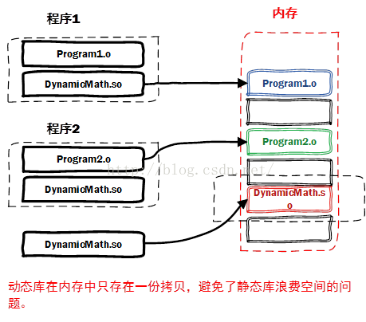

# 静态链接

## 背景及定义

- 在我们的实际开发中，不可能将所有代码放在一个源文件中，所以会出现多个源文件，而且多个源文件之间不是独立的，会存在多种依赖关系
- 比如一个源文件可能要调用另一个源文件中定义的函数，但是每个源文件都是独立编译的，即每个* .c文件会形成一个* .o文件
- 为了满足这种依赖关系，则需要将这些源文件产生的目标文件进行链接，从而形成一个可以执行的程序，这个链接的过程就是**静态链接**
- 在linux下或是gcc中，生成的静态库文件后缀名为.a；对应到windows上就是.lib文件

- 静态链接器以一组可重定位目标文件为输入，生成一个完全链接的可执行目标文件作为输出。链接器主要完成以下两个任务：
  - 符号解析：每个符号对应于一个函数、一个全局变量或一个静态变量，符号解析的目的是将每个符号引用与一个符号定义关联起来
  - 重定位：链接器通过把每个符号定义与一个内存位置关联起来，然后修改所有对这些符号的引用，使得它们指向这个内存位置
- 函数和数据被编译进一个二进制文件。在使用静态库的情况下，在编译链接可执行文件时，链接器从库中复制这些函数和数据并把它们和应用程序的其它模块组合起来创建最终的可执行文件
- 静态链接文件在windows上没有后缀名，而在linux上有，是.a

- 

## 优点

- 运行速度快：在可执行程序中已经具备了所有执行程序所需要的任何东西， 在执行的时候运行速度快

## 缺点

- 空间浪费：因为每个可执行程序中对所有需要的目标文件都要有一份副本，所以如果多个程序对同一个目标文件都有依赖，会出现同一个目标文件都在内存存在多个副本
- 更新困难：每当库函数的代码修改了，这个时候就需要重新进行编译链接形成可执行程序 

## 静态库的编写

- `gcc -c print.c`生成.o文件（要和下面的区分开来）
- `ar rcs libStaticPrint.a print.o`将所需的.o文件集合起来，生成一个静态库文件
- 然后需要给动态库编写头文件（可以认为是接口）
- 最后编写目标文件（比如说main.c），引入头文件即可
  - `gcc main.c libstaticprint.a -o mainstatic`生成可执行文件mainstatic
  - `./mainstatic`执行可执行文件

## 和.o文件的区别

- 在linux下，静态链接库是.a文件，和.o文件最大的区别就是，.a文件可以是数个.o文件的合集

# 动态链接

## 背景

- 解决静态链接空间浪费和更新困难的缺点
- 对于 printf 这种标准函数库，如果每个程序都要有代码，这会极大浪费资源

- 

## 定义

- 共享库是为了解决静态库的这两个问题而设计的，在 Linux 系统中通常用 .so 后缀来表示，Windows 系统上它们被称为 DLL。它具有以下特点：
  - 在给定的文件系统中一个库只有一个文件，所有引用该库的可执行目标文件都共享这个文件，它不会被复制到引用它的可执行文件中
  - 在内存中，一个共享库的 .text 节（已编译程序的机器代码）的一个副本可以被不同的正在运行的进程共享
- 基本思想是把程序按照模块拆分成各个相对独立部分，在程序运行时才将它们链接在一起形成一个完整的程序，而不是像静态链接一样把所有程序模块都链接成一个单独的可执行文件

- 动态库一般存放在/usr/lib目录下
- 动态链接生成的可执行文件要比静态链接生成的文件要小一些
- 动态链接是在执行的过程中将要链接的内容加载

- 可以直接修改动态库而无需重新编译全部代码

## 重定位过程

- 虽然动态链接把链接过程推迟到了程序运行时，但是在形成可执行文件时（注意形成可执行文件和执行程序是两个概念），还是需要用到动态链接库
- 比如我们在形成可执行程序时，发现引用了一个外部的函数，此时会检查动态链接库，发现这个函数名是一个动态链接符号，此时可执行程序就不对这个符号进行重定位，而把这个过程留到装载时再进行

## 优点

- 共享库：多个程序在执行该共享库的时候，都用到的是同一份副本，无需每个应用程序拥有自己的副本
- 更新方便：更新时只需要替换原来的目标文件，而无需将所有的程序再重新链接一遍。当程序下一次运行时，新版本的目标文件会被自动加载到内存并且链接起来，程序就完成了升级的目标
- 缩小了原本可执行文件的大小，加快了源文件的编译速度

## 缺点

- 性能损耗：因为把链接推迟到了程序运行时，所以每次执行程序都需要进行链接，导致性能会有一定损失
- 更容易破坏：如果动态库损坏，则可执行文件可能不再起作用；但静态库是不可触及的，因为它存在于可执行文件中
- 可能会导致原文件附带过于庞大的链接库；而且如果其他计算机上没有安装对应的运行库，则用动态编译的可执行文件就不能运行

## 隐式链接

## 显式链接

## 动态库的编写

- `gcc -fPIC -c print.c -o print.o`将print.c文件编译为.o文件（生成与位置无关的代码）
- `gcc -shared print.o -o libprint.so`将.o文件编译为.so文件（将.o打包生成.so文件，这里的习惯就是在动态库的前面加上lib）
  - `gcc -shared print.o  pp.o -o libprint01.so`可以多个.o文件一起形成.so文件
- 然后需要给动态库编写头文件（可以认为是接口）
- 最后编写目标文件（比如说main.c），引入头文件即可
  - `gcc main.c libprint.so -o main`生成可执行文件main
  - `./main`执行可执行文件

- PS：上述是在windows下编写的，而如果要在linux下使用的话，需要修改环境变量

# 二者的比较

- 静态链接库执行速度比动态链接库更快（执行过程不需要找链接的内容）
- 动态链接库更节省内存（未写入要链接的内容）

# 模板的链接

- 不管模板内部的实现调用了什么依赖库，模板生成的代码本身是静态链接的，因为模板的目标代码都是当时编译器即时生成的
  - 所以我们平时用的string或是iostream都是静态链接的（因为cout这些都是模板）
  - 但是这些头文件所依赖的内容可能存在于libstdc++(libc++或者其它)当中，这一部分是动态链接的
- 而像stdio等头文件中，大部分东西都是C里面的标准IO之类的东西，这些东西存在于libc当中，即是动态链接

# to read list

- https://blog.csdn.net/kang___xi/article/details/79571137
- https://blog.csdn.net/wddpfx/article/details/115326921
- https://blog.csdn.net/freestyle4568world/article/details/49817799
- 内部链接和外部链接？？？
