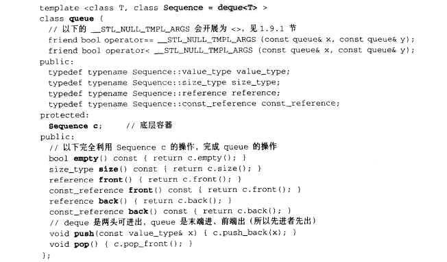

# queue

## 用法


## 定义

- 队列，先进先出
- 底层是以deque作为底层容器的，也可以以list作为底层容器
- queue也不提供迭代器，不提供遍历功能
- 
- 在g++10.3中，queue的大小为80（64位机器）


# priority_queue

## 用法

- ```cpp
  // 升序队列（小顶堆，堆顶是最小的元素）
  priority_queue<int, vector<int>, greater<int>> q;
  //堆顶是最小的元素，堆底是最大的元素（小顶堆），升序队列，这里升序队列是指从左到右，数据依次递增；而本质还是队列，所以每次出去都是最小的元素出去
  greater<int>;//也是仿函数
  
  //降序队列（大顶堆，堆顶是最大的元素）
  priority_queue<int, vector<int>, less<int>> p;
  
  // 返回堆顶的元素
  q.top();
  
  // 弹出堆顶的元素
  q.pop();
  
  // 插入元素
  q.push();
  
  // 查看是否为空
  q.empty();
  
  priority_queue<pair<int, int>> q;//pair的比较是先比较第一个元素，第一个相等就比较第二个元素
  
  ///////////////////////////////////
  
  //自定义数据
  struct tmp1 {//数据本身，运算符重载
      int x;
      tmp1(int a) {
          x = a;
      }
      bool operator<(const tmp1& a) const {
          return x < a.x;
      }
  }
  
  struct tmp2 {
      bool operator() (const tmp1& a, const tmp1& b) {
          return a.x < b.x;//大根堆
      }
  }
  
  priority_queue<tmp1, vector<tmp1>, tmp
  ```


## 定义

- 
- 可以发现优先队列的底层是一个**vector**


- 优先队列，但是他和queue不同的就在于我们可以自定义其中数据的优先级，让优先级高的排列在队列前面，优先出队

- 提供**常数时间的最大元素查找，对数时间的插入与释出**

- ```cpp
  template< class T, class Container = std::vector<T>, class Compare = std::less<typename Container::value_type> >
  class priority_queue;
  ```

- T是存储的元素类型，Container是存储元素的底层容器类型，compare是比较函数

- 缺省的时候是最大堆


- priority_queue的所有元素，进出都有一定的规则，只有queue顶端的元素才有机会被外界采用，所有**不提供遍历功能，不提供迭代器**
