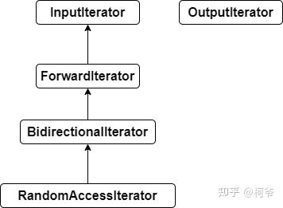

# 迭代器的种类

- **InputIterator**：输入迭代器。支持对容器元素的逐个遍历，以及对元素的读取（input)
- **OutputIterator**：输出迭代器。支持对容器元素的逐个遍历，以及对元素的写入（output)
- **ForwardIterator**：前向迭代器。向前逐个遍历元素。可以对元素读取
- **BidirectionalIterator**：双向迭代器。支持向前向后逐个遍历元素，可以对元素读取
- **RandomAccessIterator**：随机访问迭代器。支持O(1)时间复杂度对元素的随机位置访问，支持对元素的读取

- 


# 迭代器的基本实现

- 迭代器在c++实际实现为指针。即使用指针访问对应索引的对象。为了更加直观简便的使用迭代器，各个迭代器均对该指针重载了"->"和"*"解引用操作符

- 比如list的迭代器，只有一个指向数据的指针，同时重载了很多运算符

- ```cpp
    template<typename _Tp>
      struct _List_iterator
      {
        typedef _List_iterator<_Tp>		_Self;
        typedef _List_node<_Tp>			_Node;
    
        typedef ptrdiff_t				difference_type;
        typedef std::bidirectional_iterator_tag	iterator_category;
        typedef _Tp				value_type;
        typedef _Tp*				pointer;
        typedef _Tp&				reference;
    
        _List_iterator() _GLIBCXX_NOEXCEPT
        : _M_node() { }
    
        explicit
        _List_iterator(__detail::_List_node_base* __x) _GLIBCXX_NOEXCEPT
        : _M_node(__x) { }
    
        _Self
        _M_const_cast() const _GLIBCXX_NOEXCEPT
        { return *this; }
    
        // Must downcast from _List_node_base to _List_node to get to value.
        reference
        operator*() const _GLIBCXX_NOEXCEPT
        { return *static_cast<_Node*>(_M_node)->_M_valptr(); }
    
        pointer
        operator->() const _GLIBCXX_NOEXCEPT
        { return static_cast<_Node*>(_M_node)->_M_valptr(); }
    
        _Self&
        operator++() _GLIBCXX_NOEXCEPT
        {
    	_M_node = _M_node->_M_next;
    	return *this;
        }
    
        _Self
        operator++(int) _GLIBCXX_NOEXCEPT
        {
    	_Self __tmp = *this;
    	_M_node = _M_node->_M_next;
    	return __tmp;
        }
    
        _Self&
        operator--() _GLIBCXX_NOEXCEPT
        {
    	_M_node = _M_node->_M_prev;
    	return *this;
        }
    
        _Self
        operator--(int) _GLIBCXX_NOEXCEPT
        {
    	_Self __tmp = *this;
    	_M_node = _M_node->_M_prev;
    	return __tmp;
        }
    
        friend bool
        operator==(const _Self& __x, const _Self& __y) _GLIBCXX_NOEXCEPT
        { return __x._M_node == __y._M_node; }
    
        friend bool
        operator!=(const _Self& __x, const _Self& __y) _GLIBCXX_NOEXCEPT
        { return __x._M_node != __y._M_node; }
    
        // The only member points to the %list element.
        __detail::_List_node_base* _M_node; // 这是唯一的数据，指向node的一个指针
      };
  ```


# 迭代器的获取

- begin()/end()：获取的迭代器的类型是T::iterator，可通过该迭起修改对应元素。即**可变**

- cbegin()/end()：获取的迭代器的类型是T:const_iterator，仅能读取对应元素，不可修改。即**常量访问**

- rbegin()/rend()：获取的迭代器的类型是T::reverse_iterator。反向访问元素，即从最后一个元素向第一个元素遍历。可修改对应元素，即可变

- crbegin()/crend()：获取的迭代器的类型是T::const_reverse_iterator。反向访问元素，即从最后一个元素向第一个元素遍历。不可修改对应元素，即常量访问

- 从c++11开始，提供了工具函数begin()/end()

  - 支持原生数组的迭代器访问

  - ```cpp
    int eles[10] = {};
    for (auto itr = begin(eles); itr != end(eles); ++itr)
    {
    }
    ```


# 容器对迭代器的支持

支持迭代器的容器

- array，vector，deque（双向队列），forward_list（单向（前向）列表），list（双向链表），set，map


不支持迭代器的容器

- stack，queue，priority_queue


# 迭代器失效问题

## 顺序型容器

- 修改元素时不会失效，插入或删除元素的时候可能会失效


**vector**（deque 和 vector 的情况类似）

- 插入元素： 

  - 尾后插入：size < capacity时，首迭代器不失效尾迭代失效（未重新分配空间），size == capacity时， 所有迭代器均失效（需要重新分配空间）

  - 中间插入：中间插入：size < capacity时，首迭代器不失效但插入元素之后所有迭代器失效，size ==  capacity时，所有迭代器均失效

- 删除元素： 

  - 尾后删除：只有尾迭代失效

  - 中间删除：删除位置之后所有迭代失效


**list**每一个节点内存不连续， 删除节点仅当前迭代器失效，erase返回下一个有效迭代器


## 关联型容器

- 对于rbtree构建的容器，迭代器不会失效；而hash构建的，无论是修改删除插入都可能会导致失效


**map/set**等关联容器底层是红黑树删除节点不会影响其他节点的迭代器， 使用递增方法获取下一个迭代器 mmp.erase(iter++)

**unordered_**系列的迭代器意义不大， rehash之后， 迭代器应该也是全部失效


# 八股

## 有了指针为什么还要迭代器

- 迭代器不是指针，是类模板，表现的像指针，他是模拟了指针的一些功能，重载了指针的一些操作
- 返回的也是对象的引用
- Iterator类的访问方式就是把不同集合类的访问逻辑抽象出来，使得不用暴露集合内部的结构而达到循环遍历集合的效果
- 背景：编程中会用到各种各样的容器，这些容器的底层实现不同，所以它们进行遍历的方法也是不同的，这不利于代码的重用
- 范围上：指针也是迭代器的一种
- 功能上：迭代器有着比指针更细的划分并对应能力不同的功能（迭代器重载了很多的运算符）
- 行为上：迭代器用法上更加统一良好（不怕越界，可以使用begin和end）


## 迭代器的注意事项

- for each容器的时候是基于迭代器的，如果一边遍历一遍insert元素的话，就可能造成容器扩容，间接导致失效
- 例如unordered_set在添加元素的时候，如果容量达到上限的话，就会使得迭代器失效
