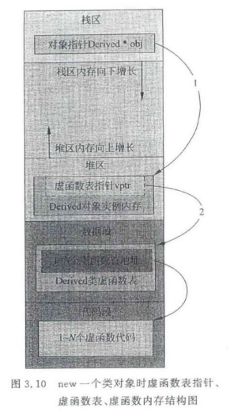
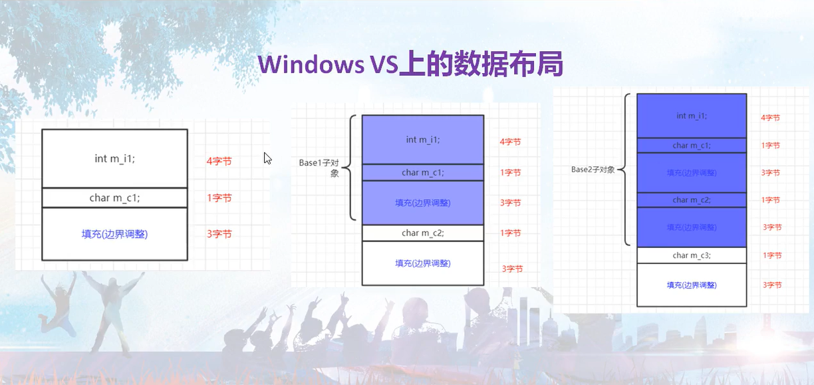
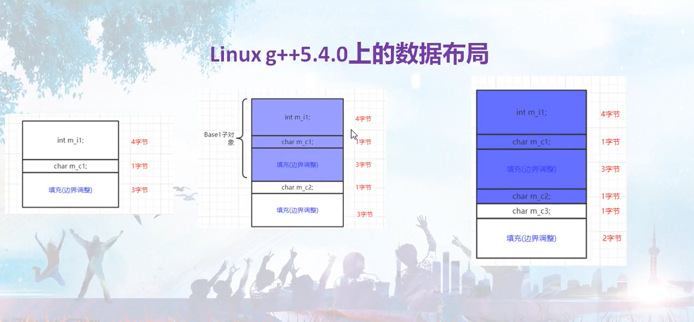
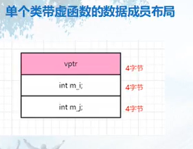
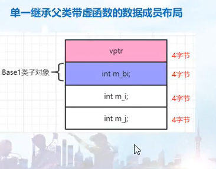
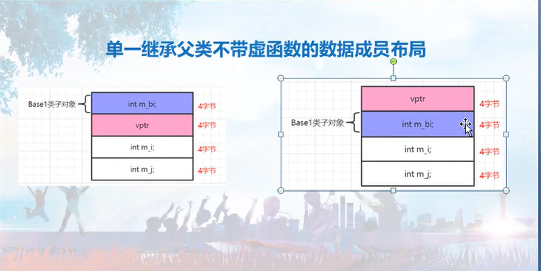
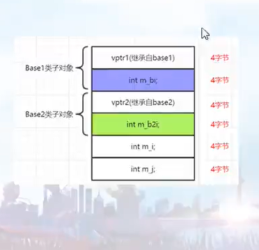
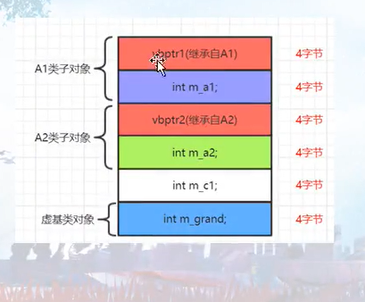
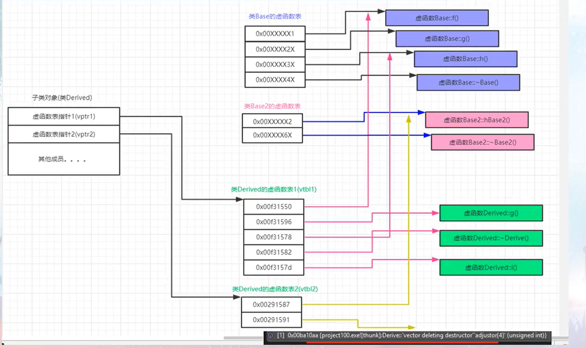
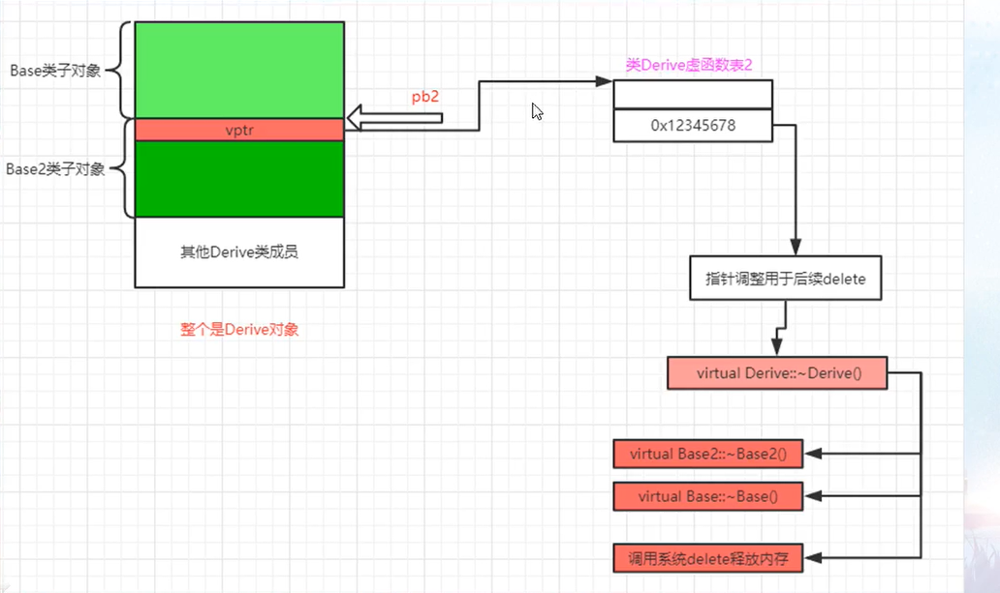

# 1-1 cpp对象模型探索课程详细介绍 


# 2-1 类对象所占用的空间

- 空类的大小为1（即空类的大小为1，里面存放的是该对象的地址）
- 成员变量是包含在每个对象中，是占用对象字节的
- 而成员函数虽然也写在类的定义中，但成员函数不占用对象字节数（不占内存空间）
- 成员函数 每个类只诞生一个，而不管你用这个类产生了多少个对象


# 2-2 对象结构的发展和演化

- 非静态的成员变量（普通成员变量）跟着对象走（存在对象内部），也就是每个类对象都有自己的成员变量
- 静态成员变量和对象没有关系，所以肯定不会保存在对象内部，是保存在对象外面（表示所占用的内存空间和类对象无关）
- 成员函数：不管静态的还是非静态的，全部都保存在类对象之外，所以不管几个成员函数，不管是不是静态的成员函数，对象的大小不会因此改变
- 虚函数：不管几个虚函数，sizeof()都是多了4/8个字节（多放了一个虚指针）
- 类里只要有一个虚函数（或者至少有一个虚函数），这个类就会产生一个指向虚函数的指针
  - 有多少个虚函数就有多少个虚函数指针
  - 类本身，指向虚函数的指针，要有地方放，所以存放在一个表格里面，这个表格就是虚函数表 virtual table vtbl
  - 这个虚函数表一般是保存在可执行的文件中，在程序执行的时候载入到内存中
  - 虚函数表是基于类的，跟着类走的
  - 为什么会多出4/8个字节，因为虚函数的存在，导致系统往类对象中添加了一个指针
  - 这个指针正好指向这个虚函数表，很多资料上把这个指针叫做vptr
  - 这个vptr的值由系统在适当的时候(比如构造函数中通过增加额外的代码来给值)
  - 虚函数表存储虚函数的地址，即虚函数表的元素是指向类成员函数的指针
- 总结：
  - 静态数据，普通成员函数和静态成员函数都不计算到对象的大小上
  - 虚函数也不计算到类对象的大小上，但是虚函数会让类对象的大小增加4个字节以容纳虚函数表指针
  - 虚函数表vtbl是基于类的（跟着类走的，和对象没有关系）
  - 虚函数表存放的是函数的指针
  - 如果有多个数据成员，那么为了提高访问速度，某些编译器可能会将数据成员之间的内存占用比例进行调整（内存字节对齐）
  - 不管什么类型的指针，大小都是一样的
- 总结类对象大小的组成
  - 非静态成员变量
  - 内存字节对齐
  - 虚函数指针
  - PS：如果类之间有多重继承的关系，并且每个父类都有虚函数


# 2-3 this指针调整

- 派生类对象 是包含基类子对象的
- 如果派生类只从一个基类继承来的话，那么这个派生类对象的地址和它的基类子对象的地址相同
- 但如果派生类对象同时继承多个基类：
  - 第一个基类子对象的开始地址和派生类对象的开始地址相同
  - 后续这些基类子对象的开始地址 和派生类对象的开始地址相差多少，那就得把前面那些基类子对象所占用的内存空间干碎
- 总结：调用哪个子类的成员函数，这个this指针就会被编译器自动调整到对象内存布局中，对应该子类对象的起始地址去


# 2-4 分析obj文件，构造函数语义

- 传统观念认为，如果我们自己没定义任何构造函数，那么编译器就会为我们隐式自动定义一个默认的构造函数
  - 我们称这种构造函数为合成的默认构造函数
- 事实上：合成默认构造函数，只有在必要的时候，编译器才会为我们合成出来，而不是必然或者必须为我们合成出来
- 第一种情况：该类没有任何构造函数，但包含一个对象类型的成员，并且该对象所属的类有一个缺省构造函数
  - 这时，编译器就会为该类生成一个 合成默认的构造函数，合成的目的是为了调用上述类的缺省构造函数
  - 换句话，编译器合成了默认的构造函数，并且在其中安插代码，调用成员对象类的缺省构造函数


# 2-5 构造函数语义续

- 第二种情况：父类带缺省构造函数，子类没有任何构造函数，那因为父类这个缺省的构造函数要被调用，所以编译器会为这个子类合成出一个默认构造函数
  - 合成的目的：为了调用父类的构造函数，换句话说，编译器为它合成了默认的构造函数，并在其中安插代码，调用其父类的缺省构造函数
- 第三种情况：如果一个类含有虚函数，但没有任何构造函数时
  - 因为虚函数的存在，编译器会为我们生成一个基于该类的虚函数表
  - 编译器为它合成了默认的构造函数，并在其中安插代码，把类的虚函数表地址赋给类对象的虚函数表指针（赋值语句/代码）：
  - 我们可以把虚函数表指针看成是我们表面上看不见的一个类的成员函数（把虚函数表的首地址赋值给虚指针）
  - 即使有默认构造函数，编译器还是会为我们额外添加代码：
    - 生成虚函数表；调用父类的构造函数；因为虚函数的存在，把类的虚函数表地址赋给对象的虚函数表指针
- 当我们有自己的默认构造函数时，编译器会根据需要扩充我们自己写的构造函数代码，比如调用父类的构造函数，给对象的虚函数表指针赋值
- 编译器干了很多事，没默认构造函数时必要情况下帮助我们合成默认构造函数，如果我们有自己的默认构造函数，编译器会根据需要扩充默认构造函数的代码
- 第四种情况：如果一个类带有虚基类，编译器也会为它合成一个默认构造函数（虚基类：通过两个直接基类继承同一个基类，所以一般是三层）
  - 虚基类结构，编译器为子类和父类都产生了“合成的默认构造函数”


# 2-6 拷贝构造函数语义

- 传统上，大家认为如果我们没有定义一个自己的拷贝构造函数，编译器会帮助我们合成一个拷贝构造函数

- 这个合成的拷贝构造函数，也是在 **必要**的时候才会被编译器合成出来

- ```cpp
  A a1;
  a1.a = 10;
  A a2 = a1;//这里没有为其合成拷贝构造函数
  //这里其实是编译器内部的一种手法，成员变量初始化手法，比如int这种简单类型，直接就按值拷贝过去，编译器不需要合成拷贝构造函数就可以实现
  //同时，这是递归实现的，即如果A里面还有一个对象A1，A1里面有int类型的话，那么也是会递归的去按值拷贝的
  //这种按值拷贝会出现在所有的拷贝构造函数里面
  ```

- 某些情况下，如果我们不写自己的拷贝构造函数，编译器就会帮助我们合成出拷贝函数来

  - 第一种情况：如果一个类A没有拷贝构造函数，但是含有一个类类型CTB的成员变量，该CTB含有拷贝构造函数，那么当代码中有涉及到类A的拷贝构造时，编译器就会为类A合成一个拷贝构造函数
  - 第二种情况：如果一个类A没有拷贝构造函数，但是它的父类CTB有拷贝构造构造函数，那么当代码中有涉及到类A的拷贝构造时，编译器就会为类A合成一个拷贝构造函数
  - 第三种情况：如果一个类A没有拷贝构造函数，但是该类声明了或继承了虚函数，那么当代码中有涉及到类A的拷贝构造时，编译器就会为类A合成一个拷贝构造函数（这个语句的含义是，设定类对象的虚函数指针值，虚函数表指针，虚函数表等概念）
  - 第四种情况：如果一个类A没有拷贝构造函数，但是该类继承了虚基类，那么当代码中有涉及到类A的拷贝构造时，编译器就会为类A合成一个拷贝构造函数

- 编译器合成的拷贝构造函数往往都是干一些特殊的事情，如果只是一些类成员变量值的拷贝，是不用专门生成拷贝构造函数的，内部就会干的


# 2-7 程序转化语义

- 我们写的代码，编译器会对代码进行拆分，拆分成编译器更容易理解和实现的代码

- 站在程序员角度和站在编译器角度看代码

- ```cpp
  //1、定义时初始化对象（编译器视角）
  X x100;//步骤一：定义一个对象，为对象分配内存，从编译器的角度来看，这句是不调用X类的构造函数的
  x100.X::X(x0);//步骤二：直接调用对象的拷贝构造函数
  //等价于下列语句
  X x3(x0);
  ```
  
- ```cpp
  //2、参数初始化（程序员视角）
  void func(X tempx) {//因为这里是拷贝出来的一个临时对象，所以会调用拷贝构造函数
      return ;
  }//出来的时候会析构tempx
  X x1;
  func(x1);
  //上面是现代编译器的
  
  //老编译器的视角
  X tempoj;//编译器产生一个临时对象
  tempoj.X::X(x0);//调用拷贝构造函数
  func(tempoj);//用临时对象调用func
  void func(X& tempx) {//这里改为了引用传递了
  }
  tempoj.X::~X();//析构临时对象
  ```
  
- ```cpp
  //3、返回值初始化
  X func() {
      X x0;
      //...
      return x0;//系统产生临时对象并把x0的内容拷贝构造给了临时对象
  }
  
  //编译器的角度
  void func(X &extra) {
      X x0;//这里不会调用构造函数
      //..
      //..
      extra.X::X(x0);
      return ;
  }
  
  //返回值初始化（程序员角度）
  X my = func();
  
  //编译器的角度
  X my;//不会调用构造函数
  func(my);
  ```

- ```cpp
  func().functest();//通过函数返回的临时对象调用成员函数
  
  //切换到编译器视角
  X my;//不会调用构造函数
  (func(my), my).functest();//逗号表达式，返回值是第二个值
  ```

- ```cpp
  //程序员视角
  X(*pf)();//定义一个函数指针
  pf = func;
  pf().functest();
  
  //编译器视角
  X my;//不调用构造函数
  void (*pf)(X &);
  pf = func;
  pf(my);
  my.functest();
  ```


# 2-8 程序的优化

- 从开发者和编译器的角度对程序进行优化

- ```cpp
  X test(X& ts) {
      X tmpm;//这里生产了临时对象，消耗了两个
      tmpm.x1 = ts.x1 * 2;
      tmpm.x2 = ts.x2 * 2;
      return tmpm;
      
      //优化后
      return X(ts.x1 * 2, ts.x2 * 2);
  }
  ```

- 


# 2-9 程序优化续、拷贝构造续、深浅拷贝

- ```cpp
  class A {
      public:
          A() = default;
          A(int value): m_i(value) {//类型转换函数
              cout << "A(int)" << endl;
          }
          A(const A& other): m_i(other.m_i) {
              cout << "A(const A&)" << endl;
          }
          int m_i;
          ~A() {
              cout << "~A()" << endl;
          }
  };
  
  int main() {
      A x10(100);//没有优化的情况下，这种写法效率最高
      cout << "--------------------------------" << endl;
      A x11 = 100;
      cout << "--------------------------------" << endl;
      A x12 = A(100);
      cout << "--------------------------------" << endl;
      A x13 = (A)100;
      cout << "--------------------------------" << endl;
  }
  
  //结果：（g++ -fno-elide-constructors test.cpp -o test）关闭优化了的
  A(int)
  --------------------------------
  A(int)
  A(const A&)
  ~A()
  --------------------------------
  A(int)
  A(const A&)
  ~A()
  --------------------------------
  A(int)
  A(const A&)
  ~A()
  --------------------------------
  ~A()
  ~A()
  ~A()
  ~A()
  
  //上述代码在msvc中运行得到的都是一样的，但是在linux下的gcc下关闭优化的情况下运行，就不一样
  //从编译器视角来看（不优化）
  //第一行
  X x1;
  x1.X::X(100);
  //第二行
  X temp0;
  temp0.X::X(1000);//带一个参数的构造函数被调用
  X x2;
  x2.X::X(temp0);//拷贝函数被调用
  temp0.X::~X();//调用析构函数
  ```

- 总结：

  - 当编译器面临用一个类对象作为另一个类对象初值的情况，各个编译器表现不同，但是所有编译器都为了提高效率而努力
  - 我们也没有办法确定我们自己使用的编译器是否一定会调用拷贝构造函数

- 拷贝构造函数是否必须要有？视情况而定

  - 如果只有一些简单的类型变量，根本不需要拷贝构造函数，编译器内部本身就提供支持成员变量的bitwise copy（按位拷贝）


# 2-10 成员初始化列表说

- 何时必须用成员初始化列表

  - 如果这个成员是个引用
  - 如果是个const类型成员
  - 如果这个类是继承一个基类，并且基类中有构造函数，这个构造函数里面还有参数
  - 如果你的成员变量类型是某个类类型，而这个类的构造函数带参数时

- 使用初始化列表的优势

  - 提高程序的运行效率

  - ```cpp
    class A{
        public:
            int m_i;
            A(int value = 0):m_i(value) {
                cout << this << endl;
                cout << "A(int)构造函数调用" << endl;
            }
            A(const A&mid) {
                cout << this << endl;
                cout << "A拷贝构造函数调用" << endl;
            }
            A& operator=(const A&tmp) {
                cout << this << endl;
                cout << "A的operator=函数调用" << endl;
                return *this;
            }
            ~A() {
                cout << this << endl;
                cout << "A析构函数调用" << endl;
            }
    };
    
    class B{
        public:
            A m_a;
        
            B(int tmp) {//会调用两次int构造函数，一次operaotr=函数，两次析构函数
            /*
            因为在这一行（最开始的一行）会创建一个m_a对象，然后下面又要把tmp先转换为A类
            再调用=赋值给m_a
            相当于多调用了一遍构造析构和operator=
           	从编译器的视角来看：
           	A aobj;
           	aobj.A::A();
           	//上面是一开始就安插好了的
           	A taobj;//生成一个临时对象
           	taobj.A::A(1000);//临时对象调用构造函数
           	aobj.A::opeartor=(taobj);//调用拷贝赋值运算符
           	taobj.A::~A();//调用析构函数回收对象
            */
            
            
            // B(int tmp) : m_a(tmp){//只调用一次析构一次int构造
            /*
            而这里就直接解决了，从一开始就是调用int构造函数
            从编译器的视角来看：
            A m_a;
            m_a.A::A(1000);
            */
                m_a = tmp;
            }
    };
    
    int main() {
        B b1(1000);
        cout << &b1.m_a << endl;
    }
    ```

  - 对于类类型成员变量放到初始化列表中能够比较明显的看到效率的提升

  - 但如果是个简单类型的成员变量，比如int，其实放到初始化列表或者放在函数体里效率差别不大

  - 最好写在初始化列表中，更加专业，高端

- 初始化列表细节探究

  - 初始化列表中的代码可以看作是被编译器安插到构造函数体中，只是这些代码有些特殊
  - 这些代码 是在任何用户自己的构造函数体代码之前被执行的，所以要区分构造函数中用户代码和编译器插入的 初始化所属的代码
  - 这些列表中变量的初始化顺序是 定义顺序，而不是在初始化列表中的顺序（所以不要相互赋值）
    - 建议不在初始化列表中进行  两个 都在初始化列表中出现的成员之间的赋值


# 3-1 虚函数表指针位置分析

- 类：有虚函数，这个类就会产生一个虚函数表
- 类对象，有一个指针，指针（vptr）会指向这个虚函数表的开始地址
- 经过代码验证发现，虚函数指针位于对象内存的开头


# 3-2 继承关系作用下虚函数的手工调用


# 3-3 虚函数表分析

- 一个类只有包含虚函数才会存在虚函数表，同属于一个类的对象共享虚函数表，但是有各自的vptr，当然所指向的地址（虚函数表首地址）是相同的，即同一个类共用一个vtbl
- 父类中有虚函数就等于子类中有虚函数：父类中有虚函数表，则子类中也有虚函数表
  - 只要父类是虚函数，子类的同名函数也是虚函数（无论有没有virtual）
  - 但不管是父类还是子类，都是一个类配一个虚函数表
- 如果子类中完全没有新的虚函数，则我们可以认为子类的虚函数表和父类的虚函数表**内容相同**（内容相同的两张表）
  - 虚函数中的每一项，保存着一个虚函数的地址，但如果子类的虚函数表某项和父类的虚函数某项代表同一个函数（这表明子类没有覆盖父类的函数），则该表项所执行的该函数的地址应该相同
- 超出虚函数表的内容不可知
- 直接用子类对象给父类对象赋值，子类中属于父类那部分内容会被编译器自动区分（切割）出来并拷贝给了父类对象
  - 首先生成一个base对象
  - 其次用derive来初始化base对象
  - 编译器的一个操作是，derive的虚函数表指针并没有覆盖base对象的虚函数表指针值，编译器帮我们做到了这点


# 3-4 多重继承虚函数表分析

- 一个对象，如果它的类有多个基类则有多个虚函数表指针（注意是两个虚函数表指针，不是有两个虚函数表）
  - 在多继承中，对应各个基类的vptr按继承顺序依次放置在类的内存空间中，且子类与第一个基类共用一个vptr（第二个基类有自己的vptr）
- 画图（一个类继承了两个类以后）
  - 子类对象有两个虚函数指针
  - 子类有两个虚函数表，因为它继承了两个基类
  - 子类和第一个基类共用一个vptr（因为vptr指向一个虚函数表，所以也可以说子类和第一个基类共用一个虚函数表vtbl）
    - 所以子类后续的虚函数（如无覆盖的话）都会加到这个表中
    - 如果出现覆盖了的话，子类就会把所有的表中的同名函数全给覆盖了
  - 子类中的虚函数覆盖了父类中的同名虚函数


# 3-5 辅助工具，vptr，vtbl创建时机

- 后续要好好学习gdb和gcc的调试
- vptr创建的时机
  - vptr跟着对象走，所以对象什么时候创建出来，vptr就什么时候创建出来，即运行的时候
  - 但实际上，对于这种有虚函数的类，在编译的时候，编译器会往相关的构造函数中增加为vptr赋值的代码，这是在编译期间编译器为构造函数所增加的（这都是编译器做的事情）
  - 当程序运行的时候，遇到创建对象的代码，执行对象的构造函数，那么这个构造函数里有给对象的vptr（成员对象）赋值的语句，自然这个vptr就被赋值了
  - 总结：vptr是类对象被创建的时候就创建了，而这个创建，是编译器在编译期间插入相关代码到构造函数中的
- vtbl创建的时机
  - 实际上，虚函数表是编译器在编译期间（不是运行期间）就为每个类确定好了对应的虚函数表vtbl的内容
  - 然后也是在编译期间在相应的类构造函数中添加给vptr赋值的代码，这样程序运行的时候，当运行到类对象的代码的时候，会调用类的构造函数
  - 总结：编译期间就确定了每个类的vtbl
- 


# 3-6 单纯的类不纯时引发的虚函数调用问题

- 


# 4-1 数据成员绑定时机

- 编译器对成员函数中的数据的解析，是整个类定义完毕后才开始的
  - 所以对类的函数里面的属性的解析和绑定，是在整个类定义后发生的
  - 即使是在类内定义，类外实现的函数，对于其中变量的解析还是会先在类内寻找，然后再到类外寻找
  - 提示：使用::符可以访问到全局变量

- 对于成员函数参数（在类内定义或实现）：是在编译器第一次遇到整个类型的时候被决定的
  - 所以特别是对于typedef，如果最近遇到的typedef是全局的，那函数的成员函数参数就会被定义为全局的那个类型
  - 所以，一个类中所有的typedef就要全部放在类的最前面
  - 特别的：在类内定义，类外实现的函数，对于成员函数参数的解析，是先到类内判断，再到类外判断的（有点违背了）
  - 结论：为了在类中尽早的看到类型mytype，所以这种类型定义语句typedef一定要挪到类的最开头定义；那后边的成员函数第一次遇到这个类型的时候，它就本着最近碰到原则来应用最近碰到的类型


# 4-2 进程内存空间布局

- 不同的数据在内存中会有不同的保存时机和保存位置
- 当运行一个可执行文件时，操作系统就会把这个可执行文件加载到内存中，此时进程有一个虚拟的地址空间（内存空间）
- linux有一个nm命令，能够列出可执行文件中的全局变量存放的地址
- 从高地址往下到低地址
  - 堆栈段（栈，一般函数里面的临时变量都是放到这里的）
  - 空洞（未映射区域）
  - 堆（堆，申请才被使用的）
  - BSS段（存放未被定义了的全局数据和静态数据）
  - 数据段（存放定义了的全局数据和静态数据）
  - 代码段（存放代码）
- 


# 4-3 数据成员布局

- 观察成员变量地址规律

  - 普通成员变量的存储顺序，是按照在类中的定义顺序从上到下来的
  - 后面出现的成员变量在内存中有更高的地址
  - 类定义中public，private，protected的数量，不影响类对象的sizeof

- 边界调整，字节对齐（padding）

  - 某些因素会导致成员变量之间排列不连续，就是边界调整（字节对齐），调整的目的是提高效率（是编译器自动调整）

    - 调整的定义：往成员之间填补一些字节，使用类对象的sizeof字节数凑成一个4的整数倍或8的整数倍

    - 为了统一字节对齐问题，引入一个该概念叫一字节对齐（不对齐）

    - ```cpp
      #pragma pack(1);//对齐方式设置为1字节对齐（不对齐）
      
      #pragma pack();//取消指定对齐，恢复缺省对齐；
      ```

    - ps：有虚函数时，编译器会往类定义中增加vptr（这个要视为内部数据成员）

- 成员变量偏移值的打印

  - 成员变量偏移值，是这个成员变量的地址，离对象首地址偏移多少

  - ```cpp
    printf("%d", &A::m_i);//输出十进制的偏移值
    //记录一种偏门的写法
    #define GET(A, m) (int)(&((A*)0) -> m)//其中A为类名，m为属性名
    ```

  - ```cpp
    int A::*mypointer = &A::m_i;//定义成员变量指针
    
    printf("%p", mypointer);//输出的是变量的偏移值
    ```


# 4-4 数据成员布局

- 静态成员变量的存取

  - 静态成员变量，可以当做一个全局变量，但是它只在类的空间内可见
  - 可以通过类名，对象或对象指针来访问成员属性（查看反汇编后发现这几个都是一模一样的）
  - 静态成员变量只有一个实体，保存在可执行文件的数据段
    - 编译后，运行多次的情况下，静态成员的地址都是不变的
    - 即静态成员变量的地址是在编译为可执行文件后，就已经确定好了的（地址都写在了可执行文件上了）

- 非静态成员变量的存取（普通的成员变量）

  - 通过类对象或指针来存取

  - ```cpp
    class A{
        public:
        	int a;
        	void func() {
                a += 2;
            }
    };
    
    A a1;
    a1.a = 1;
    a1.func();//其实这里调用func函数的时候，编译器会隐含的传入一个this指针
    //编译器的视角
    void A::func(A* const this) {
        this -> a += 2;
    }
    
    a1.a;
    apointer->a;//这两个访问的效率上在单一继承中是无差别的，但是在虚基类中是有差别的（汇编中都是一样的）
    ```

  - 对于普通成员的访问，编译器是把类对象的首地址加上成员变量的偏移值（所以可以O(1)的访问任意对象）

    - 注意：这个偏移值已经写到了汇编代码里面了的

- 虚基类是个例外哦


# 4-5 单一继承下的数据成员布局

- 一个子类对象，所包含的内容，是他自己的成员，加上他父类的成员的总和

- 从偏移值上看，父类成员先出现，然后才是子类成员

- ```cpp
  class BB {//sizeof(BB) = 8
      int m_i1;
      char m_c1;
      char m_c2;
      char m_c3;
  };
  
  class Base {//8(msvc,g++,clang)
      public:
      	int m_i1;
      	char m_c1;
  };
  
  class Base1: public Base {//12(msvc,g++,clang)
    public:
      	char m_c2;
  };
  
  class Base2: public Base2 {//sizeof(Base2) = 16(msvc)/12(g++,clang)
      public:
      	char m_c3;
  }
  ```

  - 引入继承关系后，可能会带来内存空间的额外增加
  - 
  - 
  - linux和windows上数据布局不一样，说明：
    - 编译器在不断地进步和优化
    - 不同厂商编译器，实现细节也不一样
    - 内存拷贝就要谨慎（因为不同对象地内存布局是不一样的，比如base2在linux下就不能往base3下拷贝，因为这会覆盖掉原来base3的m_c3的位置的值）


# 4-6 单类单继承虚函数下的数据成员布局

- 单个类带虚函数的数据成员布局（类中引入虚函数时，会有额外的成本付出）

  - 编译的时候，编译器会产生虚函数表
  - 对象中会产生虚函数指针vptr，用以指向虚函数表
  - 增加或者拓展构造函数，增加给虚函数表指针vptr赋值的代码，让vptr指向虚函数表
  - 如果出现多重继承，比如继承了两个父类，每个父类都有虚函数的话，每个父类都会有vptr，那继承时，子类就会把这两个vptr给继承过来（如果子类还有自己额外的虚函数的话，子类与第一个基类共用一个vptr）
  - 析构函数中也被拓展增加了虚函数表指针vptr相关的代码
  - 

- 单一继承父类带虚函数的数据成员布局

  - 
  - 基类带虚函数，派生类继承基类，派生类有虚函数

- 单一继承父类不带虚函数的数据成员布局

  - ```cpp
    class A {
        public:
            int a;
    };
    
    class B: public A {
        public:
            virtual ~B() {}
            int b;
            int c;
    };
    
    int main() {
        printf("%d\n", &B::a);//0
        printf("%d\n", &B::b);//12
        printf("%d\n", &B::c);//16
    }
    ```

  - 这里如果只是看偏移值的话，会觉得虚函数指针是在父类对象下面的，但是实际上从内存中来看的话，虚函数指针还是在对象的第一个位置的

  - 

  - ps：右边才是正确的


# 4-7 多重继承数据布局与this调整深谈

- 单一继承数据成员布局this指针偏移知识补充

  - 对于具有继承关系的类来说，如果要调用父类的成员变量，就要调整this指针的位置

- 多重继承且父类都带虚函数的数据成员布局

  - 通过this指针打印，发现访问A类的成员不用改变this指针，访问B类的成员要偏移指针

  - 看到偏移值，发现a1和g1的偏移值是一样的

  - this指针，加上偏移值 就能够访问对应的成员变量

  - 结论：我们要访问一个类对象中的成员，成员的定位是通过：this指针（编译器会自动调整）以及该成员的偏移值来决定的（这种this指针的偏移，都需要编译器介入来处理完成）

  - ```cpp
    class A {//4(int)+8(vptr)+4(padding)
    public:
        A() {
            printf("A的地址%p\n", this);
        }
        int a1;
        virtual ~A() = default;
    };
    
    class B {//4(int)+8(vptr)+4(padding)
    public:
        B() {
            printf("B的地址%p\n", this);
        }
        int b1;
        virtual ~B() = default;
    };
    
    class C:public A, public B {
    public:
        C() {
            printf("C的地址%p\n", this);
        }
        int c1, c2;
        virtual ~C() = default;
    };
        /*
         * C的内存布局
         * 8    vptr1
         * 4    a1
         * 8    vptr2
         * 4    b1
         * 4    padding
         * 4    c1
         * 4    c2
         * 4    padding(要变为8的倍数)
         * */
    ```

  - 上述注释是在clang下的布局，下图是在msvc下的布局

  - 

  - ps：当父类指针指向子类的时候，父类指针会发生偏移，父类指针会指向到子类中属于父类的那一部分

    - ```cpp
      Base2 *pbase2 = &base;
      Base2 *pbase2 = (Base2 *)(((char*)&base) + sizeof(Base1));//站在编译器的角度来看
      ```

    - 所以，如果用父类指针来析构对象，但是析构函数没有写为虚函数的话，就会造成内存泄漏（因为这个父类指针只析构了自己这个对象，却没有析构掉整个子类对象）


# 4-8 虚基类问题的提出和初探

- 虚基类（虚继承/虚派生）问题的提出

  - 传统多重继承造成的：空间问题，效率问题，二义性问题

  - ```cpp
    class Grand{
        public:
        	int m_grand;
    };
    
    class A: virtual public Grand {
        
    };
    
    class B: virtual public Grand {
        
    };
    
    class C: public A, public C {
        int m_a1;
    };
    
    C c1;
    c1.m_grand = 12;//出现二义性，访问不明确，名字冲突
    c1.A::m_grand = 12;
    c1.B::m_grand = 13;
    //使用虚基类，让grand只被继承一次
    ```

  - 注意：引入虚基类之后，只能让子类调用爷爷类的构造函数

  - 

- 虚基类初探

  - 虚基类表 vbtable，虚基类表指针 vbptr（用来指向虚基类表）
  - virtual虚继承之后，父类就会被编译器插入一个虚基类表指针，这个指针有点成员变量的感觉
  - 
  - 上图的右图是A2的布局
  - 
  - 上图是子孙类的布局（虚基类何时何地都是放到最后面的）


# 4-9 两层结构时虚基类标内容分析（待）


# 4-10 三层结构时虚基类表内容分析（待）


# 4-11 成员变量地址、偏移、指针重申

- 对象成员变量内存地址及指针

- 成员变量的偏移值及其指针（和具体的对象是没有关系的）

  - ```cpp
    //打印对象的偏移值
    //方法一
    printf("%p", &A::m_i);
    //方法二，用成员指针来打印偏移量
    int A::*my = &A::m_i;
    printf("%p", my);//as we all know，成员变量指针里边保存的，实际上是偏移量（不是实际内存地址）
    ```

- 没有指向任何数据成员变量的指针

  - 通过一个对象名或者对象指针后边跟 成员变量指针 来访问某个对象的成员变量
  - 成员变量指针感觉一般用不到，不仔细看了


# 5-1 普通成员函数调用方式

- cpp语言设计的一个要求：要求对这种普通成员函数的调用不能比全局函数效率差
- 基于这种设计要求，编译器内部实际上是将成员函数的调用转换成了对全局函数的调用
- 成员函数有独立的内存空间，是跟着类走的，并且成员函数的地址，是在编译的时候就确定好了的
  - 编译器额外增加了一个叫做this的形参，是个指针，指向的是生成的地址
  - 常规成员变量的存取，都通过this形参来进行
  - 查看反汇编发现，当调用成员函数的时候，会把该对象的地址放到寄存器上
  - 编译器在内部一般都会将函数名给重命名一遍，防止重名


# 5-2 虚成员函数、静态成员函数调用方式

- 虚成员函数的调用
  - 直接通过对象调用虚函数，就像调用普通成员函数一样，不需要通过虚函数表
  
  - 而指针+对象就要通过虚函数表指针查找虚函数表，通过虚函数表在找到虚函数的入口地址，完成对虚函数的调用
  
    - 注意，这里如果发生了多态，最开始是要先调整this指针的位置的
  
    - ```cpp
      pmycals -> func();
      //编译器视角
      (*pmycals -> vptr[0])(pmycals);
      //vptr表示编译器生成的虚函数表指针，下标[0]是表中的第一项，后面传入的相当于this参数
      ```
  
  - ```cpp
    //在虚函数里面用类调用虚函数，会压制住虚拟机制，不再通过查询虚函数表来调用
    virtual void test() {
        Base::func();//这里func是虚函数，而通过类调用的话走的就不是虚函数表了
    }
    //这种明确调用虚函数的方法等价于直接调用一个普通的成员函数
    ```
  
- 静态成员函数的调用

  - 调用静态成员函数时编译器是不会插入 this 作为形参的

  - 指针或对象调用静态函数，汇编都一样的

  - ```cpp
    //一种特殊的写法
    ((Base*)0) - >mystfunc(); //调用静态函数
    ```

  - 特点总结：

  - 1、静态成员函数没有this指针

  - 2、无法直接存取类中普通的非静态成员变量

  - 3、静态成员函数不能在末尾增加 const 后缀 也不能设置为virtual

  - 4、可以用类对象来调用，但不要求一定要用类对象来调用（查看反汇编发现，即使是用类对象来调用，实际上还是被转换为了直接调用）

  - 5、静态成员函数等同于全局函数(非成员函数)所以一般提供回调函数的场合，可以将这种函数提供为回调函数

  - 6、静态成员函数有地址，并且是在编译的时候就确定好了的


# 5-3 虚函数地址问题的vcall引入

- ```cpp
  printf("%p", &Base::test);//这里打印的是vcall函数地址，而不是真正的虚函数
  ```

- vcall的作用

  - 调整this
  - 跳转到真正的虚函数中去


# 5-4 静动态类型、绑定、坑点、多态体现深谈

- 静态类型和动态类型

  - 静态类型：对象定义的时候，编译期间就确定好了的

  - 动态类型：对象目前所指向的类型（运行的时候才决定的类型）

    - 一般只有指针和引用才有动态类型的说法，而且一般都是指父类指针或者引用
    - 动态类型在执行过程中可以改变

  - ```cpp
    class Base {};
    class Derive: public Base {};
    class Derive2: public Base {};
    
    Base base;//静态类型是Base，没有动态类型
    Derive derive;//静态类型是Derive，没有动态类型
    Base *pbase;//静态类型依旧是Base*，至少现在没有动态类型
    Base *pbase2 = new Derive();//静态类型依旧是Base*，动态类型是Derive
    Base *pbase2 = new Derive2();//静态类型依旧是Base*，动态类型是Derive2
    ```

- 静态绑定和动态绑定

  - 静态绑定：绑定的是静态类型，所对应的函数或者属性依赖于对象的静态类型，发生在编译期
  - 动态绑定：绑定的是动态类型，所对应的函数或者属性依赖于对象的动态类型，发生在运行期
  - 普通成员函数是静态绑定，而虚函数是动态绑定
  - 缺省参数一般是静态绑定（大坑！）（所以如果是用子类指针指向父类的话，缺省参数绑定的就是子类的那个参数，就不是父类的了）
    - 函数参数缺省值是静态绑定，所以缺省参数绑定到了父类函数的缺省参数上了

- 继承的非虚函数坑

  - 因为普通函数是静态绑定，是在编译器就决定好了的，所以看的是指针或引用是啥类型，而不是指向的是啥类型
  - 结论：不应该在子类中重新定义一个继承来的非虚函数（即使在子类中重新定义了该函数，最终调用的时候还是要看是谁（指针的类型）调用的）

- 虚函数的动态绑定

  - 虚函数是动态绑定，到底执行谁就要看指针指向的是谁

- 不要重新定义虚函数的缺省参数的值

- cpp中的多态性体现

  - 多态，必须是存在虚函数，没有虚函数，绝不可能存在多态，有虚函数并且调用虚函数

  - 从代码实现上：

    - 当我们调用一个虚函数的时候，走的是不是通过查询虚函数表来找到虚函数入口地址，如果是，就是多态（否则就不是）

    - ```cpp
      class A {
          public:
          virtual void func() {}
      };
      
      A a1;
      a1.func();//这不是多态
      
      A *a2 = new A();
      a2 -> func();//这是多态
      ```

  - 从表现形式上：

    - 有继承关系，有父类有子类，父类中必须有虚函数（这意味着子类中一定有虚函数），派生类重写基类的虚函数
    - 父类指针或引用指向子类对象
    - 当以父类指针 或 引用调用子类中重写了的虚函数时，我们就能看出来多态的体现了，因为调用的是子类的虚函数


# 5-5 单继承虚函数趣味性测试和回顾

- 唯一需要在执行期间知道的东西就是，通过，哪个虚函数表来调用虚函数（是父类还是子类）
- 回顾
  - 虚函数地址：编译期间知道，写在了可执行文件中，编译期间已经构建出来
  - vptr编译期间产生，编译器在构造函数中插入了给vptr赋值的代码，当创建对象时，因为要执行对象的构造函数，此时vptr就被赋值


# 5-6 多继承深释、第二基类，虚析构比加

- 多继承下的虚函数

  - ```cpp
    Base2 *pb2 = new Derive();
    
    //编译器视角
    Derive *temp = new Derive();
    Base2 *pb2 = (Base*)((char*)(temp) + sizeof(Base));//这里涉及到指针的调整，即这个父类的指针指向的是子类中属于这个父类的部分
    ```

- 如何成功删除用第二基类指针new出来的子类对象

  - 如果Base2中没有析构函数，那么编译器会直接删除指针指向的内存，报异常
  - 如果Base2中有普通析构函数，Base2析构函数被调用（因为是静态绑定的），也是删除指针指向的内存，报异常
  - 如果Base2中有虚析构函数（子类没有虚析构函数），或者子类有虚析构函数（父类没有虚析构函数），那么就会删除指针指向的整个对象，不会报错
    - 如果子类有虚析构函数，那么编译器在处理 delete pb2 代码时，因为多态的特性，查虚函数表去执行析构函数时执行的肯定是子类的虚析构函数
    - 然后编译器会向子类虚析构函数中插入调用两个父类的析构函数
    - PS：如果父类有虚析构函数，而子类没有，那么编译器就会为子类合成虚析构函数（用于调用父类的虚析构函数）
    - PS：如果子类的是普通析构函数，那么编译器也会把它变为虚析构函数的，目的同上
  - 只要这个析构函数是虚函数，那么他就支持多态
  - 总结：如果要防止内存泄漏，父类的析构必然要是虚析构；而为了统一，所有的析构最好都写为虚析构
  - 
  - 

- 父类非虚析构函数时导致的内存泄漏展示

  - 如果父类的析构函数不是虚函数，则不会触发动态绑定，结果就是只会调用父类的析构函数而不会调用子类的析构函数，从而可能会导致内存泄漏
  - 如果父类的析构函数是虚函数，则子类的析构函数一定是虚函数，会触发系统的动态绑定


# 5-7 多继承第二基类虚函数支持、虚继承带虚基类（待）


# 5-8 RTTI运行时类型识别回顾与存储位置介绍（待）


# 5-9 函数调用、继承关系性能说

- 函数调用中编译器的循环代码优化
  - 在 Debug 版本编译器会往里插入很多信息用于程序调试目的；而 Release 版本是发布版(一般用于商业环境中实际使用) ，编译器不会插入调试信息，而且还会进行优化， 执行效率一般比较高
  - 编译器将一些简单的循环优化为一条语句，而有些编译器在编译期间就替程序员完成了运算
- 继承关系深度增加，开销也增加
  - 深度增加，要调用的函数也增加，性能降低
- 继承关系深度增加，虚函数导致的开销增加
  - 每个类的构造函数中都要增加用于给虚函数表指针赋值的代码


# 5-10 指向成员函数的指针及vcall进一步说（待）


# 5-11 inline函数回顾和拓展细节说

- inline函数回顾

  - 使用inline之后，编译器内部会有一个比较复杂的测试算法来评估这个inline函数的复杂程度
  - 会统计这个inline函数中，赋值次数，内部函数调用，虚函数调用次数等--权重
  - 开发者写inline只是对编译器的一个建议，但如果编译器评估这个inline函数的复杂程度过高，这个inline建议就被编译器忽略掉
  - 如果inline被编译器采纳，那么inline函数的拓展，就要在调用这个inline函数的那个点上进行（可能带来额外的问题，比如参数求值，可能产生临时对象的生成和管理）

- inline拓展细节

  - 形参被对应实参取代

  - ```cpp
    inlint int test(int t) {
        return t * t + 9;
    }
    
    int i = test(1 + 2);//这里会先计算1+2，然后再放入拓展后的代码里面进行计算
    
    int a = 90;
    int j = test(a + 98);//同上
    
    int i = test(func() + 15);//会先计算func()，然后得到返回值再相加
    ```

  - 局部变量的引入（局部变量能少用就少用，能不用就不用）

    - 因为inline会在用到的时候拓展代码，导致局部变量的产生

  - inline失败情形（比如递归，其实成功与否，主要看编译器的）


# 6-1 继承体系下的对象构造步骤

- 对象的构造顺序
  - 先构造爷爷类，补充爷爷类的虚指针
  - 然后构造父亲类，补充父亲类的虚指针
  - 最后构造自己，补充虚指针，接着初始化列表，最后调用自己的代码

- 虚函数的继续观察
  - 千万不要在构造函数中使用memcpy或直接操作等手段，来修改虚函数指针的值，否则可能会造成无法调用虚函数的情况
  - 对于自己类的虚函数指针，首先是补充为爷爷类的虚指针，接着是补充为父亲类的虚指针，再接着才是补充为自己的指针
- 构造函数中对虚函数的调用
  - 某个类的构造函数 中 调用一个虚函数，走的不是虚函数表，而是直接通过虚函数地址，直接调用这个虚函数（静态方式）
  - 如果当前类没有，就会返回父类去找，递归寻找
  - 一个比较好玩的事情：如果在构造函数中调用虚函数，这个虚函数再调用一个虚函数，那么后面这个虚函数走的是**虚函数表**


# 6-2 对象复制语义学、析构函数语义学

- 对象的默认复制行为
  - 如果我们不写自己的拷贝构造函数和拷贝赋值运算符，编译器也会有默认的对象拷贝和对象赋值行为
- 拷贝赋值运算符，拷贝构造函数
  - 当我们提供自己的拷贝赋值运算符和拷贝构造函数的时候，我们就接管了系统默认的拷贝行为，此时，我们有责任在拷贝赋值运算符和拷贝构造函数中写适合的代码，来完成对象的拷贝或者是赋值
- 如何禁止对象的拷贝构造和赋值
  - 把拷贝构造函数和拷贝赋值运算符私有起来，只声明，不需要函数体
  - cpp11以后也可以用delete来解决
- 析构函数语义
  - 析构函数被合成（如果不需要的话，编译器是不会生成的，什么情况下编译器会给我们生成一个析构函数）
    - 如果继承一个基类，基类中带有析构函数，那么编译器会合成一个析构函数调用基类中的析构函数
    - 如果类成员是一个类类型成员，并且这个成员带析构函数，编译器也会合成一个析构函数，意义是调用类类成员的析构函数
  - 析构函数被拓展（如果我们有自己的析构函数，那么编译器就会在适当的时候拓展我们的析构函数代码）
    - 如果类成员是一个类类型，并且这个成员带析构函数，编译器拓展类的析构函数（是先执行自己的析构以及代码，再执行成员的析构，即是做完了全部工作，再析构类成员）
    - 如果继承一个基类，基类中带析构函数，那么编译器就会拓展析构函数来调用基类中的析构函数（也是先执行类本身的析构部分，最后再析构基类）


# 6-3 局部对象、全局对象的构造和析构

- 局部对象的构造和析构
  - 会在，退出对象的作用域的地方，编译器总会在适当的地方插入调用对象的析构函数的代码
  - 所以，最好现用现定义
  - 对于局部对象，里面的属性是随机值（如果构造函数不给初值的话）
- 全局对象的构造和析构
  - 全局变量是放在数据段里的
  - 在构造函数不给初值的情况下，编译器会默认把全局对象所在的内存全部清0（也叫静态初始化）
  - 全局变量在编译阶段就会把空间分配出来（全局变量的地址在编译期间就确定好的，内存也是编译时分配好的，放在BSS数据段里面）
  - 是在main函数执行之前就被构造完毕；在main函数执行完毕后，才被析构
- 总结：
  - 全局对象获得地址（编译时确定好的，内存也是编译时分配好的，内存时运行期间一直存在）
  - 把全局对象的内存内容清零
  - 调用全局对象的构造函数
  - main函数执行完毕，调用析构函数


# 6-4 局部静态对象、对象数组构造析构和内存分配

- 局部静态对象的构造和析构
  - 如果我们不调用局部的代码，那么局部静态对象就不会被生成
  - 局部静态对象，内存地址是在编译期间就确定好了的
  - 静态局部量刚开始也被初始化为0
  - 局部静态对象的析构，也是在main函数执行结束后才被调用的
  - 局部静态对象之后被构造一次（如何实现只被构造一次：编码中有一个4位的地址用来表示对象是否被创建过；如何实现在main函数后析构：汇编中插入代码，告诉程序在main执行后要执行析构）
  - 总结：局部静态对象只会被构造一次，在调用的时候构造；在main函数执行完毕后析构
- 局部静态对象数组的内存分配
  - 和局部静态对象的特点基本一致
  - 只是，如果局部静态对象数组太多了的话，那么在一些编译器上（比如msvc上）就先不会制造出那么多的对象，即只有用到了那么多的对象的时候才会构造出来


# 6-5 new、delete运算符，内存高级话题（待）


# 6-6 new、delete的进一步认识（待）


# 6-7 new细节，重载类内operator new，delete（待）


# 6-8 内存池概念、代码实现和详细分析（待）


# 6-9 嵌入式指针概念及范例、内存池改进版（待）


# 6-10 重载全局new、delete，定位new及重载等（待）


# 6-11 临时性对象的详细探讨

- 拷贝构造函数相关的临时性对象

  - 如果函数直接返回的是一个对象的话，未优化的情况

    - 那么编译器会产生临时对象，把要返回的结果通过**拷贝构造**放入到这个临时对象当中，然后返回这个临时对象（注意：调用的时候，是直接把这个对象放到结果当中的，所以返回的结果是不会调用拷贝构造函数的）

    - ```cpp
      A operator+(const A& a1, const A& a2) {
          A ombj;
          return ombj;//这里会调用拷贝构造函数
      }
      
      A a = a1 + a2;//这里是直接把这个临时对象给了a，不调用构造函数
      //所以一共是调用了三次构造函数，一次拷贝构造函数
      ```

  - 如果函数直接返回的是一个对象的话，优化的情况

    - 在msvc和gcc的情况下，里面生成的临时对象在退出程序后会被当作结果来使用（调用了三次构造函数）
    - 但是这里的一个但前提就是自己写拷贝构造函数，然后拷贝里面啥都不写（如果我让编译器帮我写的话，那么后面生成的临时对象就不会被当作结果）

- 拷贝赋值运算符相关的临时性对象

  - 事实证明，拷贝构造（优化后直接把临时对象当作该对象）会比拷贝赋值运算符（优化后把临时对象当作一个对象，然后再调用拷贝赋值运算符）更有效率，即会少调用一次构造函数

- 直接运算产生的临时性对象

  - 临时性对象的析构，是在整行语句的最后一步

  - ```cpp
    cout << (ma + mb).i << endl;//这里临时对象的析构，是执行完输出以后才析构的
    ```

  - 临时对象被摧毁

  - ```cpp
    const char* p = (string("133") + string("12")).c_str();//这行有问题，因为临时对象过了这行就会被摧毁，错译打印p的内容的时候发现是空的（msvc下是这样，但是gcc和clang下却是可以运行的）
    ```

  - 临时对象因绑定到引用而被保留

  - ```cpp
    const string &s = string("q") + string("1");
        cout << s.c_str() << endl;
    //因为这个临时对象被引用了，所以它的声明周期就变为其作用域了
    ```


# 7-1 模板及其实例化详细分析

- 函数模板

  - 编译器编译时，根据针对函数的调用参数来确定T的类型
  - 如果没有针对函数的代码，编译器不会为我们产生任何和函数有关的代码

- 类模板的实例化分析

  - 如果没有用来该类，那么编译器不会产生该类相关的代码

  - 模板中的枚举类型（和模板本身关系不大）

  - 类模板中的静态成员变量

    - ```cpp
      template<class T>
      class A {
      public:
          static int i;
      };
      
      template<class T> int A<T>::i = 1111;
      
      int main() {
          A<int>::i = 111;
          A<double>::i = 121;
          cout << A<int>::i << endl;//111
          cout << A<double>::i << endl;//121
          //说明不同的类型会导致静态成员变量的不同，而具体的类并没有被实例化
      }
      ```

  - 类模板的实例化

    - ```cpp
      A<int> *p = nullptr;//这种写法不会实例化类
      const A<int>& p = 0;//这种写法会实例化类
      ```

  - 成员函数的实例化

    - 如果没有用到函数的话，是不会实例化出来这个函数的

- 多个源文件中使用类模板

  - 在多个obj文件中可能会产生多个重复的类模板，对应的具体的实例化类，但链接的时候只会保留一个实体，其他的会被忽略
  - 虚函数的实例化（虚函数即使没有被调用，但也会被实例化出来）
  - 显式实例化语法（`template class A<int>;`，即使没有使用这个类，这种语法会把模板类的所有内容都实例化出来；或者实例化单独的成员函数：`template void A<int>::func() const;`，但是没有实例化出int的类本身）


# 7-2 歪门邪道，推荐书籍，结束语

- 不能被继承的类

  - cpp11中可以用final来实现

  - 在此之前是通过友元函数+虚继承来实现的（副作用：友元：破坏封装性，虚继承：消耗较大）

  - ```cpp
    class A {
        private:
        	A() = default;
        	friend class B;
    };
    
    class B: virtual public A {
        
    };//这样B类就无法被继承了
    ```

  - 原因：如果要继承B类，那么就要调用A类的构造函数，在没有虚继承的时候，因为B类是A类的友元类，所以B类可以调用A类的私有构造函数，但是有了虚继承以后，A类的构造函数是要通过孙子类来调用的，而孙子类不是A类的友元类，所以孙子类是无法调用A类的构造函数的，即孙子类无法构造出来，即B类无法被继承

- 类外调用私有虚成员函数

  - 无非就是走虚函数表来调用虚函数

  - ```cpp
    class V {
    private:
        virtual void virfunc() {
            myfunc();
        }
    
        void myfunc() {
            cout << "!!!!!" << endl;
        }
    };
    
    int main() {
        V obj;
    //    (reinterpret_cast<void(*)()>(**(int**)(&obj)))();
        long long *pvptr = (long long*)&obj;//把对象obj的地址拿到（&取地址，long long转类型）
        long long *vptr = (long long*)(*pvptr);//拿到虚函数表指针
        typedef void(*FUNC)(void);//定义一个函数指针类型
        FUNC f = (FUNC)vptr[0];//给虚函数表指针f赋值为第一个虚函数地址
        f();//调用虚函数
    }
    ```

- 书籍推荐

  - 程序员的自我修养-链接、装载与库

- 学习之道

  - 选对老师走对路
  - 学精不要学杂，不要贪大贪全，否则会分散精力，浪费时间
  - 尽早选择一条能拿高薪的路，一直不断的努力达成目的