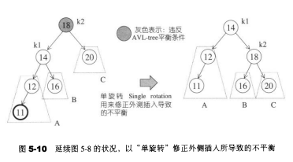
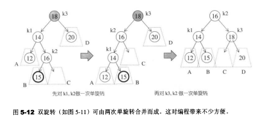

# 定义

- AVL 是大学教授 G.M. Adelson-Velsky 和 E.M. Landis 名称的缩写，他们提出的平衡二叉树的概念，为了纪念他们，将平衡二叉树称为 AVL树

- 又叫做平衡二叉树（误导性太强了），自平衡二叉查找树，高度平衡树

- 平衡二叉树是二叉搜索树的一种，是用于解决二叉排序树高度不确定的情况

概念定义

- 或者是空树
- 或者是具有下列性质的二叉排序树
  - 左子树与右子树的高度差的绝对值小于等于1
  - 左子树和右子树也是平衡二叉排序树

# 性质

- 在AVL树中，要求任何节点的左右子树高度相差最多为1（为了保证"对数深度"平衡状态）
- 平衡因子：对于每个结点，都给一个平衡因子 = 结点左子树的高度 - 结点右子树的高度（bf），取值只能为0，-1
- 对于一颗n个结点的avl树，其高度保持在O(log2n)数量级，asl(平均查找长度)也保持在log2n量级

# 插入

## 单旋转

- 当插入操作是在最左边或是最右边的时候，单旋转就可以解决平衡（即左左 右右的情况）
- 一般的左旋或者右旋，都是单旋转
- 

## 双旋转

- 当插入操作是在内部的时候，就必须用双旋转（左右 右左）
- 

# 删除

- 如果要删除的节点时NULL 则直接返回NULL
- 如果删除的节点不为NULL，需要判断要删除的值是否等于当前节点。如果大于，则递归去删除当前节点的右子树
- 如果删除的节点不为NULL，且要删除的值小于当前节点的值，则递归删除当前节点的左子树
- 如果删除的节点不为NULL，如果要删除的值等于当前节点的值，则找到右子树的最小节点替换掉当前节点或者找到左子树的最大节点替换掉当前节点

# 应用

- windows对进程地址空间的管理