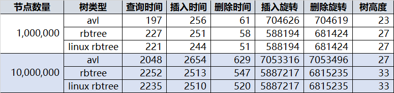

# 定义

- 是一种特化的AVL树，**不要求绝对平衡**，从而减少二叉树的旋转次数

  - 红黑树： 不是要求绝对平衡，付出的代价是要着色，查询次数可能会多一层，好处是减少旋转次数
- AVL：要求绝对平衡，付出的代价是要计数，旋转次数可能会多，好处是所有查询都是最短路径

和AVL树的对比（更加细化的比较）

- 和红黑树相比，AVL树是严格的平衡二叉树，平衡条件必须满足所有节点的左右子树高度差不超过1
  - 而红黑树是一种弱平衡二叉树，**所以在相同的节点情况下，AVL树的高度低于红黑树**

- 通过对任何一条从根到叶子的路径上各个节点着色的方式的限制，**红黑树确保没有一条路径会比其它路径长出两倍**（从而在整体上保持了平衡）
- 在插入上，avl树和红黑树都能保证常数级别的旋转实现（**avl树插入新节点所需要的最大旋转次数是常数**）
  - 查找上，二者性能上几乎是一模一样的（可能红黑树会略逊与avl树）
  - 但在删除上，avl的极端情况可能需要logn的时间复杂度实现，而红黑树至多需要三次旋转，rb-tree在删除上的性能优于avl
  - 
  - 总结：**rb-tree的旋转次数是小于avl的**
  - https://www.zhihu.com/question/30527705/answer/259948086

# 特点

- 每个节点是红色或者黑色
- 根节点是黑色
- 每个红色结点的两个子结点都是黑色
- 对任意一个结点来说，从它到空结点的所有路径必须包含相同数目的黑色结点
- 所有叶子节点都是黑色的

# 应用

- C++广泛用在C++的STL中。如map和set都是用红黑树实现的
- JavaJava的集合框架(HashMap、TreeMap、TreeSet)；HashMap的底层实现，在JDK1.8中为了解决过度哈希冲突带来的长链表，当链表长度大于某个阈值会将链表转为红黑树
- Linux操作系统CFS进程调度算法中，vruntime利用红黑树来进行存储，选择最小vruntime节点调度
- 数据包CD / DVD驱动程序执行相同的操作
- 高分辨率计时器代码使用rbtree来组织未完成的计时器请求
- ext3文件系统跟踪红黑树中的目录条目
- 虚拟内存结构管理（VMA）
- 多路复用技术的Epoll的核心结构也是红黑树+双向链表
- 加密密钥和网络数据包均由红黑树跟踪
- Linux应用程序nginx用红黑树管理timer等。 
