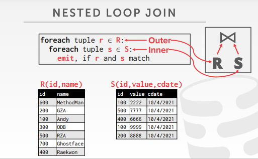
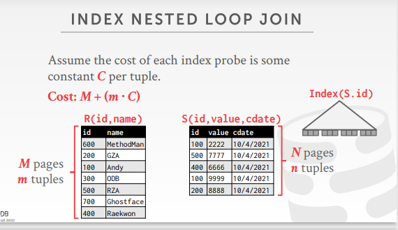
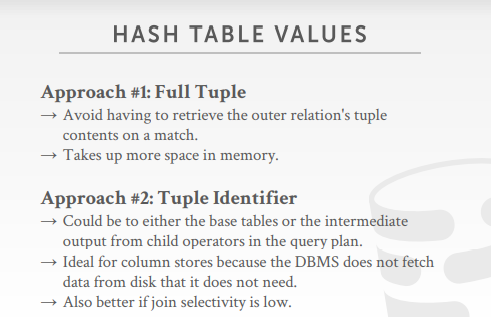
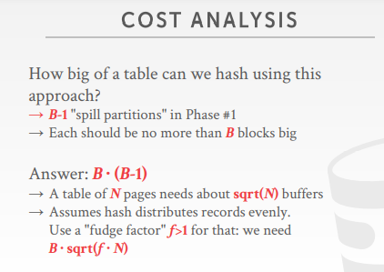
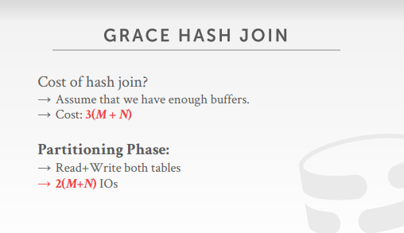

# why do we need to join

- 因为关系型数据库本身就是按照数据模型的连接关系给分开的
- 所以如果想要取用数据的话，就应该join连表去取数据
- 研究的是**内连接**，用**相等**谓词连接的算法
- trick：最好把小一点的表放到左侧

# join operators

- 首先就要研究算子的输出是什么，向上级输出的data是什么
- 接着就要研究不同的算法的cost，根据cost决定用什么去实现

## operator output

### data

- early materialization（提前物化）
- 向上输出两个表连接后得到的数据，即把整个数据记录都往上传
- 优点：最后算子得到的就是result，不需要回表
- 缺点：数据的传输cost比较大

### record ids

- late materialization（延迟物化）
- 向上输出的是数据记录的id号
- 缺点：上层想要获得完整的数据记录，就需要用记录id进行回表

# cost analysis criteria

- 对算法的开销进行分析
- 以**磁盘的IO次数**衡量算法的开销

笛卡尔积

- 笛卡尔积是解决join最基础的办法，但它是非常的低效的
- 为了降低连表开销，想到了以下算法
  - nested loop join（鸟巢，嵌套循环）（simple，stupid，block，index）
  - sort-merge join
  - hash join

# nested loop join

## stupid nested loop join

- 嵌套循环
- 过程：外层循环是遍历R表的每一行，对于R表的每一行，再开一个内层循环，用来遍历S表的每一行
- 
- 相当于O(N^2)的算法循环

- PS：对于磁盘来说的小表，应该是指总数据量小，占用磁盘页少的表，因为这样的表，遍历起来IO次数就会少很多
- 这种说把小表放到左边的办法，我是有点存疑的，因为实际上总体IO的数量取决于R表的记录数和磁盘页数，即是由两个变量决定的

缺点

- 没有充分利用到缓存池的特点
- 比如说当第一行记录在S表中进行join时，会把S表中的数据都读入到buffer中
- 但是当读到第二行记录的时候，又会从头把数据读入
- 这就间接的导致了buffer失效

cost

- 要读取整个R表，所以是M；而对于R表中的每一条记录，都要一一和S表匹配，所以是m * N

- 

## block nested loop join

- 一种优化的思路：按照数据页进行遍历
- 过程：先读入R数据的数据页A，然后再依次的遍历S中的数据页，从而将数据页A中的数据一一对上
- 

cost

- 要读取整个R表，所以是M；而此时是以数据页进行匹配的，即每个数据页都匹配一遍S表，所以是M * N

- 

继续优化

- 假设内存池中有B个缓存页，将一个页作为输出缓存，一个页作为内表缓存（即S表缓存），剩下的B-2个页作为外表数据的缓存
- 
- cost就变为M + (M / (B - 2) * N)
  - M表示所有的数据页都要读一遍
  - M / (B-2)是因为要将M张page放入到大小为B-2的内存中，需要那么多次
  - 因此如果B  - 2 > M，那就相当于只需要M + N次，非常的高效

- 这种做法充分的利用了缓存池，极大的提高了性能
- 

- 思考：为什么nested loop join那么慢，即为什么一定要完全遍历S表的所有数据
- 解答：因为内表没有加索引，导致每次数据的查询必须全遍历，由此引申出基于索引的查询

## index nested loop join

- 用索引查询内表的数据
- cost：M + (m * C)
  - C是指每次查询所有需要的页数

- 

## summary

- 尽量让小表放左边，因为这样就可以让左边的大表遍历的次数减少
- 尽量缓存多一点外表的数据，这样可以减少内表的遍历次数
  - 因为我们是以外表为核心遍历的，所以内表的数据缓存下来是没有意义的，每次都还是得从头遍历
- 每次查找都会一直遍历循环内表（可以用索引提高效率）

# sort merage sort

- 将需要join的列，先进行sort，然后再merge
- 
- 这里有一个细节就是对于双指针中二者值相等的时候，一般的做法是输出值后同时下移指针
- 但这里S表（即内表）中可能会出现多个数据相同的情况，如果同时下移指针可能会略过一些数据
- 所以不能同时移动两边的指针，而只能移动右表的指针（即移动S表的指针）

cost

- 

- 缺点：如果两边的数据全都一样，或者说重复的数据太多，在最严重的时候会导致退化为stupid nested loop join

- 什么时候最高效（when is sort-merge join useful?）
  - 当数据本身就排好序了，就减少了sort的过程，直接merge（比如说下一级算子给的数据是有序的，或者是从index读取的数据）
  - 或者说需要的数据本身要求是有序的，那么sort就必不可少

- 思考：发现B+树的查询有点随机性（和树的结点数和层数有关），并且我们的需求其实是点查询，不需要B+树范围扫描的特性
- 因此引入了hash查询

# hash join

## basic hash join algoritham

- 阶段一：build，扫描外表数据，构建hash表
- 阶段二：probe，扫描内表的数据，放入hash表中查询
- hash表的kv是什么，k是语句用于join的那一列数据
- 而v有以下几种表示方法：
  - 提前物化（full tuple，将整个元组作为数据存储）
  - 推迟物化（tuple identifier，即是数据的行id之类的，后续回表取数据）
  - 

bloom filter加速

- 背景：发现如果使用hash匹配数据，没匹配上很浪费时间精力，因此想要用bloom filter进行优化
- 即用外表做一个hash的同时，同时维护一个bloom filter，然后内表查数据的时候，就先查bloom filter，如果没有就不继续查了
- 为什么bloom filter可以提高性能，因为内表查询数据首先会去filter中查找，如果没找到，就会跳过当前数据
- 而如果没有bloom filter的话，就会加载hash表的page，然后去寻找（这种磁盘的IO无疑是浪费资源的）
- 所以bloom filter就可以提早知道数据不存在，就不会去读取内存，从而提高效率
- 但bloom filter会出现假阳性

cost

- 

- 这里的问题是，内存不够，会导致hash难以构建，那该怎么办？
  - 需要把一些hash表的数据放到硬盘中
- 所以有了grace hash join

## grace hash join

- 解决在hash join的过程中，hash表无法全部放到内存的问题
- phase1：用同一个hash函数，把R表和S表分别做一个hash表1和hash表2
- phase2：把R表的hash表1和S表的hash表2，各取一个分区的数据，进行nested loop join
  - 这里的原理就是，都是用的同一种hash算法，能够join的元素必然是在同一个分区当中的

## recursive partitioning

- 问题又来了，如果一个分区的元素都非常多，都放不到内存中，该怎么办
- 解决办法：对这个非常大的分区，对两边的数据表，再用一个新的hash函数进行hash，直到能够分到足够小的块
- 

cost

- partitioninh phase：2（M + N）
  - 无论是内表还是外表，一次是要把数据从硬盘读到内存中，另一次是要把数据写入到hash表中
  - 这里假设hash表的页数也是和原来的数据表同页
- probing phase：M + N
  - 两边分别把hash表的数据都读入到内存，所以就是M + N
  - 读到内存的数据再进行nested loop join
- 所以cost就是3 * （M + N）次的IO
- 

- 如果提前知道外表的大小，就可以用静态的hash表对数据操作，而不是使用动态扩容的hash表

# conclusion

- 
- 如果是两个大表做join的话，最好就是做hash join
- 但，如果需要数据是倾斜的，即发生hash冲突的概率较大（会导致算法退化），那么最好还是选择sort-merge
- 或者，输出结果需要被排序的时候，会选择sort-merge
- 一般，比较好的DBMS会选择hash join和sort-merge join