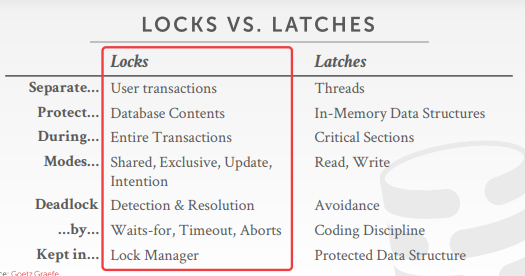
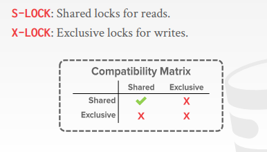
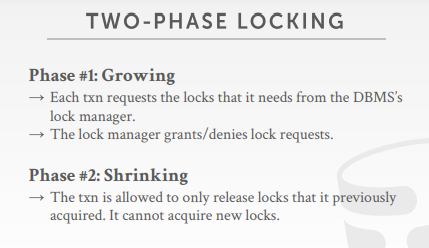
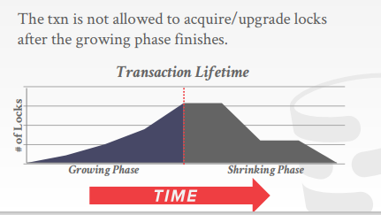
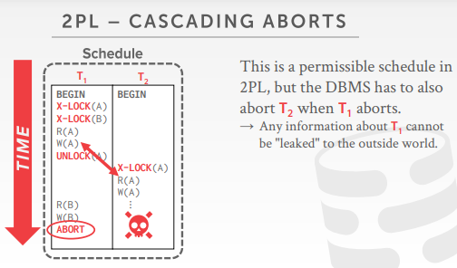
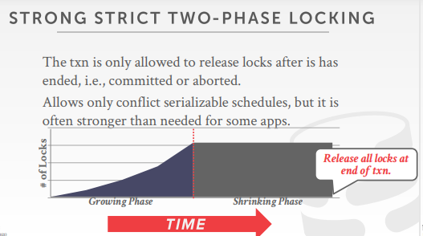
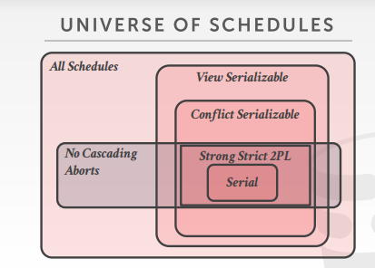
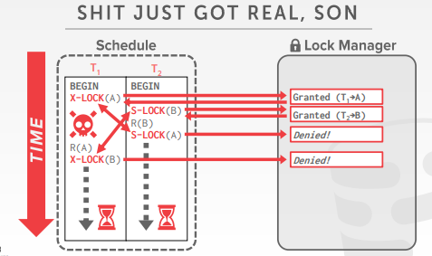
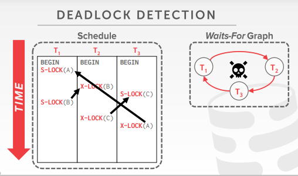
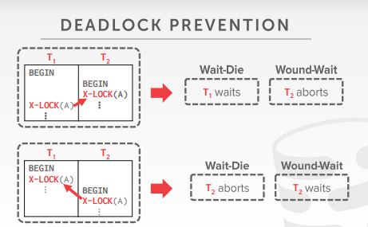

# backround

- 前面的分析都是基于事务已经发生了，然后再去判断分析是否可行
- 而实际上是不可能这么顺利的，因为我们不知道整个事务是怎么运行的
- 所以很自然的想到用锁实现对数据的保护

# lock types

- 

## latches

- 微观的概念

- 保护的是底层的数据结构（比如说B+树，hash表）
- 物理上的结构，hash的数据，树的结点

## lock

- 宏观的概念

- 对数据库的抽象的内容的锁
- 对于用户来说，是获取一条数据的lock，而真正去操作这条数据的时候，比如说操作B+树，就会去操作latches
- 锁的是表或者行
- lock的类型
  - S-LOCK：shared lock，共享锁，读锁
  - X-LOCK：exclusive lock，排他锁，写锁
  - 
- 锁的过程
  - 事务需要锁
  - 锁管理器要么给锁（锁是空闲的）要么阻塞（锁给其他事务了）
  - 事务释放锁
  - 锁管理器更新锁的使用情况

# two-phase locking

- 把锁用在并发控制中，决定了一个事务在运行过程中如何和其他的事务进行协调
- 不需要知道提前知道事务做了什么
- 2PL是针对单个事务来说的

- 

- 阶段一：growing
  - 事务只能不断的加锁，不能解锁
  - lock manager在这个阶段要么给锁，要么阻塞（因为lock被别人拿走了）
- 阶段二：shrinking
  - 事务在这个阶段只能解锁，不能加锁
- 

- 用二阶段锁的事务执行顺序，用依赖图表示是没有环的

- 2PL会出现级联终止的问题（也就是脏读）
  - 
  - T1先做一部分，T2基于T1的数据再做一部分，结果T1要回滚了，导致T2出现了错误
  - 问题就在于T2是基于T1还未提交的一个版本进行的

- 解决办法：严格二阶段锁（strong strict 2PL）（SS2PL）
  - 
  - 原来的二阶段锁，在shrinking的时候，是可以边操作边解锁的
  - 而严格二阶段锁，是指一定程度后锁的数量会保持不变
  - 到了最后事务commit的时候才会释放所有的锁
  - 事务修改的数据，一直到事务提交之前，别人都不能修改
  - 优点：不会出现级联回滚；事务中间可能对数据又多次操作，但是不用管，直接回滚到事务之前的版本即可；被abort的txn可以通过恢复到原始数据来消除影响

- 

- 2PL也会出现死锁的问题
  - 解决办法：detection and prevention

# deadlocking detection + prevention

- 无论是2PL，还是严格2PL，都可能会产生死锁饥饿
  - 

- 解决办法：
  - deadlock detection（死锁检测）
  - deadlock prevention（死锁预防）

## deadlock detection

- 死锁检测

- 内部会维护一个锁依赖图，记录了当前并发的事务谁在等待谁的锁，图的每个结点都是一个事务
  - 

- 事务A指向事务B，表示事务A在等待事务B的锁
- 周期性的去检测锁依赖图
- 发现环的话，就选择一个事务回滚，解开环，使得事务跑下去
- 权衡：因为是周期性的检查图，所以要权衡检查维护的频率
- 应该选择哪一个事务进行回滚（考虑的因素）：
  - 如果执行了时间特别的长或者快要执行完了的，就不要干掉他
  - 看事务执行了多少条sql语句，即查看要回滚的代价，尽量干掉sql语句做得少的事务
  - 查看事务拿了多少锁，要干掉加锁加的多的事务
  - 考虑多少其他的事务都因为它而回滚过（即检测该事务被回滚了多少次）
- 回滚的程度：
  - 完全回滚 completely rollback
  - 部分回滚 minimallly rollback

## deadlock prevention

- 死锁预防：当T1想要的lock被T2拿到的时候，那么DBMS就会挑选其中一个kill

- 根据时间戳给事务优先级，越先开始的事务有高优先级（older time stamp = higher priority）

- 

- old waits young，如果是老的事务（高优先级）想要加锁，发现锁被一个年轻的事务拿到了，那么老的事务就要等年轻的事务释放了才能拿
  - 反之，年轻的事务想要加的锁在老的事务持有，那么年轻的事务就要abort
- young waits for old，如果一个老的事务想要拿的锁被一个年轻的事务持有，那么老的事务就把年轻的事务的锁抢过来，并把年轻的事务abort
  - 反之，年轻的事务想要加的锁在老的事务持有，那么年轻的事务要等待老的事务

- 说白了就是给事务优先级，然后针对优先级指定不同的策略，即高低有顺序（这就是为什么可以解决死锁的原因，有点像swap时，要先拿低地址数据的lock，再拿高地址数据的lock一样，就要保持所有的拿锁都有一个顺序可言）

- 被abort的事务的时间戳是多少：应该还是原来的时间戳（为了防止饥饿，因为此时年轻的时间戳，早晚会变成老的时间戳）
- mysql的死锁检测是第一种，old waits young

# lock granularitiles

- 锁的粒度
- 如果更新两条事务都要锁表的话，并发粒度就会下降
- DBMS需要尽可能少一些锁
- 想要更少的锁的数量，还是要用更大粒度的锁
- 大粒度的锁：给整个表加锁，要先检查每个行是否要加锁
  - solve：给一个标记，加行锁的时候标记一下，表示当前加不了表锁了

## intention locks

- 意向锁
- 只是一个意向标记
- 意图锁允许更高级别的节点锁定在共享（S锁）或独占（X锁）模式，无需检查所有后代节点
- 如果一个表被加了意向锁，就表示下面的行被加锁了
- intention shared（IS）意向共享锁
  - 下面的行有被加S锁

- intention exclusive（IX）意向排他锁
  - 下面的行有被加X锁

- shared + intention -  exclusive （SIX）
  - （部分行被加了排他锁（X lock），整个表又被加了共享锁（IS））

- 

## locking protocol

- To get S or IS lock on a node, the txn must hold at  least IS on parent node
  - 想要对数据加S锁或IS锁，就必须要持有数据的IS锁

- To get X, IX, or SIX on a node, must hold at least  IX on parent node
  - 想要对数据加X锁，IX，SIX，就必须要持有数据的IX锁

## lock escalation

- 当低级的锁过多的时候，锁会自动升级为表锁
- 从而能够减少锁的请求和持有数量

## lock table

- 绝大部分锁，都是DBMS自己加的，当然有时候可以显式的给node 加锁
- 而DBMS也提供了接口，让用户可以在语法上加锁
  - LOCK TABLE <table> IN <mode> MODE;
  - select * from <table> where <> for update;（数据库备份的时候用到的）
  - 显式告诉数据读的数据要加的不是共享锁，而是排他锁

## select...for update

- 用sql语句显式的给数据加上X lock
  - `select * from <table> where <qualification> for update`

# conclusion

- 几乎所有的关系数据库都用了2PL
- 例如MYSQL,PG（pg有些还有个ssi）

- 通过2PL可以放心的让事务进行并发